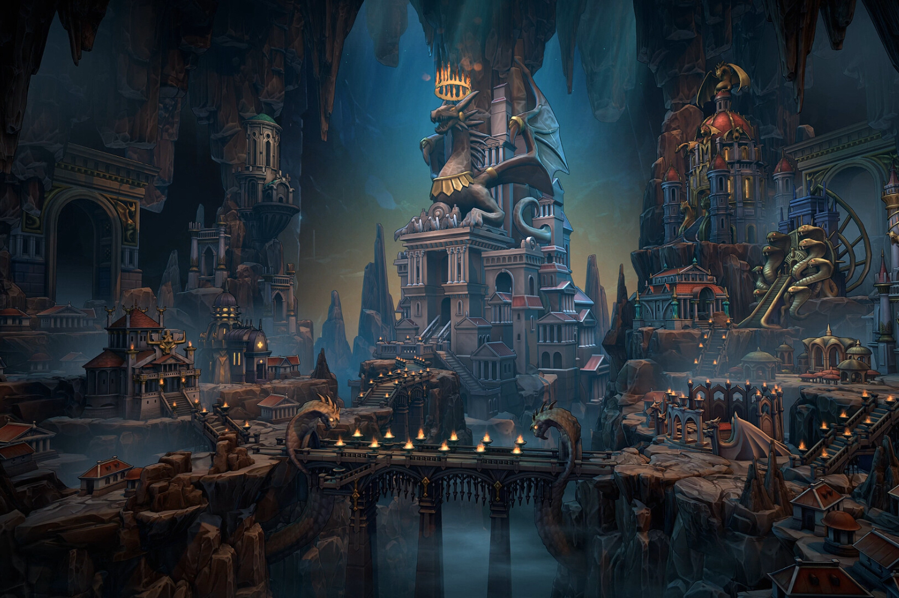

+++
title = "Heroes of Might & Magic va faire son grand retour"
date = 2024-08-26T06:00:00+01:00
draft = false
author = "Mickael"
tags = ["Actu"]
image = "https://nostick.fr/articles/vignettes/aout/nostick.jpg"
+++

Alors qu'on pensait la franchise abandonnée, Ubisoft a ressorti *Heroes of Might & Magic* du placard où elle dormait depuis 2015 et le dernier épisode en date, *Might & Magic Heroes VII* ! L'éditeur a sorti de nulle part *Heroes of Might & Magic: Olden Era*, prévu pour le deuxième trimestre de l'année prochaine.

 

Ce nouveau titre reprend le gameplay de ses prédécesseurs — c'est de la stratégie au tour par tour où il faut explorer, gérer son château et batailler — qui se déroule à Enroth, sur le continent de Jadame souvent évoqué dans les jeux précédents, mais jamais exploré. Il s'agit donc d'un préquelle, et on imagine qu'Ubisoft en profitera pour s'adresser aussi bien aux vétérans de la franchise, qu'aux newbies. 

De ce qu'on en comprend, *Olden Era* aura trois modes : une campagne solo avec des cartes inédites et des scénarios générés aléatoirement, un mode coop et un multi. Il y a également un éditeur pour créer ses propres cartes (et les partager avec la communauté). 6 factions composent ce monde avec leurs capacités uniques : Temple (chevaliers classiques), Nécropole (les sympathiques morts-vivants et vampires), Sylve (les hippies de la forêt), Donjon (BDSM) et Ruche (Winnie l'Ourson). La 6e sera dévoilée prochainement.

Les joueurs intéressés peuvent se diriger vers la page [Steam](https://store.steampowered.com/app/3105440/Heroes_of_Might__Magic_Olden_Era/) du jeu. La date de lancement correspond à l'accès anticipé, une phase qui durera un an. Pendant cette période, les cobayes pourront apporter leurs retours et leurs propositions d'améliorations.

*Heroes of Might & Magic* n'est pas né de la dernière pluie. Le tout premier titre est sorti en 1995 chez New World Computing, qui a fini sa course chez Ubisoft après l'acquisition de 3DO (ou de ce qu'il en restait) en 2003.