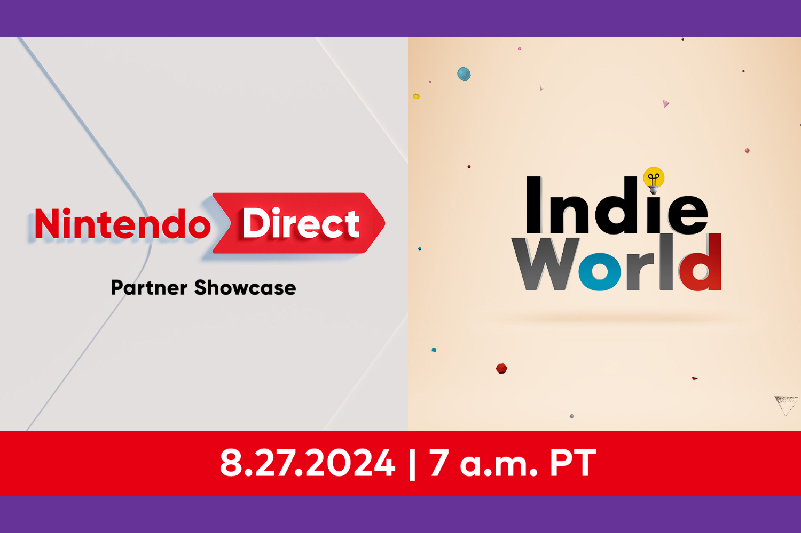

+++
title = "Un Nintendo Direct plein de jeux indés ce mardi"
date = 2024-08-26T11:47:32+01:00
draft = false
author = "Mickael"
tags = ["Actu"]
image = "https://nostick.fr/articles/vignettes/aout/nintendo-direct.jpg"
+++

Nintendo [organise](https://www.youtube.com/live/Bh7o96_yIWw) un Direct ce mardi 27 août à 16h heure de Paris (si je ne me trompe pas encore sur l'heure) ! Alors attention, l'événement est scindé en deux parties. La première sera un Partner Showcase qui sera suivi par un Indie World. Autrement dit : des jeux de tierce partie et des indés, et probablement rien de bien neuf chez Nintendo.

 

Le showcase durera quelque chose comme 40 minutes, avec des titres pour la Switch actuelle. Comme Nintendo [l'annonce](https://x.com/NintendoAmerica/status/1828070150127456613) clairement : « *il n'y aura aucune mention au successeur de la Switch durant ces présentations* ». Bouh !