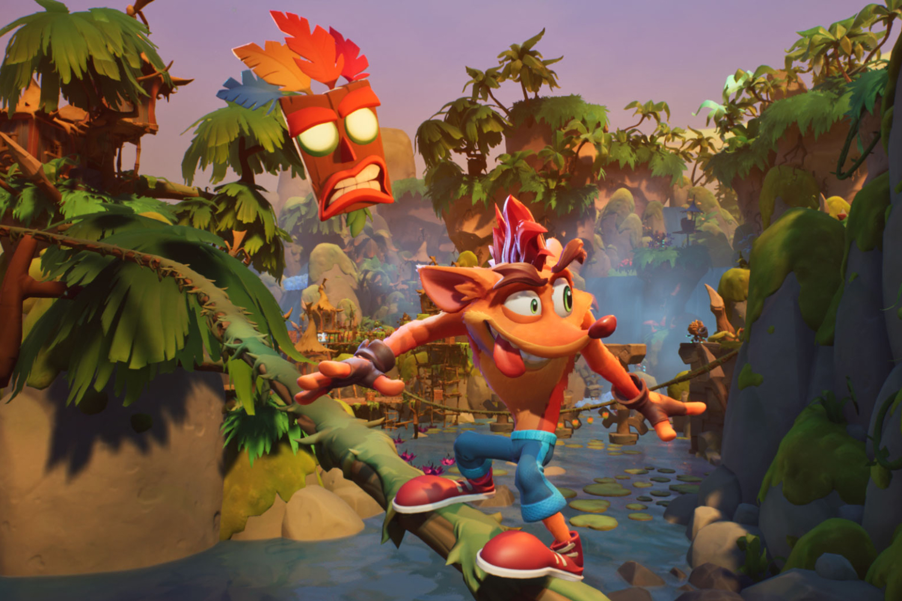

+++
title = "Activision a fait crasher Crash Bandicoot 5"
date = 2024-08-27T09:01:32+01:00
draft = false
author = "Mickael"
tags = ["Actu"]
image = "https://nostick.fr/articles/vignettes/aout/crash-bandicoot.jpg"
+++

5 millions de copies vendues, c'est de la roupie de sansonnet quand on s'appelle Activision. En n'ayant pas pu faire mieux, *Crash Bandicoot 4: It's About Time* aurait provoqué la fin prématurée du développement de la suite, *Crash 5*. C'est du moins ce que rapporte Liam Robertson, historien du jeu vidéo, qui a fait parler de nombreuses sources au sein du studio Toys for Bob, développeur de *Crash 4* et de la trilogie *Spyro Reignited*.

 

Ce nouvel épisode des aventures du marsupial sauteur se déroulait juste après *It's About Time*, dans une école pour les enfants des méchants de la saga. *Crash 5* voulait aussi  ramener des éléments du *Crash Twinsanity* de 2004 et même… Spyro ! Le dragon devait être un perso jouable. En fait, les  univers des deux licences s'entremêlaient, dans le plus pur style du multiverse.

Malheureusement, *It's About Time*, sorti en 2020, n'a pas été le méga-succès interplanétaire qu'espérait Activision, le proprio de Toys for Bob à l'époque. L'éditeur misait bien davantage sur les jeux service, plutôt que sur les aventures solo. Après l'arrêt du développement de *Crash 5*, le studio a d'ailleurs planché sur *Crash Team Rumble*, le jeu multi lancé l'an dernier mais qui a loupé la marche du succès. 

La rumeur d'une annulation de *Crash 5* s'est [propagée mi-juillet](https://nostick.fr/articles/2024/juillet/1607-crash-bandicoot-5-annule/) sans qu'on connaisse les tenants et les aboutissants de cette cette sombre histoire. Toys for Bob, devenu indépendant, travaille désormais pour le compte de Xbox sur [un nouveau jeu encore bien mystérieux](https://nostick.fr/articles/2024/mars/2403_spyrothedragon/). Peut-être le retour de Spyro… ou de Crash ?