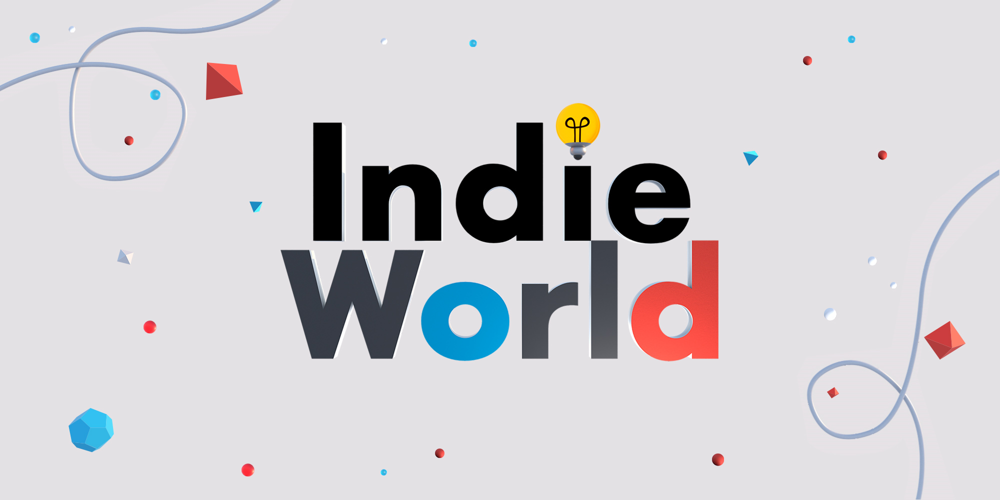

+++
title = "Neva, Morsels : ce qu’il faut retenir de l’Indie Showcase de Nintendo"
date = 2024-08-27T17:50:00+01:00
draft = false
author = "Félix"
tags = ["Actu"]
image = "https://nostick.fr/articles/vignettes/aout/crash-bandicoot.jpg"
+++

Nintendo prépare doucement la fin de vie de la Switch et a diffusé aujourd’hui un Indie World Showcase qui a permis de découvrir deux trois bricoles. Le jeu de poker-roguelike *Balatro* a ouvert le bal en présentant une [grosse mise à jour](https://www.youtube.com/watch?v=8188WZxHSkU) apportant un paquet de crossovers : avec *The Witcher*, *Vampire Survivors*, *Dave the Diver*, ou encore *Among Us*. Au risque de frôler l’overdose ? Si personnellement je ne suis pas client, j’ai été bien plus intrigué par le premier trailer de *Neva*, la suite spirituelle du sympathique *Gris* qui promet d’être fort jolie.



Le visual novel *Coffee Talk* va bientôt avoir droit à un nouvel opus centré sur la ville de Tokyo. Pourquoi pas, on verra ce que ça vaut dans le courant de l’année prochaine. VN toujours avec *Date Everything*, qui a le mérite d’être [intriguant](https://www.youtube.com/watch?v=XPftknErjMA) : c’est un dating-sim dans lequel on peut draguer des représentations humaines de différents objets de la maison qui arrivera le 24 octobre. Sinon, *PowerWash Simulator* va gagner une mise à jour basée sur [l’univers de Shrek](https://www.youtube.com/watch?v=lud2EogYv2o) dont le trailer rappellera à tout le monde que le jeu est très moche sur Switch.



*Morsels* sera le prochain jeu édité par Annapurna, et ça a l’air plutôt chouette : ce roguelike vu du dessus incite à suivre « *une souris qui utilise des cartes magiques pour se transformer en petits monstres, luttant contre les méchants félins qui dominent le monde* ». L’univers donne envie et le trailer assez fun, jugez par vous même :



Mis à part ça, *Pizza Tower* est désormais dispo sur la console tout comme la suite du très bon plateformer en multi local *Pico Park*. Le RPG *Sea of Stars* aura droit à un DLC l’été prochain. La conférence a été suivie par un Partner Showcase avec quelques surprises que Mickael vous résumera dans un prochain article.