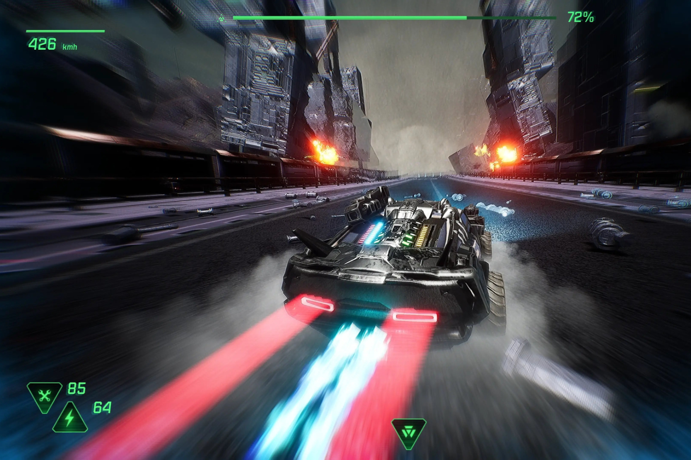

+++
title = "Fatal Run, la course à la mort de l'an 2089"
date = 2024-08-27T05:30:00+01:00
draft = false
author = "Mickael"
tags = ["Trailer"]
image = "https://nostick.fr/articles/vignettes/aout/Fatal-Run-2089.jpg"
+++

Dans deux ou trois ans, quand le monde aura complètement sombré entre hiver nucléaire et destruction complète de l'environnement, il faudra bien trouver quelque chose à faire de ses dix doigts. Et pourquoi ne pas prendre le volant d'un bolide lourdement armé pour mettre la branlée aux punks de la route ?

 

C'est le programme sympathique et familial de *[Fatal Run 2089](https://atari.com/products/fatal-run-2089)*, nouveau jeu de bagnoles post-apo du studio MNSTR. Et comme son nom l'indique, il s'agit d'un remake/reboot/suite de *Fatal Run*, le jeu d'Atari sorti en 1990 sur les consoles Atari 2600 et 7800. Évidemment, un peu d'eau a coulé sous les ponts depuis, et ce nouvel épisode est conçu avec Unreal Engine 5.

*Fatal Run 2089* se déroule dans quatre régions (et autant de boss) et 20 niveaux bourrés de raccourcis, de pièges et autres témoins du vieux monde qui explosent sur votre passage. Il faudra aussi et surtout défoncer ses adversaires à l'aide de tout un arsenal. A priori, il n'y a qu'un seul mode : le contre la montre, lié au scénario du jeu — il faut transporter une source d'énergie propre qui va « purifier » l'atmosphère. Et cette énergie doit être livrée au plus vite.

7 véhicules sont disponibles, que l'on peut customiser à loisir. *Fatal Run 2089* sortira l'année prochaine sur tout ce qu'il est possible d'imaginer, à part le Mac mais hé, qui joue avec un Mac ?