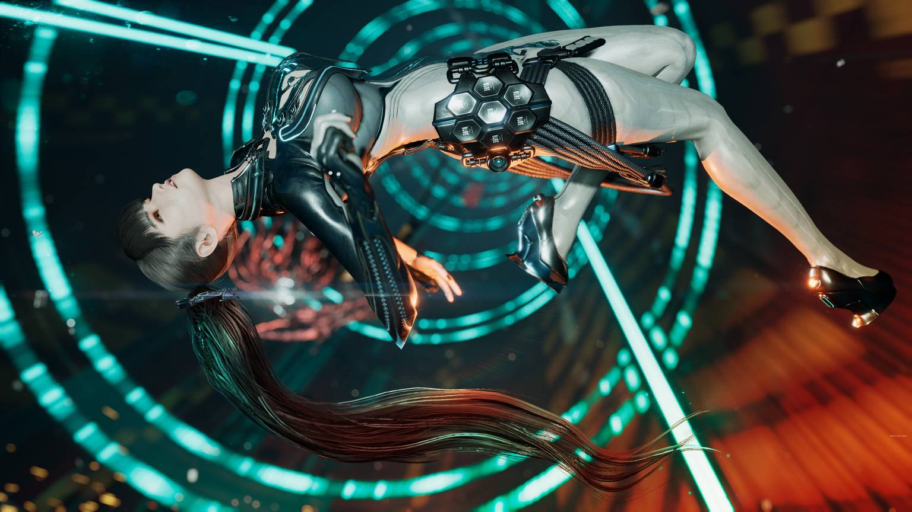

+++
title = "Il y aura bien une version PC de Stellar Blade"
date = 2024-08-27T08:04:32+01:00
draft = false
author = "Félix"
tags = ["Actu"]
type = "telex"
+++ 

La version PC de Stellar Blade ne devrait plus trop tarder d’arriver. Le studio SHIFT UP a confirmé lors de la présentation de ses résultats trimestriels qu’un portage était dans les tuyaux, ce qui n’est pas très étonnant étant donné qu’il cherchait des développeurs spécialisés [le mois dernier](https://nostick.fr/articles/2024/juillet/2607-stellar-blade-portage-pc-nouveau-contenu/). « *Afin de maintenir le dynamisme de notre licence Stellar Blade, nous préparons un lancement sur PC dans un avenir proche* », précise [le compte rendu](https://shiftup.co.kr/admin/bbs/down.php?code=ir&idx=152&no=1). Ça a le mérite d’être clair.

Les portages des gros jeux Sony vers le PC sont généralement réussis, et on peut espérer que celui-ci ne fera pas exception à la règle. Un développeur a déclaré s’attendre à ce que la version PC « *fonctionne encore mieux que sur consoles* », ce qui serait la moindre des choses vu que le titre tourne à 30 i/s sur PS5 en 3840x2160. Quelques indices laissent à penser que *Stellar Blade* aura droit à de futurs DLC, ce qui n’étonnera personne étant donné que le jeu a dépassé le million de ventes en moins de 2 mois.