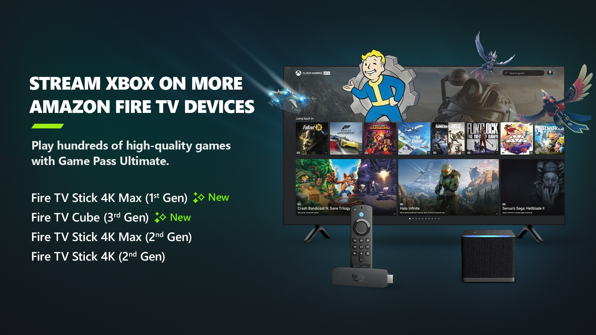

+++
title = "Xbox Cloud Gaming jouable sur encore plus de Fire TV"
date = 2024-08-27T08:04:32+01:00
draft = false
author = "Mickael"
tags = ["Actu"]
type = "telex"
+++

Pas besoin de Xbox quand on a un abonnement Game Pass Ultimate et une clé Fire TV (et une bonne connexion internet), grâce au Xbox Cloud Gaming ! Et c'est encore plus vrai aujourd'hui : Amazon a [annoncé](https://x.com/Xbox/status/1828100757104861672) que l'application [Xbox](https://www.amazon.com/Microsoft-Xbox/dp/B09MVCQJBJ?ocid=Announce_soc_omc_xbo_tw_Photo_lrn_8.27.1) était maintenant disponible pour les Fire TV Stick 4K Max de 1ère génération, en plus de la 3e gen. Le Fire TV Cube de 3e gén. a aussi été invité à la fête.

Si on ajoute le Fire TV Stick 4K (2e gen.), ça nous fait quatre produits Fire TV compatibles avec Xbox Cloud Gaming. [Un service qui fonctionne effectivement plutôt bien](https://nostick.fr/articles/2024/juillet/2907-xbox-cloud-gaming-fire-tv-stick-test/), pour peu qu'on ait à la maison un bon Wi-Fi.