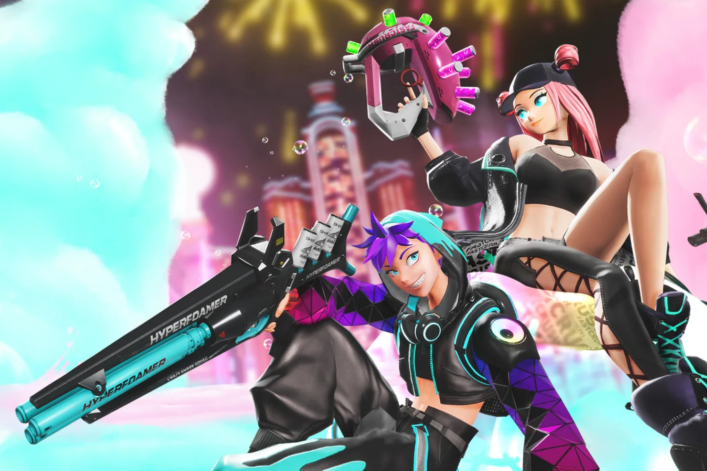

+++
title = "Après son succès en mousse, Foamstars devient free-to-play"
date = 2024-08-28T09:02:32+01:00
draft = false
author = "Mickael"
tags = ["Actu"]
image = "https://nostick.fr/articles/vignettes/aout/foamstars.jpg"
+++

Square Enix avait probablement beaucoup trop misé sur *Foamstars*, lancé en février avec l'ambition de devenir le *Splatoon* de la PlayStation. Mais n'est pas Nintendo qui veut, et le PvP avec de la mousse colorée n'a reçu ni les honneurs de la critique (un maigre [60 %](https://opencritic.com/game/16271/foamstars) sur OpenCritic) ni manifestement celui des joueurs. 

 

Il faut dire que l'éditeur a collé des boulets aux pieds du jeu avec une étiquette à 30 €, plus l'obligation de souscrire au PlayStation Plus pour le multi. Il n'y a que Nintendo pour demander (et obtenir, avec le sourire en plus) de tels sacrifices aux joueurs ! 

Histoire de donner un second souffle à *Foamstars*, Square [bazarde](https://support.na.square-enix.com/news.php?id=19278&la=1&n=2&drt=1724734800&tag=87d9005e3aa0690a5e94dc228934fdabf6edcc4a) donc le modèle économique du jeu, qui passe au free-to-play ! Et en prime, plus besoin d'un abonnement PS Plus… Ces changements interviendront le 4 octobre, ce qui laisse encore un bon mois au jeu pour végéter dans son coin.

Il aurait peut-être fallu commencer directement par ça pour espérer batailler contre la myriade d'autres jeux multi du même tonneau, mais peut-être que ces changements donneront envie aux joueurs de finalement plonger dans *Foamstars*. Il ne manque plus qu'une version PC pour que le jeu ait une véritable chance de se faire mousser.

Pour faire passer la pilule, tous ceux qui ont acheté le jeu recevront des petits cadeaux sans intérêt comme des skins et un titre spécial « Legacy ». Ça leur fera une belle jambe, certainement ! En tout cas, ça donnera sûrement des idées à Sony pour recycler un [*Concord* qui s'est méchamment vautré](https://nostick.fr/articles/2024/aout/2408-concord-se-crashe-au-decollage/) lui aussi.