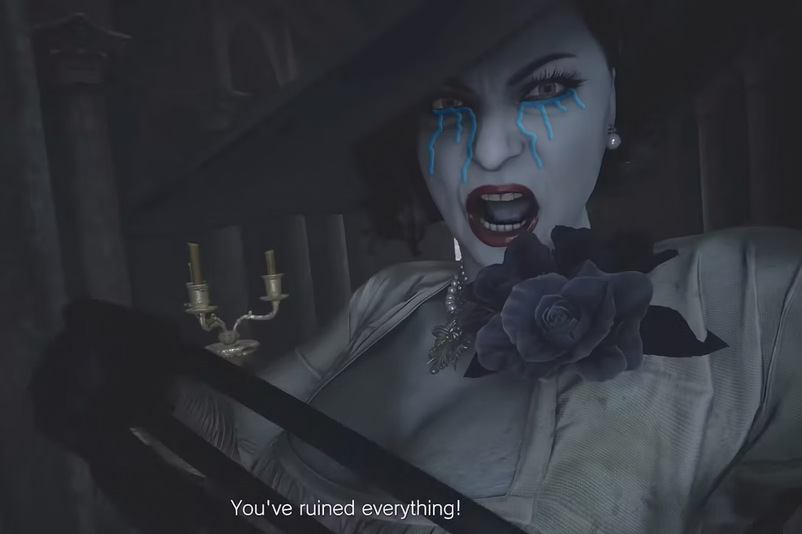
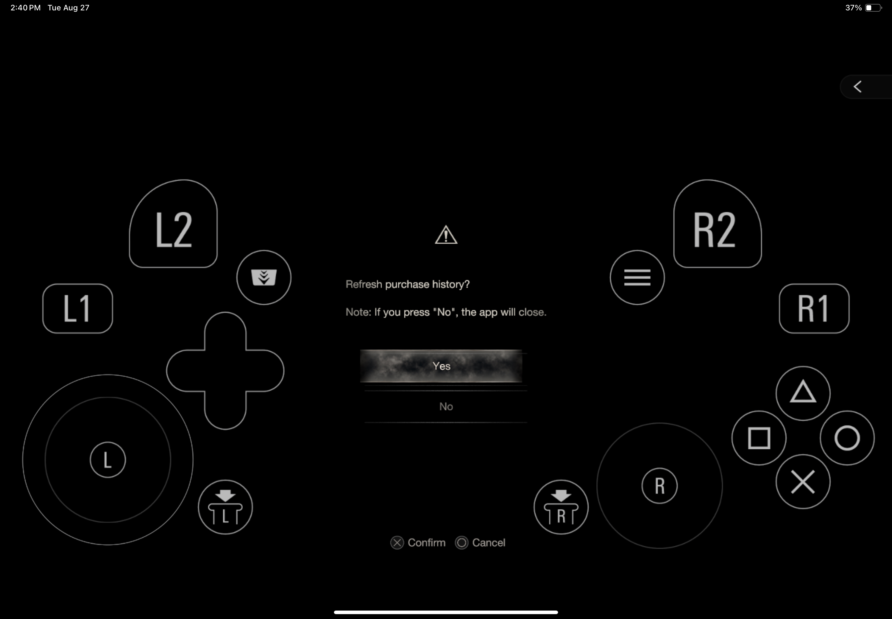
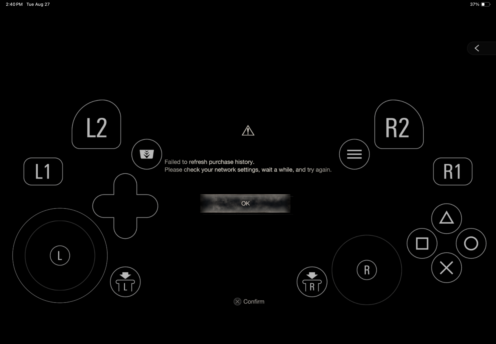

+++
title = "Sur iPhone, les trois Resident Evil infectés par un DRM"
date = 2024-08-28T09:57:32+01:00
draft = false
author = "Mickael"
tags = ["Actu"]
image = "https://nostick.fr/articles/vignettes/aout/lady-dimistrecu.jpg"
+++

Les jeux AAA sortis sur iPhone, iPad et Mac ces derniers mois ont déjà du mal à trouver preneur. Mais si en plus les éditeurs s'y mettent pour pourrir un peu plus l'expérience des joueurs, ça va quand même être difficile de valider [la stratégie déjà brinquebalante d'Apple](https://nostick.fr/articles/2024/juin/2606-gros-jeux-iphone-strategie-apple-flop/) !

Pour une raison incompréhensible, Capcom a décidé d'intégrer un DRM dans les trois *Resident Evil* pour iOS et macOS. Les jeux procèdent désormais à une vérification de l'historique de l'achat qui nécessite une connexion à internet. Il est maintenant impossible de jouer à *Resident Evil Village*, *Resident Evil 4* ou à *Resident Evil 7 Biohazard* hors connexion, ce qui était auparavant possible comme le rappelle *[TouchArcade](https://toucharcade.com/2024/08/27/resident-evil-iphone-15-pro-online-drm-update-purchase-history-check-7-biohazard-village-4-remake/)*. 

L'opération est certes rapide, mais si on est privé d'internet, on l'a dans l'os, le jeu ne se lancera pas. Et répondre « non » revient à fermer le jeu sans autre forme de procès. Voilà qui est franchement idiot, car il s'agit de titres que l'on peut certes télécharger gratuitement, mais qui coûtent bonbon dès lors qu'on veut le jeu complet (70 € pour *RE4*).

Capcom se contente d'expliquer qu'« *en raison des changements au démarrage, une connexion internet est requise au lancement du jeu* ». Beuh. Il faut espérer que l'éditeur trouve une autre solution rapidement…