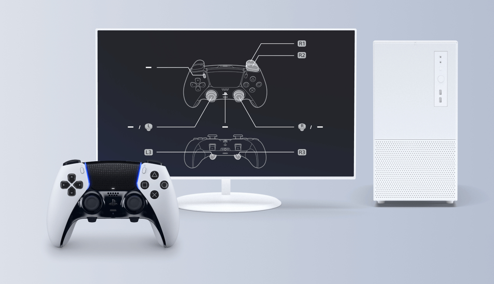

+++
title = "Les manettes DualSense Edge peuvent être personnalisées sur un PC"
date = 2024-08-28T08:04:32+01:00
draft = false
author = "Mickael"
tags = ["Actu"]
type = "telex"
+++

PlayStation soigne décidément les PC. Après le portage de la surcouche PS et [l'ouverture du PSVR2 aux jeux SteamVR](https://nostick.fr/articles/2024/juin/0306-le-psvr2-sera-bientot-compatible-pc-grace-a-un-adaptateur-a-60/), il est désormais possible de personnaliser les différents boutons de la DualSense Edge directement avec son ordi grâce à l'utilitaire [PlayStation Accessories](https://controller.dl.playstation.net/controller/lang/ca/2100004.html?smcid=cw%3Amk_sns_200&sf274405720=1), qui remplace le bien nommé, heu, « Assistant de mise à jour du micrologiciel de la manette de jeu sans fil DualSense ».

Les joueurs pourront ainsi créer des profils personnalisés et les modifier en fonction du jeu. Comme sur une PS5, en somme. La manette très haut de gamme (240 € tout de même) est elle aussi hautement personnalisable, avec des capuchons interchangeables et des modules de joystick remplaçables.