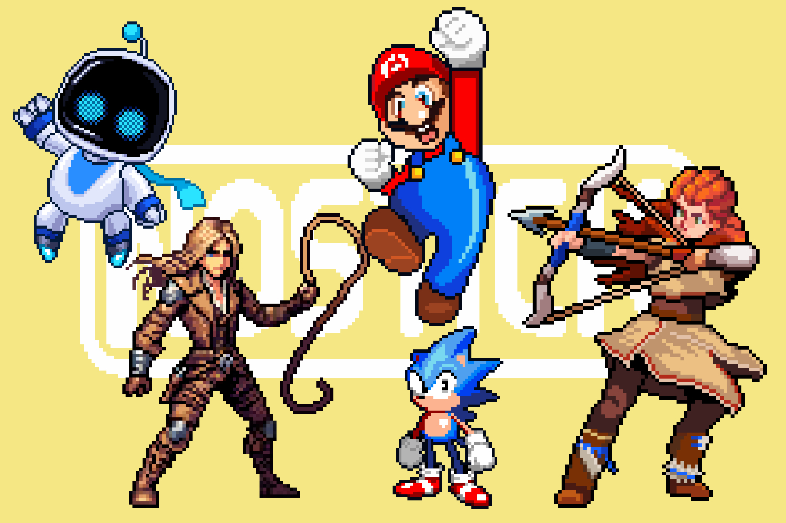
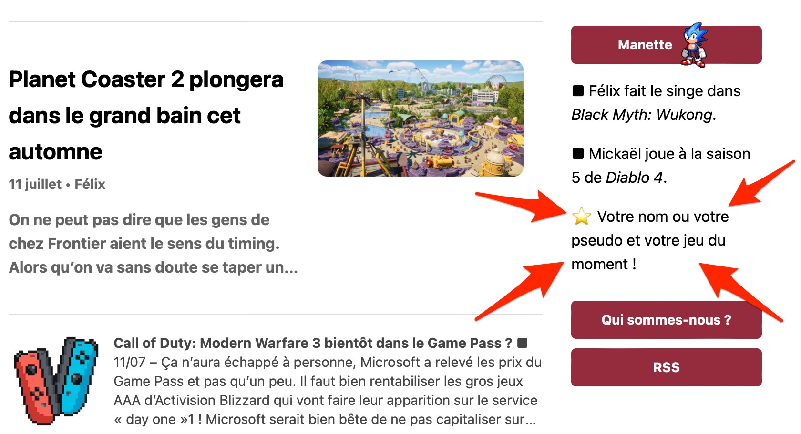

+++
title = "Nostick souffle sa première bougie et lance son Ulule !"
date = 2024-08-28T16:00:02+01:00
draft = false
author = "Félix"
type = "une"
tags = ["Actu"]
image = "https://nostick.fr/articles/vignettes/nostick.jpg"
+++

Le 26 août 2023 et par une après-midi pluvieuse, je décidais de lancer *Turbo 9* : une infolettre hebdomadaire ayant pour but de résumer l’actu de la semaine côté JV. Quelques mois plus tard, Mickael rejoignait l’aventure avec une idée commune en tête, à savoir créer un site web en parallèle de la newsletter où l’on pourrait publier des articles quotidiennement sans trop encombrer le mail dominical.

Ce site, c'est *Nostick* bien sûr, et mine de rien ce petit espace sur internet et l'infolettre — rebaptisée *[Nostick Reloaded](https://nostickreloaded.substack.com)* — ont pris une place de plus en plus importante dans nos vies ! Le projet étant en ligne depuis un an, nous avons pensé que c’était le bon moment de dresser le bilan… et de vous impliquer si le cœur vous en dit.

Après ces douze premiers mois, il n’est peut dire qu’on est satisfait du résultat. *Nostick* tient à peu près la route, ce qui n’était pas gagné étant donné qu’aucun de nous deux ne sait vraiment coder. Le site a trouvé son rythme de croisière niveau publications, et on a même pu se payer le luxe d'écrire plusieurs gros dossiers (sur [les miroirs dans les jeux](https://nostick.fr/articles/2024/mai/0805-pourquoi-les-miroirs-des-jeux-recents-sont-ils-si-moches/), la [Switch 2](https://nostick.fr/articles/2024/mai/0905-switch-2-tout-ce-que-lon-sait/)…) et quelques tests ([ROG Ally X](https://nostick.fr/articles/2024/juillet/2907-coup-doeil-sur-la-rog-ally-x/), *[Senua’s Saga 2](https://nostick.fr/articles/2024/mai/2705-test-de-senua-saga-hellblade-2/)*…). 

Niveau statistiques, vous êtes de plus en plus nombreux à nous lire : on s’apprête à dépasser les 400 (!) abonnés à l’infolettre, et le site ne cesse de gagner de nouveaux lecteurs. C’est pas le Pérou, mais à notre échelle (deux glandus sur un site statique) c’est *vraiment* pas mal.

Vous avez pu le remarquer, *Nostick* n'affiche aucune publicité, ne publie aucun article sponsorisé et ne joue pas au petit jeu du clickbait — on vous rassure, ça n'est pas près de changer. Le site est financé sur nos deniers personnels, et pour être honnête, il ne coûte pas grand-chose à faire tourner. Il faut de temps en temps mettre la main à la poche pour payer notre illustrateur et pour les stats fournies par [Plausible](https://plausible.io) (ou pour acheter un jeu qu'on veut tester !). Quant à l'hébergement, [un ami](https://www.zinzolin.fr) nous a fait une petite place gracieusement sur son serveur.

## On est preneurs d'un coup de main !

Mais bon, si une ou deux personnes veulent nous filer un coup de pouce pour continuer l’aventure, qui sommes-nous pour refuser ? Ce d'autant que nous avons quelques projets dans les tuyaux et qu'à un moment donné, il nous faudra sûrement passer à la vitesse supérieure en termes d'hébergement et de services à financer.

C’est pourquoi nous avons décidé de [lancer une campagne Ulule](https://fr.ulule.com/nostick/) qui vous permettra de devenir une **star Nostick** ! Pour nous soutenir, deux paliers sont disponibles :

- **Star Nostick : 3 € par mois** — Vous recevrez en avant-première un article par mois, qui pourra être un test, un dossier XXL, une newsletter inédite…
- **Super star Nostick : 6 € par mois** — En plus de l'article en avant-première, votre nom (ou votre pseudo) et votre jeu du moment apparaitront en page d'accueil du site !

Ces bonus s'enrichiront au fil du temps, il y a pas mal d’idées que l'on voudrait expérimenter (un podcast ? Un Discord ?).

Le but est tout de même que *Nostick* reste gratuit, donc l'article en avant-première finira par être publié pour tous les lecteurs après un certain temps. Voyez ça comme un moyen de nous filer un coup de main tout en ayant un peu de lecture supplémentaire une fois par mois.

À quoi serviront vos sous ? Le premier objectif est à la fois modeste et ambitieux (à notre échelle !) : il s'agit de financer un abonnement au service de création et de diffusion de newsletters [Ghost](https://ghost.org), qui coûte 25 $ par mois. C'est une plateforme open-source avec des outils performants pour personnaliser les infolettres, et qui nous permettra de nous passer de Substack [qu'on n'aime pas trop](https://www.theverge.com/2023/12/21/24011232/substack-nazi-moderation-demonetization-hamish-mckenzie).

Rassurez vous : *Nostick* restera gratuit et ça ne changera pas. Vous n’êtes vraiment pas obligés de sortir la CB, et cette campagne Ulule ne changera rien au fonctionnement du site. Si vous n'avez pas les moyens de vous abonner mais que vous voulez nous soutenir, pas de souci : partagez nos articles sur vos réseaux sociaux ! Plus on est de fous, plus on rit après tout.

Merci à vous tous qui nous lisez chaque jour plus nombreux, et merci à tous ceux qui voudront participer au [Ulule](https://fr.ulule.com/nostick/) 🥳

