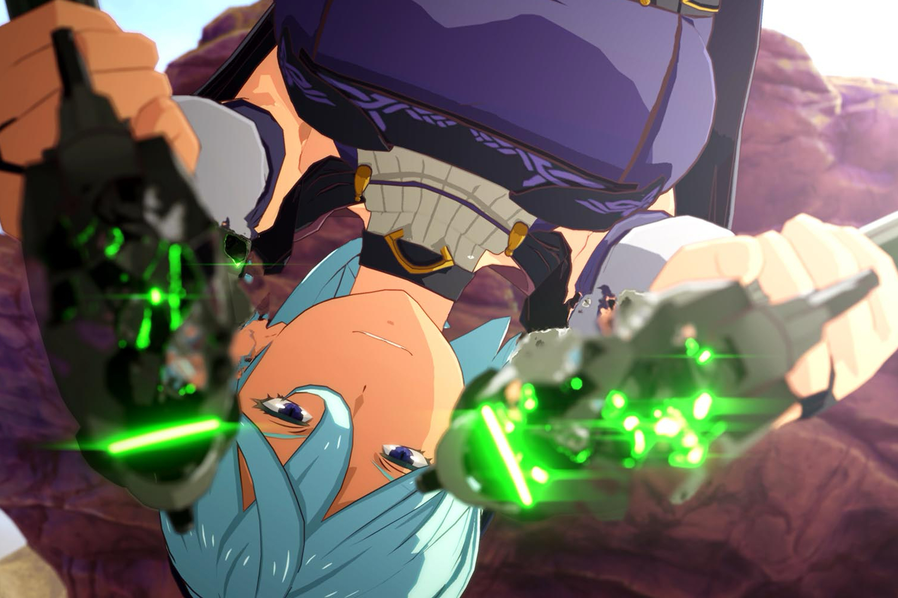

+++
title = "Blue Protocol ne sortira pas dans le reste du monde, et fermera au Japon"
date = 2024-08-29T09:00:32+01:00
draft = false
author = "Mickael"
tags = ["Actu"]
image = "https://nostick.fr/articles/vignettes/aout/blue-protocol.jpg"
+++

Malgré le succès initial de *Blue Protocol* au Japon, Bandai Namco a décidé d'arrêter les frais pour son MMO, aussi bien au Pays du Soleil-Levant que partout dans le monde. Le jeu devait sortir par chez nous l'an dernier, peu de temps après le Japon, puis en juin 2024, avant que le studio n'en repousse le lancement international indéfiniment. Finalement, c'est carrément la fin des haricots pour le jeu service qui fermera définitivement ses portes le 18 janvier 2025.

 

*Blue Protocol* devait être publié en Europe et aux États-Unis par Amazon Games. Bandai Namco [s'excuse](https://www.playblueprotocol.com/fr-ca/news/articles/the-future-of-blue-protocol) platement pour cette annonce inattendue, et dit que les équipes sont déçues de ne pas pouvoir lancer le jeu partout dans le monde. « *Nous savions qu'il y avait une grande attente pour Blue Protocol depuis l'annonce initiale* », mais voilà, « *nous sommes arrivés à la conclusion qu'il ne sera pas possible de fournir un service qui vous satisfasse tous* ».

On ignore la ou les raisons particulières qui expliquent l'arrêt complet de la machine. *Blue Protocol* a pourtant connu un gros démarrage au Japon en juin 2023, avec 600 000 joueurs au lancement, et 200 000 joueurs simultanés. C'est d'autant plus étonnant que, comme le rappelle *[GamesRadar+](https://www.gamesradar.com/games/mmo/bandai-namco-mmo-blue-protocol-has-been-outright-canceled-because-it-will-not-be-possible-to-provide-a-service-that-satisfies-players/?utm_source=substack&utm_medium=email)*, le titre avait été présenté aux journalistes occidentaux l'an dernier. Il semble bien que les performances de *Blue Protocol* n'aient pas été [au rendez-vous](https://www.siliconera.com/blue-protocol-reportedly-underperforming-for-bandai-namco/) pour Bandai Namco, en termes financiers s'entend.

 

Pour les joueurs ayant investi des deniers dans le jeu, il n'y aura pas de remboursement de la monnaie du jeu encore en leur possession (Rose Orbs) ; pour se faire pardonner, l'éditeur leur refilera 5 000 de ces orbes chaque mois, de septembre à janvier, histoire d'acheter des cosmétiques. Le battle pass sera aussi gratuit… Une maigre consolation.

