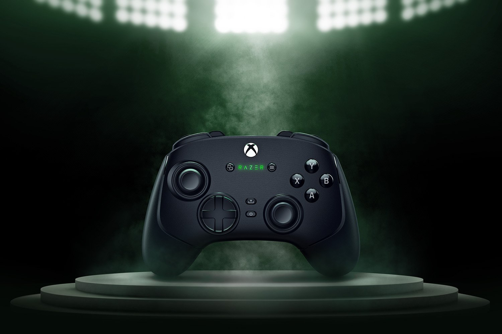
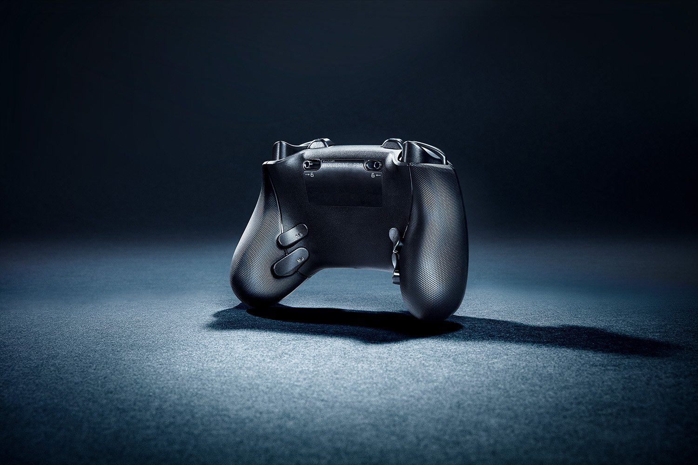

+++
title = "La nouvelle manette Razer n'est pas pour les joueurs à la petite semaine"
date = 2024-08-29T10:07:32+01:00
draft = false
author = "Mickael"
tags = ["Actu"]
image = "https://nostick.fr/articles/vignettes/aout/razer-Wolverine-v3-Pro.jpg"
+++

Quand on joue, c'est pas pour faire les malins. Pas question d'utiliser des manettes Fisher Price alors qu'on a toute la pression du monde sur les épaules dans *LoL* ou *Dota 2* (perso, je suis plus [Peglin](https://store.steampowered.com/app/1296610/Peglin/) mais chacun son truc). Razer a bien entendu les cris de douleur des joueurs pro en lançant la [Wolverine v3 Pro](https://www.razer.com/fr-fr/console-controllers/razer-wolverine-v3-pro). Mais pourquoi diable choisir cette manette (dédiée PC et Xbox) plutôt qu'une autre ?

 

Déjà, une manette qui s'appelle « Wolverine », c'est plutôt classe et badass. Et puis il y a « pro » dans le nom, alors tout de suite ça en impose. Mais plus sérieusement, la manette est la première du genre chez Razer à embarquer des sticks à effet Hall immunisés contre la maladie du drift. Deux types de capuchons sont d'ailleurs disponibles.

La Wolverine intègre aussi 6 boutons reconfigurables (4 palettes à l'arrière, plus 2 boutons poussoir). Des verrous permettent de modifier le comportement de déclenchement des gâchettes et simuler les clics de souris. À l'avant, la croix directionnelle et les boutons d'action calqués sur la disposition Xbox bénéficient de microswitches rapides et d'une membrane en caoutchouc.

Évidemment, tout cela ne servira à rien si la connexion entre la manette et le PC (ou la Xbox) est médiocre. Razer fournit un dongle USB-A avec connexion sans fil sur la bande des 2,4 GHz. Il est aussi possible de jouer en filaire, ce qui déverrouille un mode « tournoi » pour jouer avec un polling rate — la fréquence à laquelle on envoie sa position au PC — de 1 000 Hz. Ah, ça rigole moins.

Ce qui rigole moins aussi, c'est le prix : la manette revient à 230 €… Une version uniquement filaire est aussi proposée au prix de 120 €.

