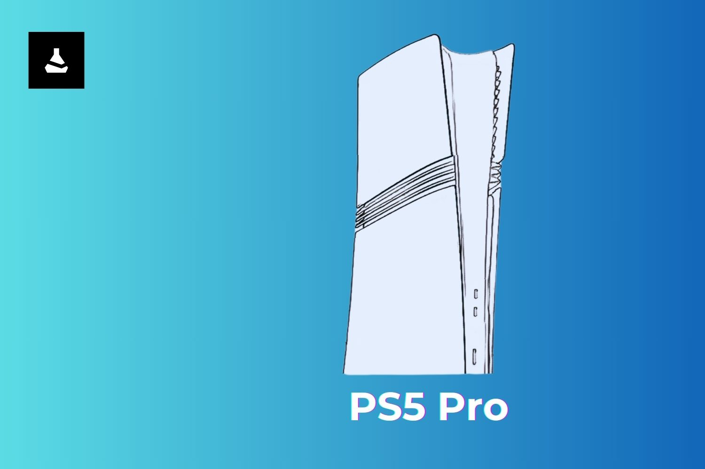

+++
title = "La PS5 Pro ressemblera beaucoup à la PS5 Slim"
date = 2024-08-29T10:47:32+01:00
draft = false
author = "Mickael"
tags = ["Actu"]
image = "https://nostick.fr/articles/vignettes/aout/PS5-Pro.jpg"
+++

On n'aura jamais été aussi proche du lancement de la PS5 Pro ! Et en attendant que Sony déballe son sac, c'est Bilbil-kun — dont les fuites tombent juste 100 % du temps — qui nous [livre](https://www.dealabs.com/magazine/voici-le-nom-le-design-de-la-nouvelle-console-de-playstation-avec-plein-dautres-details-inedits-59094) quelques infos de première main… ainsi qu'une idée du design. D'après les croquis partagés par le fuiteur, la PS5 Pro (ce qui devrait être le nom officiel de la console, sans surprise) ressemblera pas mal à la version « slim » en un peu plus épaisse.

La façade extérieure serait blanche, et on devrait y retrouver  2 ports USB-C et le bouton d'alim'. Il y a aussi trois bandes noires au centre de la façade, au lieu d'une seule. Néanmoins, les façades conçues pour la PS5 Slim pourraient être réutilisables sur la PS5 Pro.

Cette PS5 Pro vient sans lecteur de disque, comme la PS5 Slim édition numérique. Bilbil-kun ne peut pas affirmer qu'il sera possible d'installer le lecteur optique amovible, comme c'est le cas de la Slim mais selon lui, ça devrait être possible. Le fuiteur indique aussi que la nouvelle console sera fournie avec une manette DualSense aussi blanche que standard.

Enfin, la date de lancement : première quinzaine du mois de septembre ! Chaque jour qui passe nous rapproche de la bête… Quant à la liste des caractéristiques techniques, [elle est un peu connue également](https://nostick.fr/articles/2024/avril/1704-meilleur-gpu-optimisation-ray-tracing-bientot-une-ps5-pour-les-pros/).