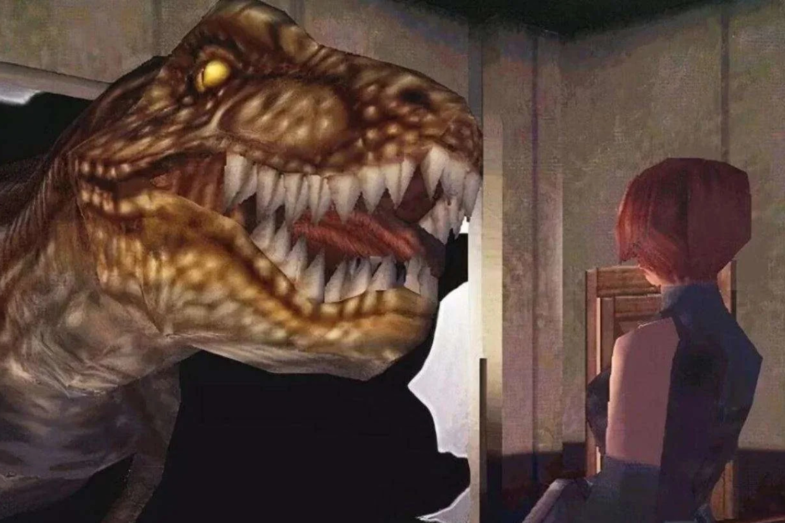

+++
title = "Ne rêvez pas, Dino Crisis ne reviendra pas"
date = 2024-08-30T06:02:32+01:00
draft = false
author = "Mickael"
tags = ["Actu"]
image = "https://nostick.fr/articles/vignettes/aout/dino-crisis.jpg"
+++

Vous pouvez bien réclamer encore et encore un nouveau jeu *Dino Crisis* : Capcom n'est toujours pas décidé à céder à la demande populaire. Même le créateur du jeu (et de *Resident Evil*) Shinji Mikami ne comprend pas l'engouement autour de la saga qui a connu son heure de gloire au début des années 2000 : « *Je suis vraiment surpris de voir [cet enthousiasme]* », affirme-t-il à *[Eurogamer](https://www.eurogamer.net/no-space-for-dino-crisis-when-monster-hunter-exists-says-shinji-mikami)*.

 

Pour lui, l'ADN de *Dino Crisis* se retrouve dans *Monster Hunter*. « *La magnificence des dinosaures et les choses que l'on peut faire avec ont été en quelque sorte vraiment bien exploitées par Monster Hunter ces dernières années* », explique-t-il. Par conséquent, l'hypothèse d'un remake ou un nouveau jeu *Dino Crisis* ne tient pas la route : « *je ne pense pas vraiment qu'il y ait beaucoup de place pour ce genre de jeu en ce moment, simplement parce que Monster Hunter est devenu un jeu si important* ».

Capcom a déjà essayé de faire appel à l'amour des fans pour les dinos avec *Exoprimal*, un shooter multi dans lequel il fallait faire la misère à des créatures préhistoriques. La sauce n'a pas pris, ce qui a peut-être découragé l'éditeur de remettre une pièce dans *Dino Crisis*. Pour Shinji Mikami, le concept d'*Exoprimal* était de toute façon « *assez différent* » de *Dino Crisis*. « *Je suppose que les fans avaient des attentes, mais voilà où nous en sommes* », conclut-il.

Le dernier épisode de la saga remonte à 2003, et depuis *Dino Crisis* fait régulièrement partie des jeux Capcom que les fans [placent](https://captown.capcom.com/en/super_elections/1) en tête des sondages de popularité (avec *Devil May Cry* et c'est quand tu veux Capcom pour un nouvel épisode).