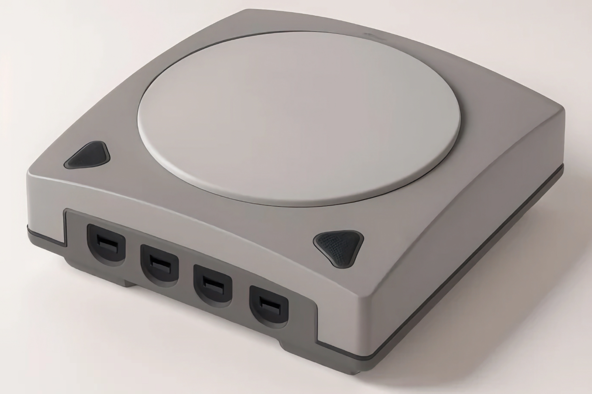
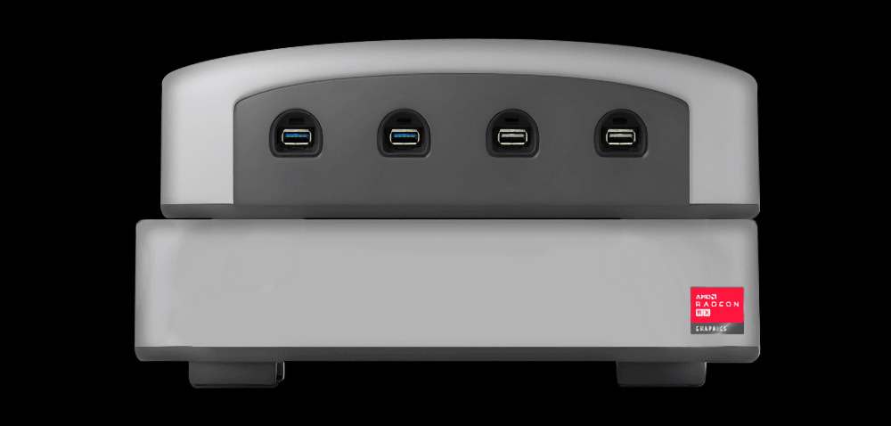

+++
title = "EmuDeck lance des consoles rétro mais pas données"
date = 2024-08-30T06:20:32+01:00
draft = false
author = "Mickael"
tags = ["Actu"]
image = "https://nostick.fr/articles/vignettes/aout/em1-emudeck.jpg"
+++

Les fans de rétro-gaming savent bien qu'une grande partie du plaisir à émuler de vieux jeux repose sur la configuration, histoire de s'assurer que tel jeu tourne au petit poil. Cette satisfaction masochiste, parfois plus importante que le jeu en lui-même, est aussi un repoussoir pour bon nombre de joueurs pas forcément versés dans l'art délicat et souvent occulte de la bidouille.

C'est pourquoi EmuDeck se lance dans le matos ! La plateforme logicielle qui simplifie l'installation et la gestion d'émulateurs commercialise sur [Indiegogo](https://www.indiegogo.com/projects/emudeck-machines-retro-emulation-console-pc#/) un boîtier au design clairement inspiré de la Dreamcast, équipé de quatre ports USB-A en façade, des ports USB-C et Ethernet 2,5 Gbps à l'arrière, et de tout ce qu'il faut à l'intérieur pour émuler à peu près n'importe quelle console.

L'EM1 (EmuDeck Machine) embarque un processeur Intel N97, 8 Go de RAM, 512 Go de SSD, ainsi que le Wi-Fi 5. L'appareil fonctionne avec [Bazzite](https://bazzite.gg/), un système d'exploitation qui ressemble pas mal à SteamOS ; et bien sûr, EmuDeck est préinstallé. Le principe, c'est de ne pas s'embêter à configurer son PC : il suffit de glisser ses ROMs et bim.

Plutôt intéressant donc, jusqu'à ce qu'on jette un œil au prix de la bête : 399 € pour l'Europe. Alors certes, la console est fournie avec une manette (une [Nova Lite](https://www.gamesir.hk/products/gamesir-nova-lite?srsltid=AfmBOoorZzy70Zx_cWLs15PQuSMW9N35zqk3Ino6jLzl7nTsw1UQi9ce) de Gamesir), mais c'est vrai que ça commence à faire un peu cher, surtout qu'en face [on peut toujours installer RetroArch sur une Apple TV](https://nostick.fr/articles/2024/mai/1705-apple-tv-retroarch/) ! Les premières livraisons devraient avoir lieu en décembre.

DragoonDorise, le project lead des EmuDeck Machines, [explique](https://www.reddit.com/r/EmuDeck/comments/1f44lgx/comment/lkj6k61/) sur Reddit que la marge réalisée sur chaque unité vendue est de 50 $ et qu'« *il n'essaie pas de devenir riche* ». Il n'est même pas certain de rentabiliser le projet.

EmuDeck ne va pas s'arrêter en si bon chemin : un modèle EM2 plus puissant est dans les tuyaux, avec un Ryzen 8600G, 16 Go de RAM et le Wi-Fi 6. Ce modèle sera capable de faire tourner des jeux AAA avec de bonnes performances en 1080p (60 FPS sur *Cyberpunk 2077* avec le FSR, la démo de *FFXVI* à 45 FPS…). Ça n'est malheureusement pas donné : comptez 759 € pour ce modèle.

Un dock intégrant une Radeon 7600 est aussi prévu pour doper les perfs et faire de l'EM2 une véritable petite machine pour tous les jeux, rétro ou pas. La conception du périphérique débutera dès que l'objectif de la campagne aura été atteint.