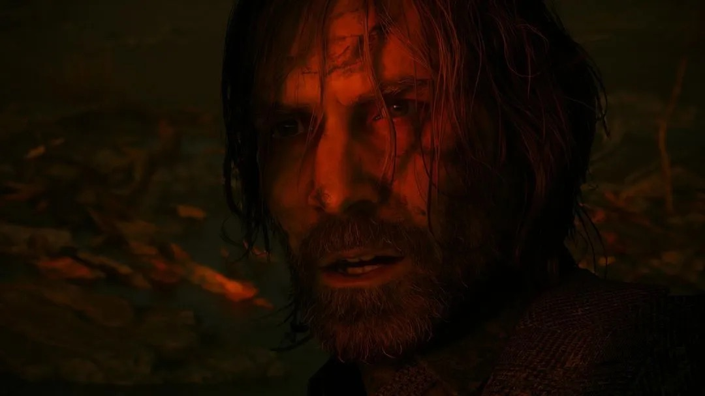

+++
title = "Annapurna et Remedy s’associent pour adapter Control et Alan Wake sur grand écran"
date = 2024-08-30T11:30:32+01:00
draft = false
author = "Félix"
tags = ["Actu"]
image = "https://nostick.fr/articles/vignettes/aout/xdefiant.jpg"
+++

 

La société de production des cool kidz d’Annapurna, à qui l’on doit un paquet [de bons films](https://en.wikipedia.org/wiki/Annapurna_Pictures#Filmography) (*The Master*, *Her*) et de [bons jeux](https://en.wikipedia.org/wiki/Annapurna_Interactive#Games_published) (*Stray*, *Kentucky Route Zero*) va s’associer à Remedy pour développer ses licences sur d’autres supports. Elle va ainsi co-financer *Control 2* et gagne au passage le droit d’en produire une adaptation au cinéma ou à la TV. Même chose pour Alan Wake, qui va avoir droit à des adaptations cross média.

Le projet d’adapter les licences Remedy sur grand écran n’est pas étonnant, et Annapurna n’en est pas à son coup d’essai dans le portage de JV vers le cinéma : la boîte travaille en ce moment sur un film d’animation basé sur *Stray*. « *Cet accord avec Remedy ne concerne pas seulement l'adaptation de grands jeux, il s'agit aussi d'innover dans la manière dont les entreprises peuvent collaborer* », a [déclaré](https://www.remedygames.com/article/remedy-and-annapurna-announce-a-strategic-cooperation-agreement) le boss d’Annapurna Interactive, qui a récemment quitté son poste de cadre chez Epic. « *Nous sommes ravis de partager leur travail avec un public encore plus large en portant les univers de Control et d'Alan Wake au cinéma, à la télévision et au-delà* ».

Le communiqué reste bien mystérieux et ne donne pas d’indice sur ce que seront concrètement ces adaptations. Le deuxième opus d’*Alan Wake* mettait fortement l’accent sur les passages en FMV : voire la licence arriver au cinéma semble donc plutôt logique. Remedy a toujours aimé faire fumer les méninges des joueurs avec ses histoires brouillant la frontière entre fiction et réalité, et les scénaristes vont pouvoir s’en donner à cœur joie. Peut-être une série basée sur *Night Springs*, elle-même très inspirée de *La Quatrième dimension* ? On attend de voir.

Remedy profite de son communiqué pour rassurer les fans de *Control* : le studio explique qu’il va pouvoir créer ce second volet « *exactement comme elle l’entend* » étant donné qu’Annapurna couvrira 50 % des frais. Un deal similaire avait été trouvé pour *Alan Wake 2* avec Epic, qui avait de son côté gagné une jolie exclusivité pour son Games Store. Les joueurs ne devraient pas avoir à se coltiner le lanceur pour *Control 2*, Remedy affirmant pouvoir publier son titre en auto-édition. « *L'équipe de développement travaille à plein régime sur le jeu* » et sur son spin-off multi *Condor*, précise le communiqué avant d’inciter à patienter pour plus de détails.

