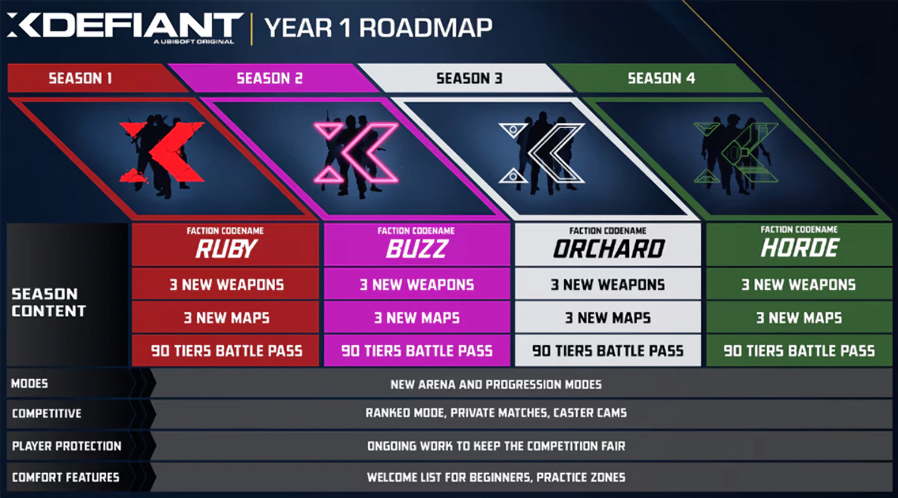

+++
title = "Ce serait déjà compliqué pour XDefiant, le nouveau shooter d'Ubisoft"
date = 2024-08-30T07:47:32+01:00
draft = false
author = "Mickael"
tags = ["Actu"]
image = "https://nostick.fr/articles/vignettes/aout/xdefiant.jpg"
+++

Ça ne sent pas très bon pour *XDefiant*, le shooter multi d'Ubisoft. Le jeu free-to-play, lancé en mai dernier, a pourtant connu un démarrage canon en dépassant le million de joueurs durant ses premières heures, du jamais vu pour l'éditeur. Et la première semaine, il engrangeait rien moins que 8 millions de joueurs.

 

Mais les choses se sont manifestement très vite tassées et désormais, Ubisoft mettrait la pression sur son studio de San Francisco — d'où le jeu est originaire — pour redresser la barre. La saison 3 serait même qualifiée de saison de la dernière chance pour éviter une charrette de licenciements, croit savoir *[Insider-Gaming](https://insider-gaming.com/xdefiant-player-numbers-2/)* !

Pourtant, *XDefiant* avec ses factions inspirées des grandes franchises d'Ubisoft avait contribué au succès du premier trimestre fiscal de l'entreprise, ce qui laissait présager le meilleur. Mais le nombre de joueurs aurait chuté, il serait difficile de maintenir 20 000 amateurs en simultané sur toutes les plateformes — ce qui, [à l'échelle de *Concord*](https://nostick.fr/articles/2024/aout/2408-concord-se-crashe-au-decollage/), est certes énorme, mais le jeu d'Ubisoft semblait beaucoup mieux parti. Autre souci : les joueurs ne dépenseraient pas suffisamment en cosmétiques et autres idioties.

La saison 3 sera donc surveillée de très près. Elle devrait apporter deux maps tirées d'*Assassins Creed Odyssey* et *Valhalla*… Peut-être de quoi relancer l'intérêt des joueurs, du moins s'ils ne se sont pas plongés dans *Black Ops 6*, cette saison devant tomber quelques semaines après le nouvel épisode de *Call of Duty*. Rude concurrence. La saison 2 devrait tomber le 23 septembre.