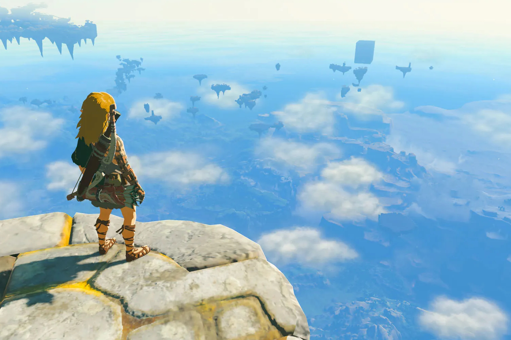

+++
title = "Breath of the Wild et Tears of the Kingdom sont à part dans la grande timeline de Zelda"
date = 2024-08-31T15:47:32+01:00
draft = false
author = "Mickael"
tags = ["Actu"]
image = "https://nostick.fr/articles/vignettes/aout/tears-kingdom-zelda.jpg"
+++

Nintendo a scellé le débat qui faisait rage depuis 7 ans chez les historiens de *Zelda* : où donc placer *Breath of the Wild* et donc de sa suite, *Tears of the Kingdom* dans la grande chronologie de la saga ? Le constructeur a enfin donné une réponse qui ne satisfera probablement pas grand monde : les deux jeux vivent tout simplement à l'écart des autres titres.

C'est la [découverte](https://x.com/vooksdotnet/status/1829702008322097308) du site *Vooks*, qui participait à l'événement Nintendo Live 2024, en Australie. Nintendo y a affiché la timeline de la légende de Zelda et les deux derniers épisodes sont séparés du reste. On retrouve d'ailleurs cette même séparation sur la frise chronologique du [site japonais](https://www.nintendo.com/jp/character/zelda/en/history/index.html) officiel consacré à *Zelda* (mais il n'y a encore rien sur le [site occidental](https://zelda.nintendo.com/about/)). Bref, nous voilà bien avancés !

L'histoire d'Hyrule débute avec *Skyward Sword* et enquille *Minish Cap*, *Four Sword* et *Ocarina of Time*. La timeline se divise ensuite en deux : le héros a été vaincu (*A Link to the Past*, *Link's Awakening*… et ça se termine avec *Zelda II*) ou s'il a remporté la victoire. Dans ce dernier cas, on enchaîne sur un autre embranchement : l'ère de l'enfance (*Majora's Mask*, *Twilight Princess*, *Four Swords Adventures*) et l'ère adulte (*The Wind Waker*, *Phantom Hourglass* et *Spirit Tracks*). 

Un beau bordel donc, que les deux derniers open world ne vont pas arranger ! À moins qu'il s'agisse pour Nintendo de rebooter la saga — auquel cas, le prochain *Echoes of Wisdom* pourrait bien intégrer cette nouvelle branche…