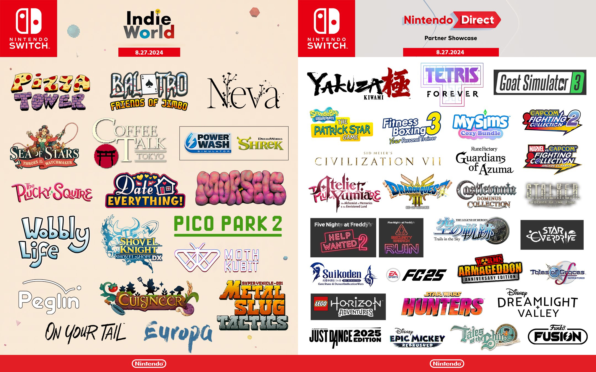

+++
title = "On vide le backlog de la semaine : Doom, Switch, Final Fantasy, Astro Bot…"
date = 2024-08-31T02:30:32+01:00
draft = false
author = "Mickael"
tags = ["XXL"]
image = "https://nostick.fr/articles/vignettes/aout/zelda.jpg"
+++

.")

L’actualité du jeu vidéo ne s’arrête pas à la poignée d’articles publiés sur *Nostick* ! Histoire de rattraper le retard accumulé, voici un retour rapide sur quelques unes des infos les plus importantes (ou insignifiantes) de la semaine.

## La vidéo de la semaine : Doom tourne aussi dans une IA



Ce n'est probablement pas aussi spectaculaire que sur une [brosse à dent connectée](https://www.reddit.com/r/itrunsdoom/comments/1b2lgxw/doom_runs_on_wifi_toothbrush_without_hardware_mods/) ou une [lampe Ikea](https://www.slashgear.com/ikea-tradfri-smart-lamp-can-sort-of-run-doom-15678171/), mais tout de même : Google, DeepMind et l'université de Tel Aviv sont parvenus à faire tourner *Doom* (le seul, l'unique) dans… un modèle neuronal.

Vous allez me dire : gné ? Et vous auriez bien raison. Mais [GameNGen](https://gamengen.github.io/?ref=404media.co) a tout de même de l'allure. Ce moteur de jeu entièrement propulsé par un modèle neuronal permet des interactions en temps réel « *avec un environnement complexe sur de longues trajectoires* », le tout en très bonne qualité — toutes proportions gardées.

GameNGen a été entraîné sur des séquences de gameplay de *Doom* pour générer les images du jeu en temps réel. Le moteur prédit chaque nouvelle image en se basant sur les images précédentes et les actions du joueur, recréant ainsi l'« expérience » de jeu. Essentiellement, GameNGen remplace le code traditionnel par un modèle d'IA qui « imagine » ce que devrait être la prochaine image en fonction du contexte du jeu !

C'est parfois poussif avec des séquences qui ne dépassent pas les 20 images par seconde, la qualité visuelle peut laisser à désirer tout comme certaines animations. Mais, pour le meilleur comme pour le pire, cette forme d'intelligence artificielle pourrait — le conditionnel est de mise — laisser entrevoir un développement des jeux complètement différent de ce que l'on connait aujourd'hui.

## La bonne nouvelle de la semaine : Square Enix veut plus de Final Fantasy sur Xbox

Les bonnes nouvelles pour Xbox ne sont pas si nombreuses, alors ne boudons pas notre plaisir : Square Enix a les consoles de Microsoft sur son radar ! Il y a déjà eu l'arrivée de *Final Fantasy XIV* en mars, 14 ans (!) après la sortie du MMORPG sur Windows. 

Naoki Yoshida, producteur et directeur du jeu, a convenu auprès d'*[Eurogamer](https://www.eurogamer.net/square-enix-to-further-deepen-the-relationship-with-xbox-gamers-says-final-fantasy-14s-naoki-yoshida)* que l'attente avait été bien longue pour les joueurs Xbox, mais il se dit aussi ravi des retours et de l'accueil de la communauté.



*FFXIV* va servir à renforcer les liens avec les joueurs de la team green, affirme-t-il, « *nous aimerions en tirer le meilleur parti, et approfondir encore davantage la relation avec les joueurs Xbox à l'avenir* ». Voilà qui est prometteur, la saga ayant consciencieusement évité la Xbox avec *FFXV* et *FFXVI*.

Les relations entre Xbox et Square Enix se sont réchauffées ces dernières années, avec en point d'orgue l'annonce du nouveau partenariat entre les deux entreprises l'an dernier. Phil Spencer et Naoki Yoshida, réunis à Las Vegas pour le Final Fantasy XIV Fan Fest, s'étaient couverts d'éloges, laissant entrevoir un avenir radieux pour la saga sur Xbox.

Les développeurs japonais ne s'intéressent guère à la Xbox, et pour cause : le marché nippon est trusté par Sony et Nintendo. « *Naturellement, en tant que développeurs japonais, nous voulons que beaucoup de personnes dans notre pays jouent à nos jeux* », explique Yoshida. La Xbox ne fait donc pas partie des priorités. Du moins jusqu'à présent.

Le producteur rappelle que Square Enix a changé sa politique et que l'entreprise a adopté une « *politique de sortie de nos jeux sur plusieurs plateformes* ». Avec *FFXIV* comme point de départ, « *nous voulons sortir davantage de jeux Square Enix sur Xbox, et il y aura plus de nos titres qui seront disponibles sur cette plateforme* ».

Ces déclarations cadrent bien avec celles d'Hiroshi Takai, le directeur de *Final Fantasy XVI* qui sortira le 17 septembre sur PC, après 15 mois d'exclusivité PS5. Il disait la semaine dernière son espoir de [voir les prochains épisodes de la saga proposés sur toutes les plateformes](https://nostick.fr/articles/2024/aout/2408-backlog-semaine/#la-bonne-nouvelle--les-futurs-final-fantasy-pour-tous-) en même temps. Sur Xbox aussi ? Ça en prend le chemin.

## La grosse info de la semaine : le cœur de la Switch bat toujours

Pour une console qui a un pied dans la tombe, la Switch a démontré qu'elle en avait encore sous la pédale ! Les deux événements Nintendo de la semaine, [l'Indie World](https://nostick.fr/articles/2024/aout/2708-ce-quil-faut-retenir-indie-world-showcase/) et [le Partner Showcase](https://nostick.fr/articles/2024/aout/2708-yakuza-kiwami-star-overdrive-atelier-yumia-capcom-castlevania/), ont réservé quelques surprises et confirmé que la console pouvaient encore sans trop de problèmes tirer à la ligne quelques mois de plus sans honte.

Alors évidemment, la Switch vit largement en dehors de ce qui fait l'actualité sur les autres consoles. Capcom ne va pas s'aventurer à annoncer *Monster Hunter Wild* ; *Black Myth: Wukong* ne tribulera pas sur la Switch ; et la rumeur voulant que *Call of Duty* fasse son grand retour est tombée à l'eau. Il y a aussi pas mal de jeux annoncés durant les deux showcases qui sont multiplateforme, même si certains restent exclusifs à la console hybride comme *Star Overdrive* (pour quelques mois, certes), ou *MySims: Cozy Bundle*.

Durant ses derniers mois de carrière, la Switch est surtout devenue la reine des remakes et des compiles. Les vieux de la vieille seront heureux de retrouver les fonds de tiroir de Capcom, de Konami ou de Sega (avec *Yakuza Kiwami*) sur leur console portable. Et puis il ne faut pas oublier les jeux first party que Nintendo égrènera tout au long du deuxième semestre, à commencer par *Zelda: Echoes of Wisdom* le 26 septembre, *Super Mario Party Jamboree* le 17 octobre, ou encore *Mario & Luigi : L'Épopée fraternelle* le 7 novembre.

Ceux qui attendent l'artillerie lourde devront prendre leur mal en patience. Les *Mario Kart 9*, *Super Mario Odyssey 2* et autres *ARMS 2* (OK je rigole) ne seront pas annoncés avant la Switch 2, dont l'annonce est prévue avant la fin mars 2025. Et pourquoi pas dès septembre ? Il se murmure que si Nintendo a décidé de coller deux showcases l'un avec l'autre, c'est pour pouvoir organiser un Direct consacré à la prochaine console le mois prochain !

L'idée n'est pas complètement farfelue : pourquoi Capcom aurait annoncé une nouvelle compile de jeux de baston (*Capcom Fighting Collection 2*) avant même de mettre en ligne la prochaine (*MARVEL vs. CAPCOM Fighting Collection*) le 12 septembre ? Peut-être que le Partner Showcase était prévu *après* cette date, mais Nintendo aurait décidé de se laisser le champ libre pour une présentation de la Switch 2 en bonne et due forme… Quoi qu'il en soit, la commercialisation risque de [prendre encore plus de temps](https://nostick.fr/articles/2024/aout/1408-nintendo-switch-avril-mai-2025/) !

## La mauvaise nouvelle de la semaine : pas d'Astro Bot pour la PSVR2

*Astro Bot* est né dans le chaudron de la réalité virtuelle : la première aventure du petit robot, *Astro Rescue Mission*, s'est jouée sur le PSVR premier du nom ! De fait, les possesseurs de PSVR2 étaient nombreux (enfin nombreux… on se comprend) à espérer un signe de bonne volonté de Sony, sachant que *Astro's Playroom*, fourni en bundle avec la PS5, n'est pas un jeu VR.



Las ! *Astro Bot*, qui sort le 6 septembre, ne proposera rien non plus pour la PSVR2. Nicolas Doucet, le directeur créatif de la Team Asobi, a définitivement douché les derniers espoirs en affirmant qu'il n'y avait « *aucune chance* » pour qu'*Astro Bot* soit jouable avec le casque de 2e génération. 

*Astro Bot* a été conçu « *pour un médium différent* », a-t-il expliqué auprès de *[MinnMax](https://www.youtube.com/watch?v=MoUq073Pp7I)*, « *ce serait un jeu différent* » s'il devait rouler sur le PSVR2. Le titre sera donc cantonné aux écrans plats, et exclusivement. Sony n'a pas eu beaucoup de bonnes nouvelles pour ses clients PSVR2 ces derniers temps ; les investissements pour [financer des jeux VR seraient au point mort](https://nostick.fr/articles/2024/juin/2106-sony-sapin-psvr2/), et la toute nouvelle compatibilité PC du casque laisse présager une lente sortie de l'orbite de PlayStation.

Et *Astro Bot* pour PC ? Nicolas Doucet ne ferme pas la porte, mais il veut savoir si un portage intéresserait les joueurs PC ! Je ne veux pas trop m'avancer mais OUI BON SANG DE BOIS.

## On n'a pas eu le temps cette semaine mais on pense à eux



*The Legend of Zelda: Echoes of Wisdom* a tout du jeu de l'année pour Nintendo, et la dernière présentation vidéo du monde du Néant laisse présager du meilleur ! On peut y voir Zelda explorer l'intérieur des failles qui ravagent Hyrule, mais aussi quelques unes des capacités de la princesse… qui pourra finalement bien se servir d'une épée. Le jeu est programmé pour le 26 septembre, ce qui est beaucoup trop long.



*Visions of Mana* est à peine disponible que le studio japonais chargé du développement, Ouka, a reçu le baiser de la mort de la part du géant chinois NetEase, son propriétaire. Ce dernier [aurait](https://www.bloomberg.com/news/articles/2024-08-30/tencent-netease-rethink-japan-approach-as-game-strategy-stalls) l'intention de fermer le studio tout simplement, et en attendant la majorité des effectifs s'est fait montrer la porte de sortie. NetEase et Tencent, autre mastodonte chinois, voudraient réduire leurs investissements au Japon, qui ne rapporteraient pas autant qu'espéré.



Tout le monde a le droit de jouer (même moi qui suis un gros nullos), et Microsoft a pris l'adage au pied de la lettre en dévoilant cette semaine de nouveaux accessoires dédiés aux joueurs à mobilité réduite. Le [joystick adaptatif Xbox](https://www.xbox.com/fr-fr/accessories/controllers/xbox-adaptive-joystick), aux faux airs de Nunchuck (ou de télécommande), complète une manette traditionnelle avec quatre boutons, deux gâchettes et un stick, tout cela étant hautement configurable. Le prix tournera autour de 30 €, sortie prévue en 2025.

## osef

Keanu Reeves [fait](https://www.youtube.com/watch?v=qSu6i2iFMO0) la voix de Shadow dans le film *Sonic 3*.

## Dans le reste de l'actu déchaînée

- Ubisoft s'est soudainement rappelé qu'il avait la franchise *Heroes of Might & Magic* dans sa besace ! Un nouvel épisode du jeu de stratégie au tour par tour, *Olden Era*, est dans les tuyaux pour l'année prochaine. [Tous les détails par ici.](https://nostick.fr/articles/2024/aout/2608-heroes-of-might-magic-olden-era-ubisoft-2005/)
- Vous l'ignoriez peut-être, mais la Révolution française s'est faite à grands coups de mechas dans la tronche ! Enfin, c'est du moins ce qu'avance le jeu *Bonaparte: A Mechanized Revolution* qui sortira début 2025, [à découvrir dans cette actu](https://nostick.fr/articles/2024/aout/2608-bonaparte-a-mechanized-revolution-mechas/).
- Non, pas la peine de crier ou de taper le sol avec vos petits poings, *Crash Bandicoot 5* a été annulé ! Mais pourquoi ? Une passionnante vidéo détaille l'histoire de cette annulation. [C'est à voir par ici.](https://nostick.fr/articles/2024/aout/2708-activision-crash-bandicoot-5/)
- Vous nous connaissez maintenant, ce qu'on aime ici c'est le bourrin qui sent la sueur et l'essence. Avec *Fatal Run 2089*, remake/reboot d'un jeu Atari de 1990, [on devrait être servi](https://nostick.fr/articles/2024/aout/2708-fatal-run-2089-course-mort-atari/).
- *Foamstars* va devenir un jeu free-to-play ! C'est probablement ce qu'aurait dû faire Square Enix dès le début pour assurer à son clone de *Splatoon* un minimum de chance de s'en sortir. [C'est à lire par ici.](https://nostick.fr/articles/2024/aout/2808-foamstars-free-to-play/)
- Bouh ! Capcom a décidé d'imposer une connexion au web obligatoire pour ses trois *Resident Evil* sur iPhone, iPad et Mac. [Un DRM qui ne dit pas son nom…](https://nostick.fr/articles/2024/aout/2808-iphone-resident-evil-drm/)
- Après plusieurs reports, Bandai Namco et Amazon ont annulé purement et simplement la sortie de *Blue Protocol* dans le monde. Et la version japonaise va aussi fermer ! [C'est triste et c'est par là.](https://nostick.fr/articles/2024/aout/2908-blue-protocol-bandai-namco-amazon-games/)
- Les manettes ce n'est pas pour rigoler. Razer a lancé cette semaine la Wolverine v3 Pro pour PC et Xbox qui va parler aux joueurs les plus capés (et les plus fortunés). [Découverte par là.](https://nostick.fr/articles/2024/aout/2908-manette-razer-wolverine-v3-pro/)
- Et si la PS5 Pro était une PS5 Slim avec quelques composants plus puissants ? Ça en prend le chemin en tout cas, [à en croire cette fuite.](https://nostick.fr/articles/2024/aout/2908-ps5-pro-design-fuite/)
- Les joueurs PS5 ayant acheté plein pot l'accès anticipé à *Star Wars Outlaws* vont être quitte pour recommencer leur partie à cause d'un bug ! [On vous explique ça dans cette actu.](https://nostick.fr/articles/2024/aout/2908-certains-joueur-star-wars-outlwas-vont-devoir-recommencer-partie/)
- *Dino Crisis*, vous aimez ça ? Tant pis pour vous, il n'y aura pas de remake, de reboot ou de nouveau jeu. À la place, Capcom recommande *Monster Hunter*… qui n'a pas grand chose à voir. [Ragez par ici.](https://nostick.fr/articles/2024/aout/3008-dino-crisis-ne-reviendra-pas/)
- Évidemment, tous le monde aime le rétro-gaming, mais force est de constater que la processus de configuration n'est pas évident. EmuDeck se lance donc dans le matos avec une console sympa, mais peut-être un peu chère. [C'est à lire par là.](https://nostick.fr/articles/2024/aout/3008-emudeck-em1-console-retro/)
- *XDefiant* serait déjà sur la sellette. Le shooter multi d'Ubisoft a pourtant connu un démarrage canon, mais l'intérêt des joueurs aurait fortement chuté depuis. [Mais que se passe-t-il ?](https://nostick.fr/articles/2024/aout/3008-xdefiant-ubisoft-multi-difficile/)
- Avec l'aide d'Annapurna, le studio Remedy va pouvoir auto-éditer *Control 2* et lancer des adaptations télé et cinoche de *Control* et d'*Alan Wake* ! [Que de bonnes choses à lire dans cette actu.](https://nostick.fr/articles/2024/aout/3008-remedy-et-annapurna-sassocient-pour-des-adaptations/)