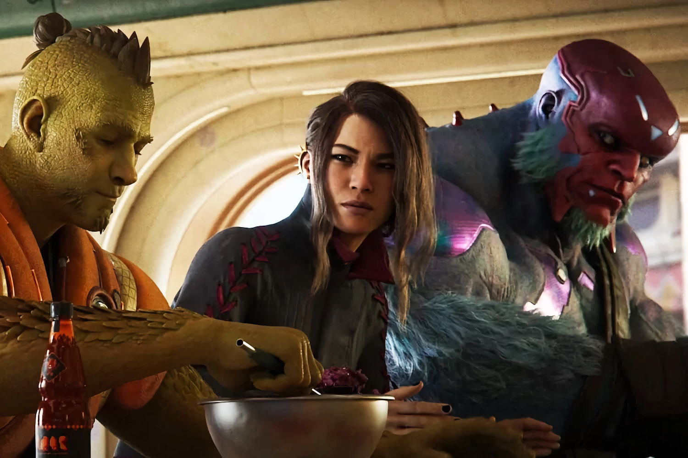
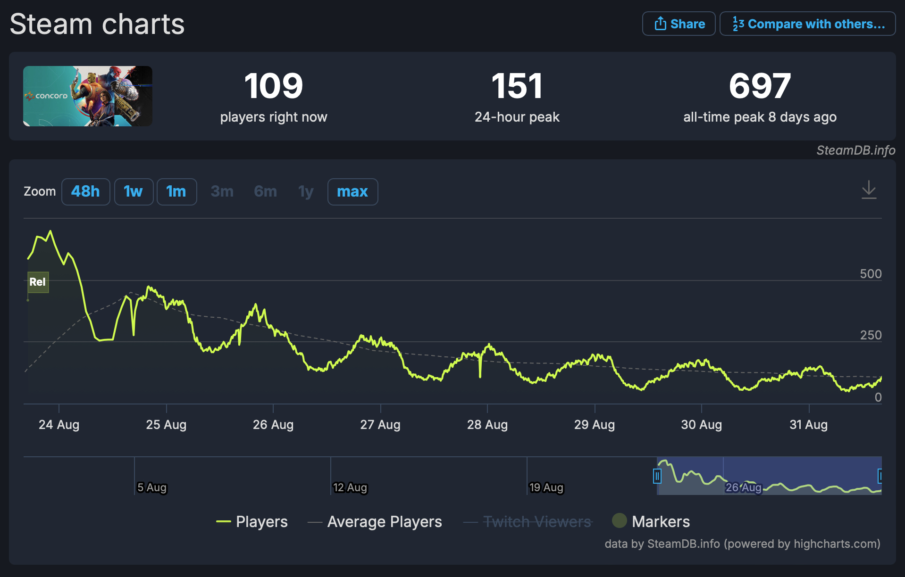

+++
title = "PlayStation aurait vendu 25 000 copies de Concord seulement"
date = 2024-08-31T12:47:32+01:00
draft = false
author = "Mickael"
tags = ["Actu"]
image = "https://nostick.fr/articles/vignettes/aout/concord.jpg"
+++

Même si c'est morbide et un peu dégueu, tout le monde aime regarder un crash au ralenti. Sauf le conducteur évidemment, et ici en l'occurrence c'est Sony qui doit probablement se mordre les coudes d'avoir mis autant d'argent pour s'offrir *Concord*. Depuis son lancement le 23 août dernier, 25 000 copies du hero shooter auraient été vendues, selon les estimations de l'analyste sérieux Simon Carless, reprises par *[IGN](https://www.ign.com/articles/concord-is-estimated-to-have-sold-only-25000-units-heres-why-analysts-think-its-failing)* : 10 000 copies sur Steam, 15 000 sur PS5.

Pour donner un ordre d'idée, *Redfall*, un des plus gros flops de 2023, se serait écoulé à 70 000 unités. Et *Gollum*, une des purges de l'an dernier, a vendu quelques centaines de copies en plus que *Concord*, selon *[VG Insights](https://vginsights.com/game/1265780)*. Évidemment, tous ces chiffres, y compris ceux du multi de Sony, sont à prendre avec les pincettes habituelles car le constructeur ne donnera aucun chiffre (si ce n'est les pertes probables engendrées par le jeu).

Néanmoins, les chiffres de *SteamDB* ne mentent pas : le plus grand nombre de joueurs simultanés sur *Concord* [n'a pas dépassé les 700](https://nostick.fr/articles/2024/aout/2408-concord-se-crashe-au-decollage/). Et actuellement, il y a une [centaine](https://steamdb.info/app/2443720/charts/) de joueurs qui se regardent en chien de faïence sur les serveurs. En termes de dollars gagnés, le résultat est tout simplement catastrophique : les ventes du jeu atteindraient péniblement le million de dollars. Et c'est sans compter les frais liés à la gestion des serveurs.

On ignore combien toute cette petite aventure a coûté à Sony, qui a financé non seulement le développement de *Concord*, mais aussi l'acquisition du studio Firewalk — manifestement, les dirigeants de PlayStation y croyaient dur comme fer ! Les estimations donnent une fourchette très large comprise entre 50 et 200 millions de billets verts. Dans tous les cas, les pertes sont considérables !

Les raisons de ce flop, peut-être le plus gros flop dans l'histoire du jeu vidéo, ont déjà été établies : le jeu est payant (40 $) alors qu'il aurait dû être free-to-play pour avoir une chance contre les autres cadors du secteur (*Overwatch*, *Fortnite*, *Apex*…) ; un marketing aux fraises et zéro pub pour le lancement ; des « héros » dont les designs  ne donnent pas très envie… 

*Concord* peut-il encore être sauvé ? On a déjà vu des lancements calamiteux pour des jeux qui ont fini par devenir des champions (*Cyberpunk 2077*, *No Man's Sky*), mais cela semble quand même compliqué pour le shooter multi. Basculer rapidement en freemium, lancer de nouveaux héros plus sexy, relancer la machine marketing… Mais Sony a-t-il encore envie d'investir à fonds perdus dans ce jeu ?

Alors oui, regarder un accident au ralenti c'est rigolo, mais on aurait presque de la peine pour Sony et pour Firewalk, chez qui on doit serrer les fesses pour éviter les licenciements.