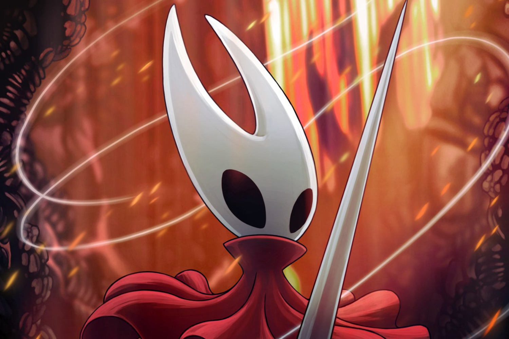
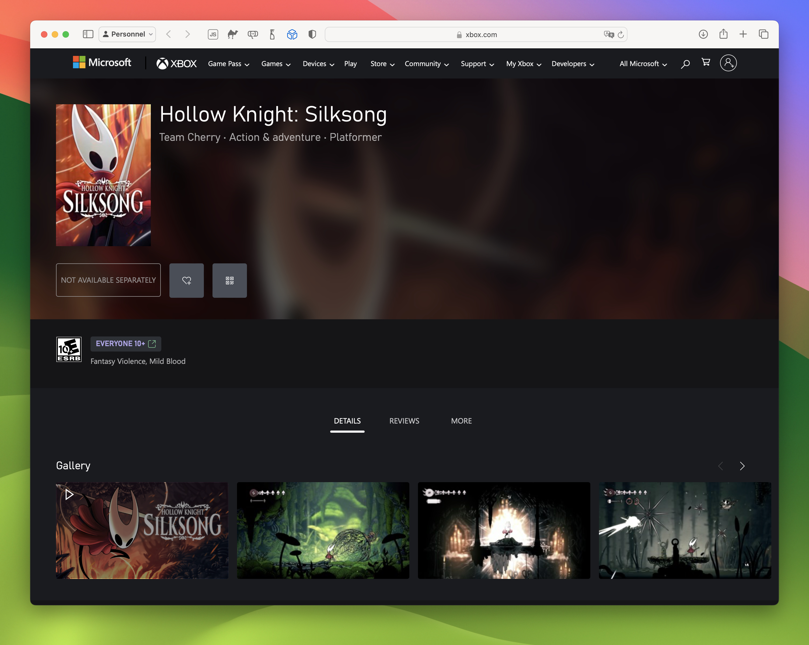

+++
title = "Allons bon, voilà des nouvelles de Hollow Knight: Silksong"
date = 2024-04-02T15:30:00+01:00
draft = false
author = "Mickaël"
tags = ["Actu"]
image = "https://nostick.fr/articles/2024/avril/0204-des-nouvelles-de-hollow-knight-silksong/HollowKnightSilksong-2.jpg"
+++ 

*Hollow Knight: Silksong* fait partie de ces jeux qui, à l'instar de *Metroid Prime 4*, ont un rond de serviette au club des vaporwares. [Annoncé](https://twitter.com/TeamCherryGames/status/1095979129432813569) en février 2019, soit deux ans après le lancement du titre original, cette suite du jeu de plateformes à haute teneur en metroidvania se fait depuis attendre, et à chaque fois que le studio Team Cherry donne des nouvelles, cela finit en moqueries.

L'apparition de *Hollow Knight: Silksong* dans la boutique Xbox — pour enregistrer le jeu dans sa liste de souhait — ce 1er avril n'a pas manqué de générer son lot de blague (d'abord parce que le 1er avril, forcément). Même les responsables de la plateforme prennent la nouvelle à la blague, comme Tao Silva, directeur marketing de Xbox, qui s'en est [amusé](https://twitter.com/taosila/status/1774886187511206356). Et mieux encore, le jeu a reçu les évaluations de plusieurs organismes de classification (l'ESRB, PEGI, USK…).

Allez, ce n'est pas bien méchant même si la crédibilité de Team Cherry en prend pour son grade ! Mais il sera beaucoup pardonné au studio (qui compte moins de 10 personnes) le jour où le jeu sera réellement disponible. Cet ajout au sein du Xbox Store pourrait être le signe que le développement va bon train, même si *Silksong* est aussi présent depuis un moment sur l'eShop, le PS Store, Steam et GOG.

 

Cette suite de *Hollow Knight* était à l'origine un simple DLC mettant à l'honneur Hornet, la princesse protectrice de Hallownest et un des personnages importants du premier jeu. Visiblement, il y a eu tellement de matière que les développeurs ont décidé d'en faire un jeu à part entière. On souhaite à *Silksong* un meilleur destin que *Duke Nukem Forever*, autre célèbre vaporware au lancement catastrophique !