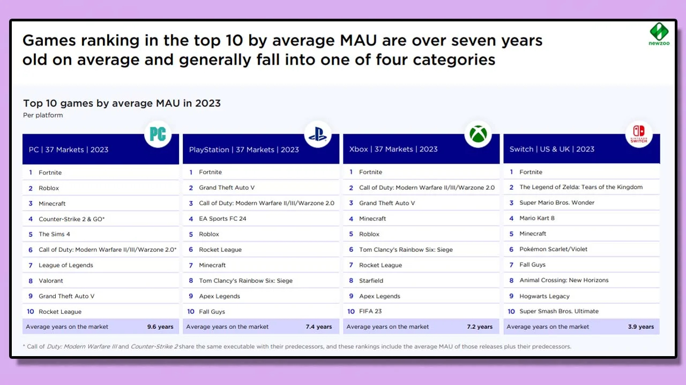

+++
title = "Les vieilles badernes ont toujours la cote chez les joueurs"
date = 2024-04-03T15:30:00+01:00
draft = false
author = "Mickaël"
tags = ["Actu"]
+++ 
 

2023 a été une année faste pour le jeu vidéo avec une tripotée de titres mémorables, aussi bien des triples A que des jeux indés. La nouvelle année est (un peu) plus calme sur ce front et franchement, personne ne s'en plaindra : on est loin d'avoir éclusé la production de l'an dernier. 

Mais malgré cette profusion de nouveautés toutes plus excitantes les unes que les autres, qu'ont fait les joueurs en 2023 ? 60 % d'entre eux se sont adonnés à des jeux vieux de six ans ou plus, d'après le [bilan annuel](https://newzoo.com/resources/trend-reports/pc-console-gaming-report-2024) de Newzoo ! *Fortnite*, *GTA V*, *League of Legends*, *Minecraft* et *Roblox* ont représenté à eux seuls 27 % du temps de jeu. 

 

Le top 10 des jeux les plus populaires en 2023 — en nombre de joueurs mensuels — ont même dépassé, en moyenne, les 7 ans d'âge. *Fortnite* (sorti en 2017) est premier sur toutes les plateformes, PC et consoles confondues. En mettant de côté le cas un peu particulier de la Switch, les jeux anciens que l'on retrouve en tête des classements sont soit des franchises annualisées comme *FIFA/EA Sports FC*, *Call of Duty*, *Madden*, soit du jeu service inondant les joueurs de nouveaux contenus pour maintenir leur engagement.

Seulement 8 % du temps de jeu enregistré l'an dernier se sont déroulés dans des nouveaux titres comme *Baldur's Gate III*, *Diablo IV* et autres *Tears of the Kingdom*. C'est grave docteur ? Disons que ce n'est pas une bonne nouvelle pour les éditeurs qui investissent des dizaines de million de dollars dans de nouveaux jeux qui doivent se faire une petite place au milieu de vieilleries rentabilisées depuis belle lurette.

Par contre, pour les joueurs dont le budget n'est pas extensible à l'infini, les nouveautés en flux continu apportées à ces « vieux » jeux permettent d'en profiter sans bourse délier… à moins de succomber aux délices des microtransactions. Le succès de ces titres, qui ont continué de cartonner l'an dernier malgré le nombre de prétendants au titre de jeu de l'année, explique aussi pourquoi les éditeurs continuent de pousser vers le jeu service : il suffit qu'il y en ait un qui rencontre son public pour gagner de l'argent pendant des années.