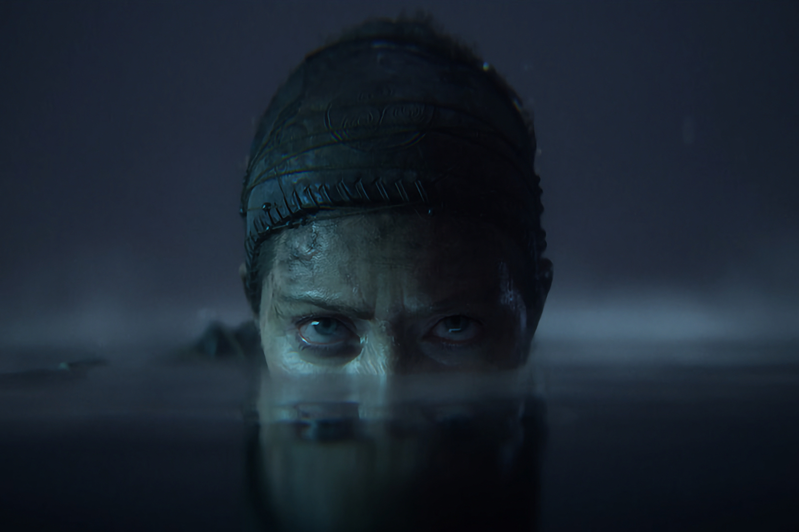

+++
title = "Les jeux trop longs sont trop longs !"
date = 2024-04-04T15:00:00+01:00
draft = false
author = "Mickaël"
tags = ["XXL"]
+++ 

 

Sérieusement, ça suffit les jeux qui durent 100 heures ou plus pour en venir à bout. Non, non et non, plus personne n'a le temps de ferrailler des nuits et des week-ends entiers pour voir le générique de fin d'un jeu ! L'industrie s'est lancée dans une course à l'échalote pour savoir qui aura la plus longue (durée de jeu) et franchement, c'est une tendance qui doit s'arrêter.

Rien que ce début d'année donne le vertige : entre *Yakuza 8*, *Final Fantasy 7 Rebirth*, *Palworld*, *Rise of Ronin*, *Dragon Dogma 2*, le dernier épisode en date de *Persona*, il faudrait plusieurs vies pour boucler toutes ces aventures. Qui a raisonnablement la possibilité d'abandonner famille, amis et travail pour parcourir ces mondes ouverts ? Et c'est bien dommage : en proposant des jeux plus ramassés, non seulement l'expérience serait plus concentrée, mais surtout les joueurs pourraient acheter plus d'un titre par an…

La bonne nouvelle, c'est que les éditeurs ont commencé à prendre  la mesure du problème. Comptez une dizaine d'heures pour la campagne de *Suicide Squad: Kill the Justice League*, idem pour *Hi-Fi Rush*, un peu moins de 20 heures pour *Alan Wake II*. *Assassin's Creed Mirage* offre lui aussi une vingtaine d'heures de crapahute dans le Bagdad du 9e siècle, ce qui peut paraître encore beaucoup… mais ce n'est qu'une fraction de *Valhalla* ou *Odyssey*.

 

Un temps de jeu compact, c'est carrément un argument de vente pour *Hellblade 2*. Ninja Theory, propriété de Microsoft, vante en effet un titre plus court, « *la bonne taille* » pour l'histoire que voulait raconter les développeurs, [affirme](https://www.ign.com/articles/hellblade-2-developer-ninja-theory-says-its-fans-enjoy-shorter-games) Dom Matthews le patron du studio à *IGN* : « *Je pense que ce que nous avons toujours cherché à faire, c'est raconter une histoire et que la durée du jeu soit appropriée pour l'histoire que nous voulons raconter* ».

Le temps que les joueurs peuvent consacrer à leur passion est « *sous pression* », en particulier les joueurs visés par l'expérience plus adulte et violente de *Hellblade 2*. « *Je pense que nos fans, d'après ce que nous entendons d'eux, apprécient un jeu plus court où notre intention est que chaque étape de ce voyage soit significative* », explique-t-il encore.

Le jeu, qui sera distribué uniquement sous forme dématérialisée, a aussi un prix à l'avenant : il coûtera 50 $, soit 20 $ de moins que les autres AAA habituels (il sera disponible sur le Game Pass). Sortie prévue sur Xbox et Steam le 21 mai.

