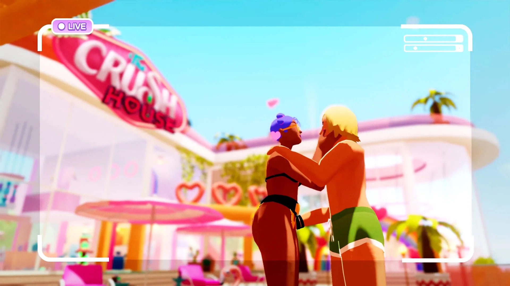
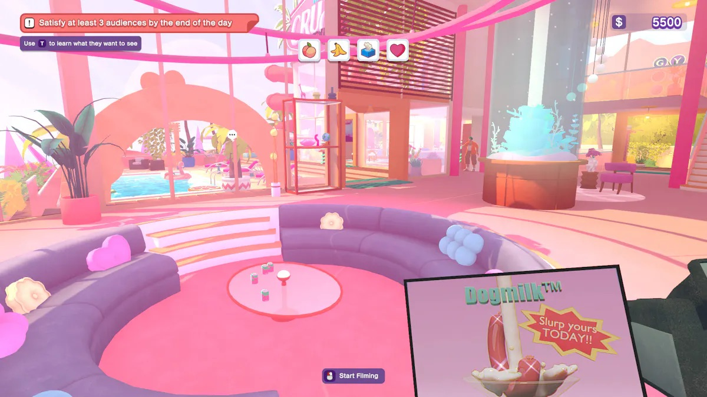

+++
title = "The Crush House est un simulateur de TV réalité des années 2000, parce que pourquoi pas après tout"
date = 2024-04-05T10:00:00+01:00
draft = false
author = "Félix"
tags = ["Actu"]
image = "https://nostick.fr/articles/2024/avril/0405-the-crush-house-est-un-simulateur-de-tv-realite-des-annees-2000-parce-que-pourquoi-pas-apres-tout/TheCrushHouse.jpg"
+++ 

Y’a pas à dire, les gens de chez Devolver ont le chic pour trouver des concepts bizarres. Le dernier en date ? *[The Crush House](https://thecrush.house)*, qui vous invite à enfiler les chaussures d’un employé d’une chaîne de TV en charge de produire « *l’émission de télé-réalité la plus en vogue de 1999* ». Dans l’idée, il va falloir sortir la caméra pour filmer les différents candidats en capturant les scènes qui feront un maximum d’audience. Interdiction de parler aux participants, et il faudra également penser à faire de la place pour les coupures pubs. La nuit, le joueur se retrouve dans sa piaule sous le manoir pour acheter différentes améliorations.

 

Une des mécaniques principales consiste à réaliser des plans faisant plaisir à différents types de spectateurs : le pervers qui veut voir des paires de fesses, les étudiants en arts qui exigent de beaux plans, ceux qui aiment les vues d’extérieurs… On nous promet 12 candidats ayant chacun une personnalité bien distincte, avec qui on pourra papoter une fois les caméras éteintes. Ils pourront donner des suggestions sur l’émission ou confier de mini-missions pouvant potentiellement en dévoiler un peu plus sur eux. Comme le laisse présager le trailer, l’histoire globale cache visiblement un mystère qui dépasse le cadre de la production. 

Quelques médias comme *[RPS](https://www.rockpapershotgun.com/the-crush-house-is-a-saucy-90s-reality-tv-show-simulator-from-the-developers-of-reigns?utm_source=feed&utm_medium=rss&utm_campaign=feed)* et *[Wired](https://www.wired.com/story/the-future-of-video-games-is-reality-tv/)* ont pu essayer une première démo, qui a l’air sympa. Malgré ses graphismes à gros polys colorés, le jeu a visiblement un message à faire passer sur le médium et sur les apparences face caméra. Bon, ça reste pensé comme un jeu fun, avec des situations générées procéduralement et un bon paquet de blagues. Pas de date de sortie pour le moment, mais [une page Steam](https://store.steampowered.com/app/2337820/The_Crush_House/) a été mise en ligne. Ah et c'est signé par le studio Nerial, à qui l'on doit les différents *Reigns* ou *Card Shark*.

 

Si vous n’en pouvez plus d’attendre et que vous avez envie de jouer à un jeu qui vous met dans les bottes d’un réalisateur, j’ai une excellent suggestion pour vous : *[Not for broadcast](https://store.steampowered.com/app/1147550/Not_For_Broadcast/)*. Ce jeu FMV vous propose d’incarner le monteur du JT d’une chaîne anglaise. Si on commence simplement par censurer les gros mots et garder les caméras au bon endroit, le titre révèle vite un scénario noir et dystopique qui vaut franchement le détour. Rien que le gameplay en lui-même est un bol d’air frais, mettant sur la table tout un tas de questions (« *Est-ce une bonne idée de continuer à filmer ?* », « *Est-ce que cette séquence va provoquer un scandale ?* »). Et si vous avez envie de voir ce que donne un mélange entre des zombies et l’esthétique acidulés des villas de TV réalité, n’hésitez pas à jeter un œil à *[Dead Set](https://fr.wikipedia.org/wiki/Dead_Set)*, une série de Charlie Brooker (*Black Mirror*). Il n’y a qu’une saison de 5 épisodes, ça se bouffe en deux soirées.