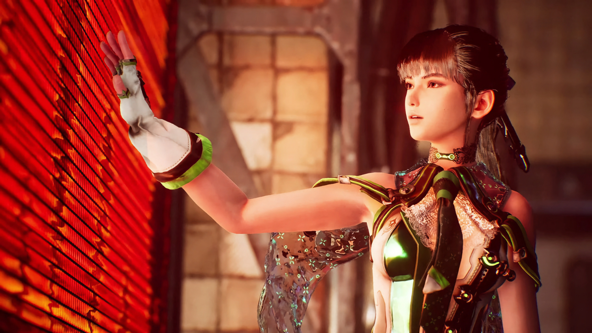
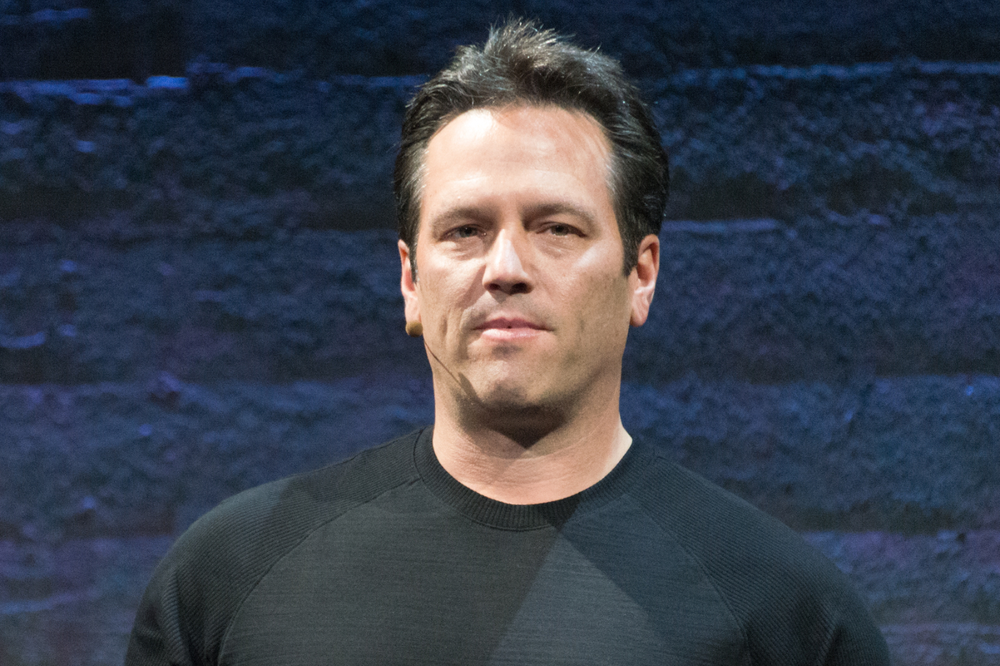
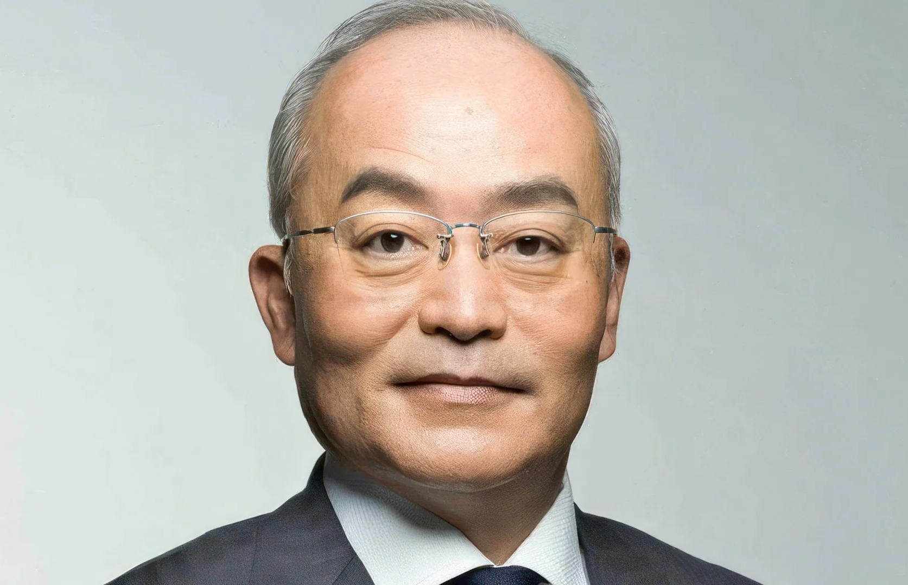
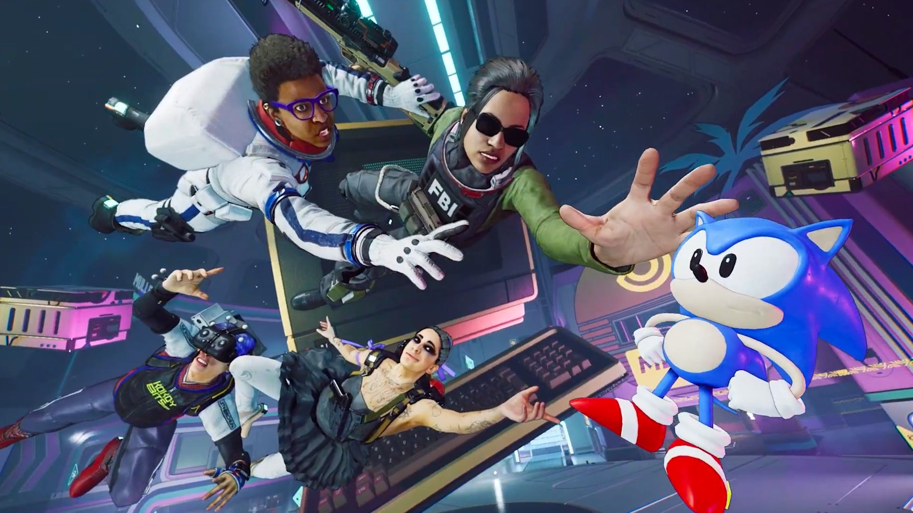
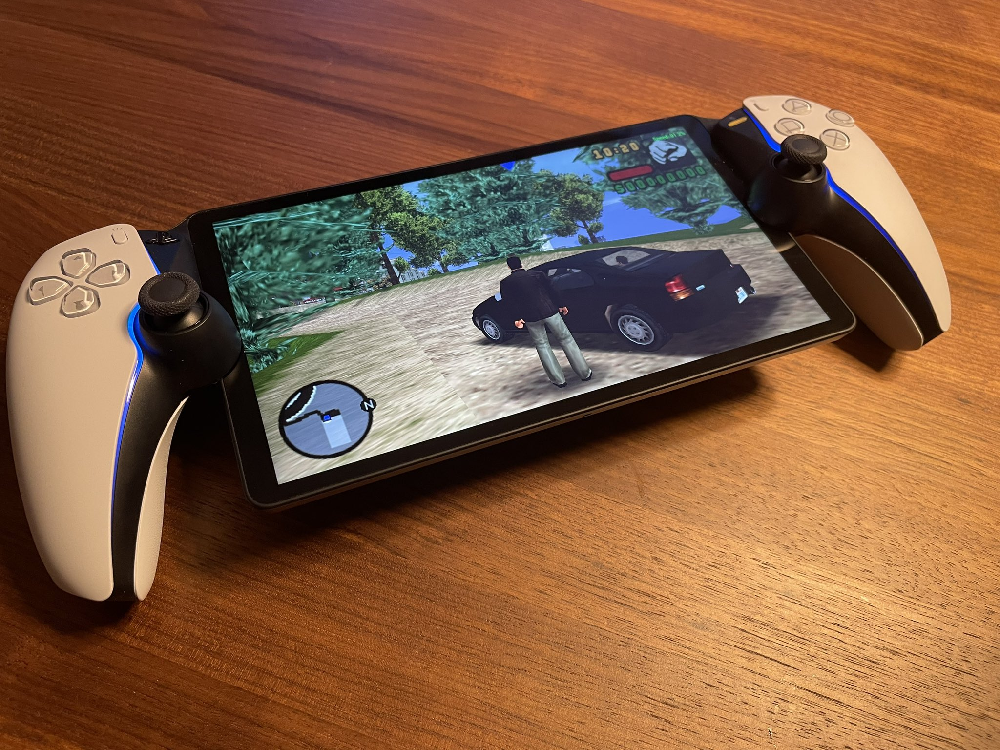

+++
title = "Passion, fascination, ronchon : la folle semaine du jeu vidéo (6/04)"
date = 2024-04-06T12:00:00+01:00
draft = false
author = "Mickaël"
tags = ["Actu"]
+++ 

L’actualité du jeu vidéo ne s’arrête pas à la poignée d’articles publiés sur *Nostick* ! Histoire de rattraper le retard accumulé, voici un retour rapide sur quelques unes des infos les plus importantes (ou insignifiantes) de la semaine.

## 10 ans de Phil Spencer, stop ou encore ?

Il y a 10 ans, le 31 mars 2014, Microsoft nommait Phil Spencer à la tête de sa division Gaming. Il est arrivé à un moment critique : le lancement catastrophique de la Xbox One un an auparavant a durablement entaché l'image de la marque qu'il fallait absolument redresser. Et qui de mieux qu'un joueur invétéré pour relever cette tâche herculéenne ?

Malgré un agenda qu'on soupçonne bien chargé, Phil Spencer passe toujours beaucoup de temps à tester les nouveautés et à se payer des trips nostalgiques sur des jeux plus anciens. Une *street cred'* qui a rassuré une communauté déboussolée par les errances de la Xbone. Et elle a pu apprécier les nouveautés mises en place par le boss, au premier rang duquel le Game Pass (2017) et xCloud (2020), ou encore le développement des fonctions d'accessibilité, à l'image de la manette Xbox Adaptive. 

L'effort en matière de rétro-compatibilité des jeux Xbox a aussi beaucoup fait pour asseoir l'impression de bonne volonté de Phil Spencer auprès de la « team green ». Mais ce crédit pourrait bien être épuisé. Malgré ces changements et le lancement de la Xbox Series S/X, Phil Spencer n'est jamais parvenu à remonter la pente d'une lointaine troisième place sur le marché des consoles. 

Le dirigeant a aussi lancé Microsoft dans une frénésie d'acquisitions (Mojang, Bethesda et surtout Activision Blizzard) qui poussent Xbox vers des horizons assez éloignés de la console en elle-même. Les actionnaires exigent maintenant un retour sur investissement : il faut rentabiliser les dizaines de milliards de dollars investis dans cette frénésie de rachats. Et la plateforme Xbox n'y suffit plus, ce qui justifie aux yeux de Spencer l'ouverture à la concurrence. 

Mais on sent confusément que Microsoft ne s'arrêtera pas aux portages de *Sea of Thieves*, *Pentiment*, *Grounded* et *Hi-Fi Rush* sur PS5 et Switch. Et que pour ramasser la mise, il faudra que les jeux Xbox abandonnent leur exclusivité, peut-être pas *day one*, mais assez rapidement, au risque de dévaluer la valeur de la plateforme. Qu sait si la Xbox existera toujours dans 10 ans…

## Un nouveau patron temporaire pour PlayStation

Coïncidence, alors qu'on fêtait les 10 ans de Phil Spencer, PlayStation accueillait un nouveau boss. Ce 1er avril, et ça n'est pas une blague, Jim Ryan a quitté la boîte après 30 ans de (plus ou moins) bons et loyaux services à tous les échelons de Sony Interactive Entertainment. Hiroki Totoki, président de Sony et directeur des opérations et des finances, s'est installé dans le fauteuil en intérim, en attendant de trouver la perle rare.

Totoki-san n'a pas perdu de temps, il a déjà fait la tournée des popotes au sein des studios PlayStation pour prendre la température. Et il a déjà sa petite idée sur la stratégie à suivre : Sony doit se montrer plus « *agressif* » pour améliorer les marges de la division jeux vidéo. Des marges très fines quand des jeux comme *Last of Us* ou *Spider-Man* coûtent des centaines de millions de dollars à développer.

Et pour y parvenir, le nouveau boss veut accélérer le portage des jeux PlayStation sur PC, ce qui est une bonne nouvelle pour tout le monde finalement. Enfin, il faudrait encore que PlayStation lance de nouveaux jeux *first party* : le robinet sera à sec pour les franchises existantes jusqu'en avril 2025, a [prévenu](https://www.ign.com/articles/sony-will-not-release-any-new-major-existing-playstation-franchise-titles-before-april-2025) le même Hiroki Totoki le mois dernier.

## Sega fait le ménage en Europe

Les temps sont difficiles dans le secteur du jeu vidéo et Sega n'est pas épargné. L'éditeur s'est lancé dans une restructuration de ses activités, et cela touche tout particulièrement l'Europe. Le groupe a ainsi [annoncé](https://www.gamesindustry.biz/sega-sells-relic-and-will-cut-240-jobs-across-uk-studios) la suppression de 240 postes sur le vieux continent, une charrette qui concerne surtout Sega Europe, Sega HARDlight (qui développe des jeux mobiles) et Creative Assembly.

Les licenciements chez Creative Assembly sont un crève-cœur : le studio avait en effet quasiment terminé le développement de *Hyenas*, un shooter en coop', avant que la maison-mère décide finalement d'arrêter les frais l'an dernier. Sega se sépare également de Relic Entertainment, qui devient indépendant. Le studio est reconnu pour ses jeux de stratégie comme *Company of Heroes* et *Dawn of War* ; il a donné un coup de main à Microsoft pour *Age of Empires*.

Jurgen Post, le nouveau boss de Sega Europe, souhaite le meilleur à Relic dans cette nouvelle aventure, et il s'excuse aussi auprès des pauvres bougres qui ont reçu leur lettre de licenciement. Mais voilà, « *les changements sont nécessaires pour sécuriser l'avenir de notre activité jeu, et pour nous assurer que nous sommes bien placés pour fournir les meilleures expériences possibles pour notre communauté de joueurs* ». C'est beau comme du ChatGPT !

## Prince of Persia revient comme un prince

Ubisoft a redonné du souffle à sa franchise *Prince of Persia* avec l'excellent *The Last Crown* en janvier. Et ça n'est pas terminé : Tom Henderson, habituellement très bien renseigné, a « [confirmé](https://twitter.com/_Tom_Henderson_/status/1775522904727261615) » la rumeur d'un nouveau jeu tiré de la licence qui sera annoncé courant avril. 

Il s'agirait d'un roguelite développé par les spécialistes du genre, Evil Empire, qui ont planché sur les DLC de *Dead Cells* ces dernières années (Motion Twin étant le créateur de *Dead Cells*). Le studio a donc une grosse expérience dans le genre, et avec la hype autour de *Prince of Persia*, autant dire que ce nouveau titre sera surveillé de très près.

## Drive to Survive chez Atari

Les vieux pots catalytiques font-ils les meilleures soupes ? Ça reste à voir, en tout cas Atari ne rate pas une occasion de faire vibrer la fibre nostalgique pour vendre ses jeux encore et encore. Pour *NeoSprint*, qui sortira sur PC et sur consoles cet été, c'est un peu particulier.

 

Ce jeu de course en 3D isométrique est le successeur spirituel des jeux *Sprint*, dont la première version remonte à [1976](https://en.wikipedia.org/wiki/Sprint_2) sur bornes d'arcade. Elle a été développée par Key Games, une filiale d'Atari, qui s'en est souvenu l'an dernier en sortant *NeoSprint* en exclusivité sur la VCS, un revival de la fameuse console.

Quoi qu'il en soit, le jeu a l'air plutôt fun avec son côté old school, qui permettra à 8 joueurs de se rentrer dedans sur des circuits personnalisables.

## Pas de PPSSPP pour la PlayStation Portal

Sony a bouché la faille qui avait permis à des ingénieurs de Google d'installer l'émulateur PPSSPP dans le PlayStation Portal… Et ce sont ces mêmes ingénieurs qui ont donné un coup de main au constructeur pour corriger la vulnérabilité ! C'était la chose responsable à faire, a [affirmé](https://twitter.com/theflow0/status/1775141744822071319) Andy Nguyen, un des bidouilleurs en question. 

Andy Nguyen est notoirement connu pour avoir jailbreaké la PS Vita et révélé des failles de sécurité dans la PS4, avant son embauche chez Google. Lorsqu'il a [annoncé](https://twitter.com/theflow0/status/1759627938910089575) sa bidouille pour le Portal, il a aussi affirmé qu'il n'était pas question d'en révéler les détails au grand public. Il s'agissait pour lui de montrer que des appareils conçus pour le streaming pouvaient aussi être utilisés pour faire fonctionner des applications en local. Dommage.

Il reviendra donc à Sony d'intégrer des fonctions natives dans le Portal, si le constructeur le désire. Ça ne sera sûrement pas un émulateur PSP ! L'entreprise pourrait pousser encore plus loin le concept de la tablette en autorisant le streaming de jeux depuis le cloud de l'abonnement PS Plus (le Portal se contente de streamer à partir de la PS5 du salon).

## En vrac

**Stellar Blade —** Les petits coquinous qui voudraient jouer avec Eve dans sa tenue « Skin Suit » (il faut dire qu'elle ne cache pas grand chose de la plastique avantageuse de la combattante) devront faire preuve d'une plus grande dextérité. Hyung-Tae Kim, le directeur de *Stellar Blade*, a [expliqué](https://www.famitsu.com/news/202403/27338068.html) qu'il valait mieux habiller chaudement l'héroïne car la difficulté augmente rapidement dans le jeu. Un conseil de bon sens : cette tenue désactive les boucliers de protection d'Eve…

**Gears of War 6 —** Les étoiles s'alignent pour une annonce estivale concernant le 6e volet tant attendu de *Gears of War*. Le célèbre fuiteur Jeff Grubb a [révélé](https://www.youtube.com/watch?v=yurkUBMTAWw) durant le podcast Xcast avoir entendu des choses qui pourraient arriver avec Gears 6 cet été. Une confidence [confirmée](https://twitter.com/tomwarren/status/1775874925850513581) par Tom Warren de *The Verge*. *Gears 5* remonte à 2019, il est temps d'avoir des nouvelles de la franchise.

**ChatGPT pour la Xbox —** Jusqu'à présent plutôt épargnés par la lame de fond de l'intelligence artificielle, les joueurs Xbox pourraient bientôt avoir droit à un assistant qui prendrait la forme d'un personnage animé (qui a dit Clippy ?!). Ce bot serait chargé de répondre aux questions d'assistance et de SAV, et peut-être prendre en charge les demandes de remboursement, selon *[The Verge](https://www.theverge.com/2024/4/2/24118728/microsoft-xbox-ai-chatbot-testing)*. Ne cachez pas votre joie.

**PS2 —** Juste avant de prendre sa retraite, Jim Ryan a donné finalement une réponse à un des plus grands mystères du jeu vidéo : le nombre de PS2 vendues par Sony. « *160 millions* », a-t-il [affirmé](https://blog.playstation.com/2024/03/29/official-playstation-podcast-episode-481-heres-to-you-jim/) dans le podcast officiel PlayStation, soit 5 millions de plus que ce que le constructeur avait annoncé au 31 mars 2012. Mais la fabrication mondiale de la console s'étant arrêtée en janvier 2013, il restait donc 9 mois durant lesquels la PS2 a continué de s'écouler… On s'en ficherait pas mal, mais l'enjeu est de taille : la PS2 creuse donc l'écart avec la DS (154 milllions) au classement des consoles les plus vendues.