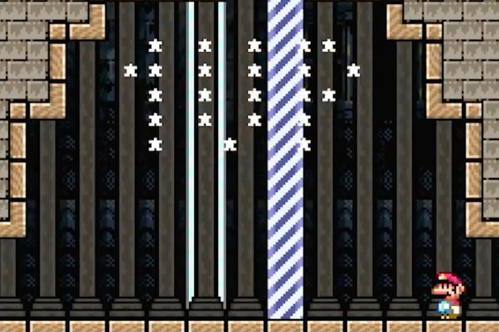

+++
title = "Tous les niveaux créés avec Super Mario Maker ont été battus ! Non mais pour de vrai cette fois"
date = 2024-04-06T22:00:00+01:00
draft = false
author = "Mickaël"
tags = ["Actu"]
image = "https://nostick.fr/articles/2024/avril/0604-tous-les-niveaux-crees-avec-super-mario-maker-ont-ete-battus/Mario.jpg"
+++ 

*Trimming the Herbs* a finalement trouvé son maître. Ce niveau réalisé avec *Super Mario Maker* réputé impossible a fini par céder à sanyx91smm2, un joueur fou qui a documenté son exploit — 25 secondes de [pure dinguerie](https://twitter.com/sanyx91smm2/status/1776407036160291101) qui a demandé des jours et des semaines d'efforts intenses.

 

En parvenant à battre ce fichu *Trimming the Herbs*, la Team 0% est parvenue à réaliser son objectif : remporter tous les niveaux créés avec *Super Mario Maker* avant la date fatidique du 8 avril, jour où Nintendo fermera définitivement l'accès à tous ces niveaux. Il était moins une… mais dans les faits, la communauté avait déjà décidé que [le but avait été atteint en battant *The Last Dance*](https://nostick.fr/articles/2024/mars/2603_supermariomaker/).

*Trimming the Herbs* est en effet très spécial : il a été conçu par Ahoyo, qui a avoué il y a quelques semaines avoir utilisé des systèmes de speedrunning automatisés (TAS), ce qui a disqualifié le niveau aux yeux de la Team 0%. Malgré tout, des acharnés, dont sanyx91smm2, ont voulu s'y frotter encore et encore pour finir le boulot. Et à quelques jours de la fermeture des serveurs, bim, la belle histoire s'est finalement terminée en beauté.