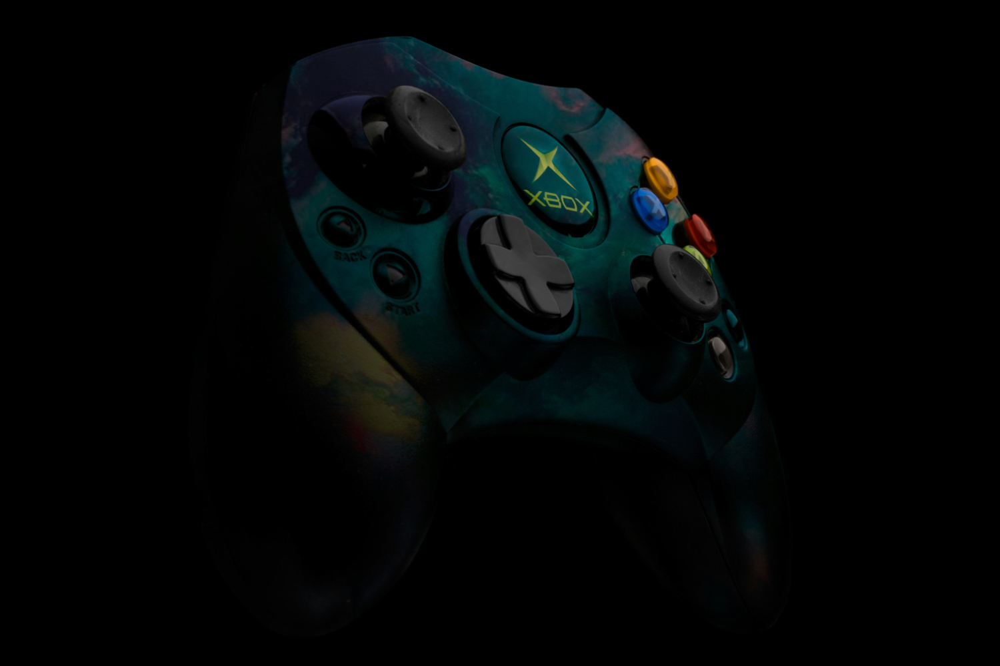

+++
title = "La rétrocompatibilité n'est pas ringarde"
date = 2024-04-08T15:00:00+01:00
draft = false
author = "Mickaël"
tags = ["Actu"]
type = "une"
vignette = "https://nostick.fr/articles/vignettes/Xbox360.jpg"
image = "https://nostick.fr/articles/2024/avril/0804-la-retrocompatibilite-nest-pas-ringarde/Xbox360.jpg"
+++ 

On ne plaisante pas avec la rétrocompatibilité chez Xbox. Phil Spencer, [alors aux manettes de la division gaming de Microsoft](https://nostick.fr/articles/2024/avril/0604-resume-semaine/#10-ans-de-phil-spencer-stop-ou-encore-) depuis un an — c'était en 2015 — avait fait vrombir l'E3 en annonçant que la Xbox One allait faire fonctionner les jeux de la Xbox 360. Depuis, l'engagement de l'éditeur ne s'est pas démenti, c'est devenu aussi bien une stratégie qu'un argument de vente.

Pour marquer ses six premiers mois à la tête de Xbox, Sarah Bond a enchâssé la rétrocompatibilité dans l'organisation de la division. Dans un mémo partagé par *[Windows Central](https://www.windowscentral.com/gaming/xbox/exclusive-xbox-president-sarah-bond-has-set-up-a-new-team-dedicated-to-game-preservation-and-forward-compatibility)*, la dirigeante a annoncé la création d'une nouvelle équipe entièrement dédiée à la préservation des jeux vidéo, c'est « *important pour pour nous tous à Xbox et pour l'industrie* ».

« *Nous nous appuyons sur notre historique de rétrocompatibilité, et nous nous engageons à transmettre l'incroyable bibliothèque de jeux Xbox pour que les futures générations de joueurs puissent en profiter* », ajoute-t-elle. Même si tout n'est pas parfait (ce jeu obscur qui vous a fait vibrer sur Xbox 360 n'est peut-être pas compatible avec la Series X), il est difficile de prendre Microsoft en défaut sur ce plan.

En juillet dernier, les joueurs de *Call of Duty: Modern Warfare 2* (2009) et de *Call of Duty: Black Ops* (2010) sur Xbox 360 ont ainsi pu [retrouver](https://gamerant.com/call-of-duty-servers-fixed-mw2-black-ops-input-delay-lag/) le plaisir de se mettre sur la tronche en multi grâce à la remise en route des serveurs d'Activision et à la rétrocompatibilité Xbox. Il suffit de glisser le disque du jeu dans la console.

Microsoft devrait d'ailleurs avoir des annonces à faire au sujet de la rétrocompatibilité durant le showcase annuel de Xbox, plus ou moins programmé pour le 9 juin.

De son côté, Sony ne fait pas vraiment de la rétrocompatibilité un cheval de bataille, malgré l'histoire du constructeur. La PS2 avait marqué son époque pour bien des raisons, mais aussi pour sa compatibilité totale avec les jeux de la PlayStation originelle — aussi bien avec la ludothèque qu'avec les accessoires, d'ailleurs. Le constructeur est depuis resté relativement discret sur ses initiatives de préservation des jeux.

Toutefois, l'abonnement PlayStation Plus Extra (13,99 € par mois) donne accès à une grosse sélection de jeux PS4 à télécharger sur  la PS5. La formule Plus Premium à 16,99 € va plus loin avec un [catalogue](https://www.playstation.com/fr-fr/ps-plus/games/#classics-a-z) de classiques PS1, PS2, PS3 et PSP. Même si ces offres ressemblent davantage à un bonus qui ne coûte pas cher pour Sony qu'à une stratégie bien pensée pour assurer l'avenir de tous ces vieux jeux, il reste au moins possible d'en profiter sur du matos moderne.

Nintendo mise aussi tout sur l'abonnement Switch Online, qui pour 3,99 € par mois (ou 20 € par an) propose l'accès à une bonne petite sélection de jeux NES, SNES et Game Boy. Le pack d'extension, vendu 40 € par an, ajoute au lot des jeux N64, GBA et Megadrive. Malheureusement, il est impossible d'acheter les jeux à l'unité comme c'était le cas du temps de la Wii avec la Virtual Console, bien plus riche en la matière. On peut toujours croire au Père Noël et espérer que ça changera avec la Switch 2…