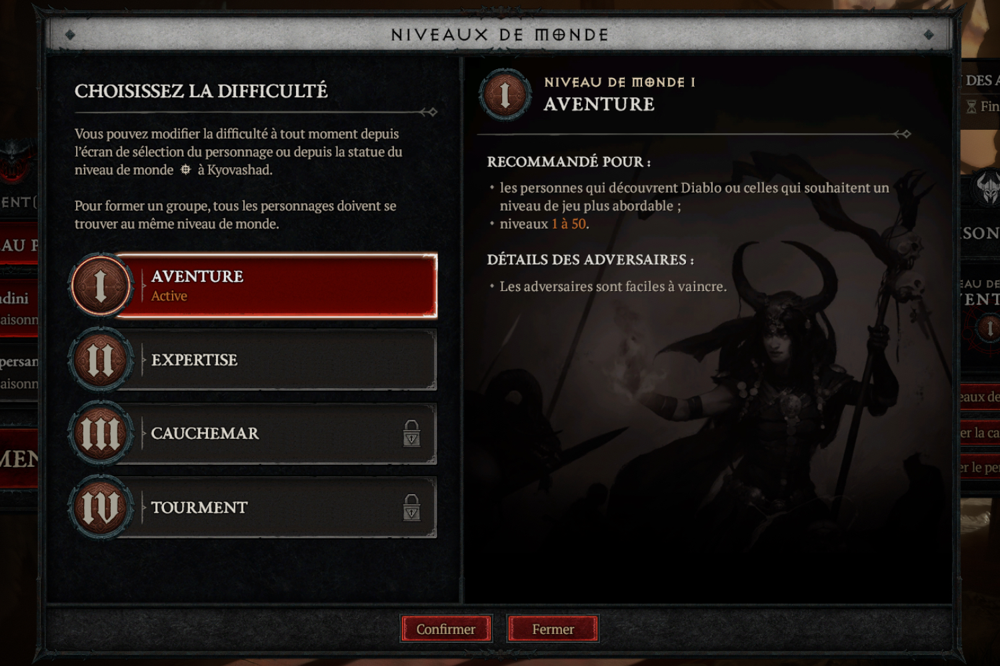
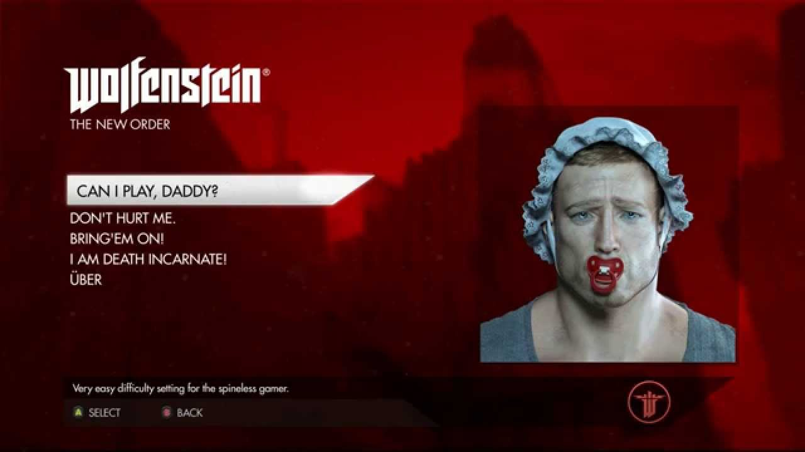

+++
title = "N'ayez pas honte de jouer en mode facile"
date = 2024-04-09T19:00:00+01:00
draft = false
author = "Mickaël"
tags = ["XXL"]
image = "https://nostick.fr/articles/2024/avril/0904-nayez-pas-honte-de-jouer-en-mode-facile/wolf.jpg"
+++ 

 

Au bout de trois tentatives ratées de battre le Jugement de la Mère dans *Diablo IV*, j'ai décidé de basculer en mode Aventure, autrement dit le niveau facile du jeu. Et j'ai enfin pu battre ce fichu adversaire, avec le sentiment du devoir accompli pour la gloire de Sanctuaire et sans honte aucune. Après tout, la vie est trop courte et il me tarde d'atteindre l'Acte 4 pour choper enfin mon canasson (oui, il arrive assez tard dans la campagne).

Voilà. Je porte fièrement mon badge « mode facile » au revers du t-shirt, car il ne sert à rien de se faire du mal (il y a les jeux de From Software pour ça). Et visiblement, les studios ont bien compris qu'il fallait faire de la place aux joueurs qui veulent certes être partie intégrante d'une aventure, sans avoir à subir des humiliations à répétition.

La plupart des jeux offrent désormais des modes de difficulté « histoire » qui permettent d'apprécier le déroulé d'un jeu en évitant que l'aventure se transforme en cinématique. Et de plus en plus de titres, notamment sur consoles, intègrent même des fonctions d'accessibilité pour permettre à tous les joueurs de franchir des étapes compliquées. 

Dans *Spider-Man 2* et *Ratchet & Clank: Rift Apart*, Insomniac Games propose de ralentir l'action du jeu en appuyant simplement sur un bouton de manette. Toujours chez PlayStation, les joueurs aguerris pourront [partager automatiquement leurs exploits en vidéo](https://nostick.fr/articles/2024/mars/2603_aideps5/) pour épauler leurs camarades qui ont plus de difficulté.

Si l'industrie des guides et autres soluces est florissante, c'est aussi parce que les joueurs ne veulent plus souffrir mille tourments ou tourner en rond pendant des heures pour arriver au bout d'un niveau ou d'une histoire ! Si le jeu vidéo est indéniablement une activité très pratiquée par les plus jeunes (aux États-Unis, les moins de 18 ans représentent 24 % des joueurs, les 18-34 ans sont 36 %), l'âge moyen [tournait](https://venturebeat.com/business/esa-ceo-64-of-u-s-adults-are-gamers-46-of-players-are-women-older-people-are-playing-more/) entre 35 et 44 ans en 2020, selon l'ESA.

 

Autrement dit, le jeu vidéo est aussi pratiqué par des personnes dont le temps se partage entre la famille et les obligations professionnelles. Les heures passées à crapahuter devant sa console ou son PC sont donc comptées ; et puis il faut bien dire aussi que les réflexes sont moins affûtés quand on commence à prendre de la bouteille.

Plutôt que l'exploit accompli à grand coup de sueur et d'énervement, de nombreux joueurs cherchent aujourd'hui une expérience, une immersion. Pas de se qualifier pour les JO du jeu vidéo. Bien sûr, rien n'empêche de vouloir se lancer dans un challenge, il est d'ailleurs souvent très simple de passer d'un niveau de difficulté à un autre sans devoir tout redémarrer ou à se prendre la honte.

