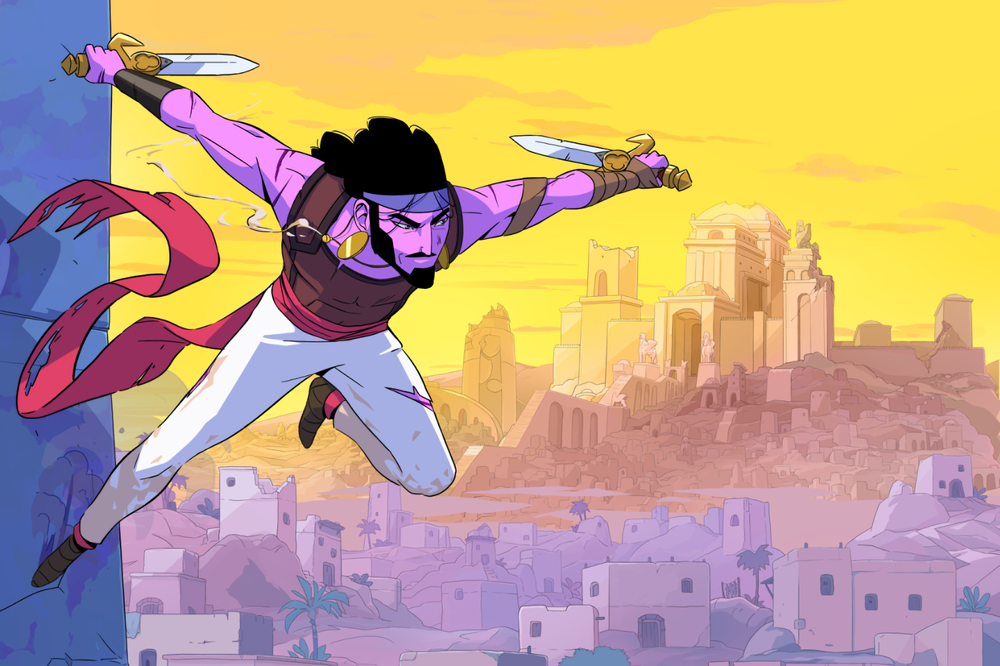
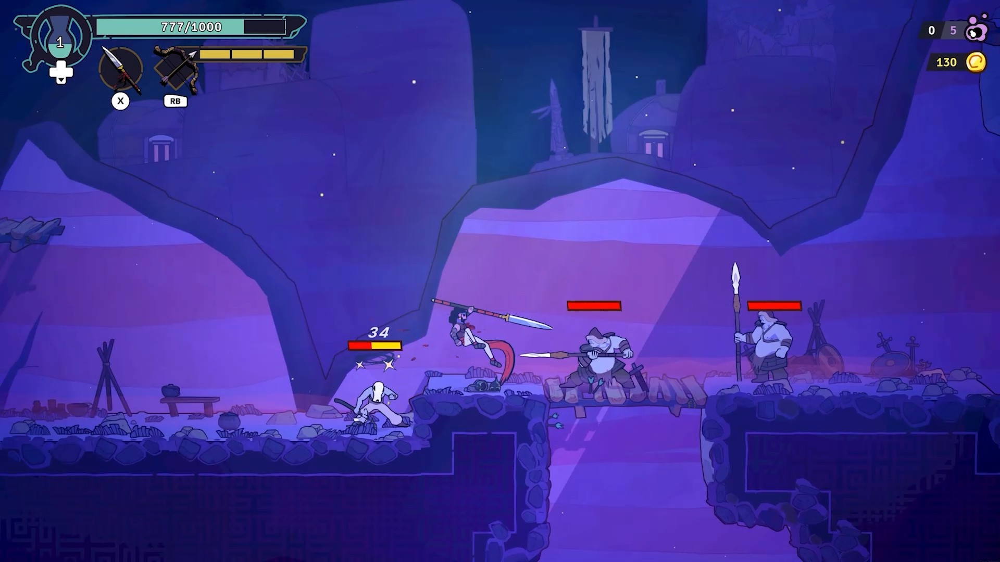
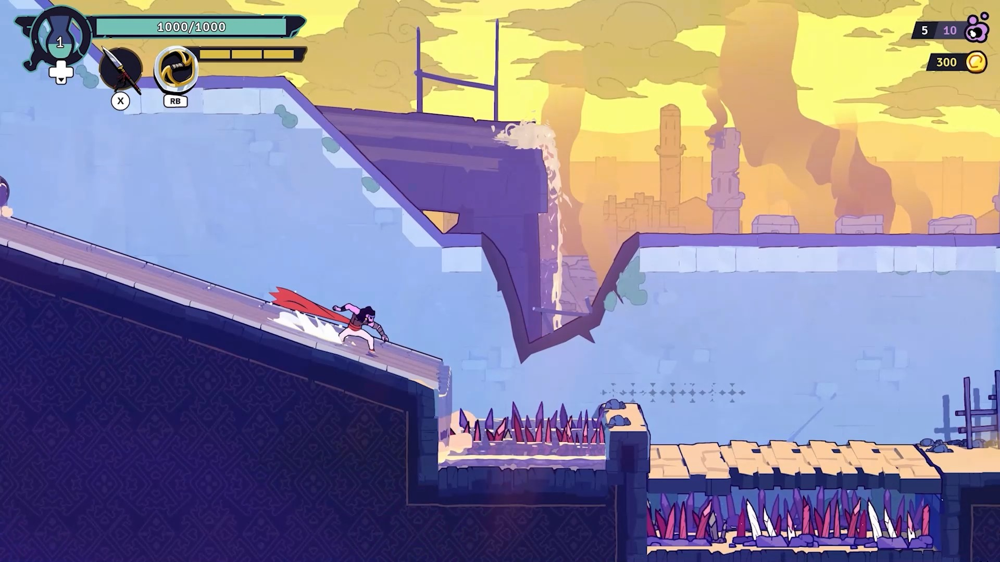
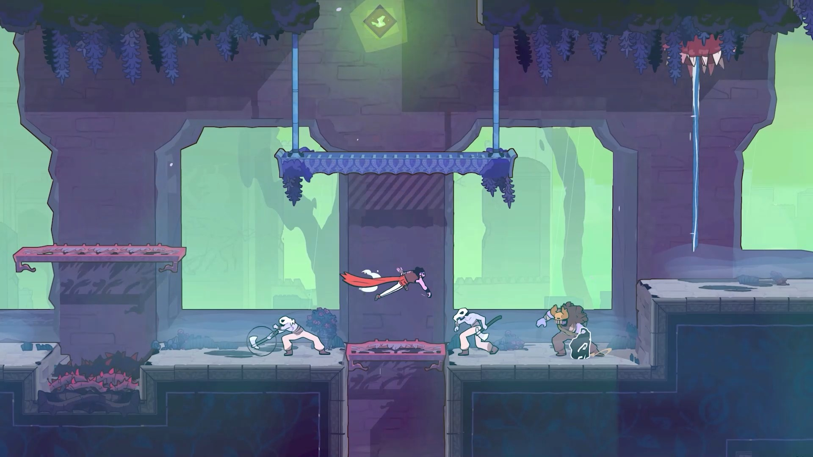

+++
title = "Le Prince de Perse est un grand seigneur"
date = 2024-04-10T20:00:00+01:00
draft = false
author = "Mickaël"
tags = ["Trailer"]
image = "https://nostick.fr/articles/2024/avril/1004-le-prince-de-perse-est-un-grand-seigneur/PoP.jpg"
+++ 

Après avoir été plus ou moins oublié par Ubisoft, le Prince de Perse est de retour en force dans l'actualité ! Début janvier, Ubisoft Montpellier (les papas de Rayman) faisait parler la foudre avec *Prince of Persia: The Lost Crown*, un retour aux sources avec ce jeu de plateformes 2D façon metroidvania de toute beauté — et qui pourrait bien se retrouver sur quelques listes des jeux de l'année.

 

Mais tel un grand seigneur, le prince n'en avait pas terminé avec nous. Le studio Evil Empire a dévoilé les premières images et un trailer pour *The Rogue Prince of Persia*, qui conserve l'aspect plateformes 2D du précédent titre… mais avec des graphismes plus cartoon et un gameplay bien différent. Alors certes, il s'agit de sauter dans tous les sens et de planter les méchants, mais le tout sous la forme d'un roguelite. Autrement dit, vous allez mourir et ressusciter souvent…

Roguelite oblige, les niveaux sont générés de manière procédurale, aucune partie ne sera exactement semblable à la précédente. On peut faire confiance à Evil Empire pour assurer le cachou : le studio a conçu tous les DLC et extensions de *Dead Cells* (notamment le fameux DLC *Castlevania*), participant largement du succès monstre du jeu développé à l'origine par Motion Twins. C'est tout le mal qu'on souhaite à The Rogue Prince of Persia !

Le jeu sera proposé en early access sur [Steam](https://store.steampowered.com/app/2717880/The_Rogue_Prince_of_Persia/) le 14 mai.