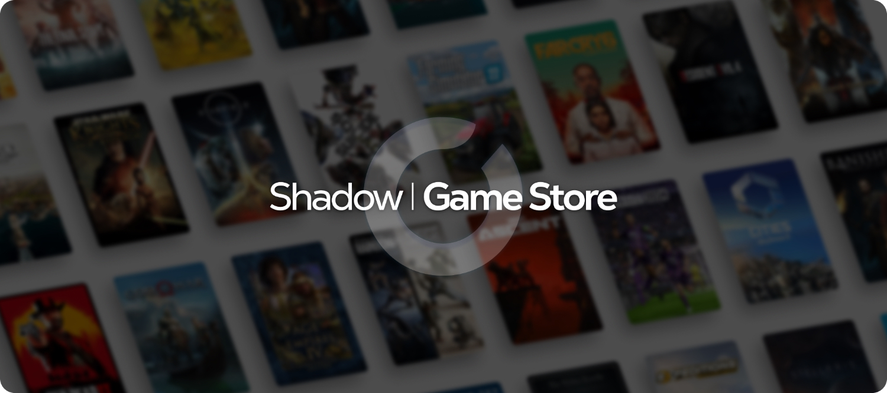
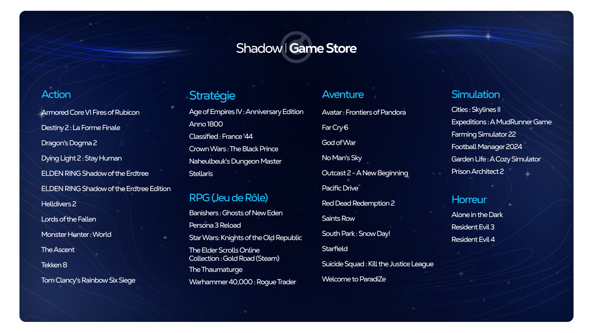

+++
title = "L'étrange nouvelle boutique de jeux de Shadow"
date = 2024-04-11T19:00:00+01:00
draft = false
author = "Mickaël"
tags = ["Actu"]
image = "https://nostick.fr/articles/2024/avril/1104-letrange-nouvelle-boutique-de-jeux-de-shadow/shadow.jpg"
+++ 

On ne sait pas trop quelle mouche a piqué Shadow pour se lancer ainsi dans le commerce de clés Steam, mais enfin c'est fait : les abonnés Shadow PC peuvent dés à présent acheter des jeux sur le [Shadow Game Store](https://shadow.tech/fr-FR/game-store) ! Et attention, il faut absolument être abonné, c'est à dire payer un minimum de 29,99 € par mois (19,99 € le premier mois) pour accéder à son propre PC dans le cloud.

Histoire d'appâter le chaland, Shadow fait miroiter des « *prix agressifs* », mais dès qu'on y ajoute le coût de l'abonnement, c'est tout de suite moins intéressant. Ce d'autant qu'il est assez facile de trouver moins cher ailleurs : le Game Store commercialise en fait des clés Steam, Ubisoft Connect et Rockstarsocial, par l'intermédiaire de la plateforme Gamesplanet. 

Les soldes Steam sont souvent plus intéressants, et puis ce n'est pas comme s'il existait de nombreux services en ligne qui permettent de trouver ces fameuses clés pour encore moins cher… et pour davantage de jeux : la boutique de Shadow compte 45 jeux en tout et pour tout, pas uniquement des nouveautés. 

Après l'achat, il faut se rendre dans la boutique de l'éditeur, saisir la licence, puis télécharger le jeu pour pouvoir y jouer dans le nuage de Shadow PC… ou tout simplement sur un autre appareil, en local. L'intérêt de passer par Shadow est de profiter d'un PC moyennement puissant (GTX 1080, Xeon 8 cœurs, 12 Go de RAM) qu'on n'a pas forcément à la maison. La formule Power est autrement plus puissante avec sa RTX 3070 Ti et son proc EPYC, mais elle est aussi beaucoup plus chère : 49,98 € par mois.

Point positif : une fois l'abonnement Shadow terminé, les jeux achetés sont toujours la propriété du joueur. Enfin, et c'est certainement pour éviter l'effet d'aubaine, Shadow limite les achats dans sa boutique à un jeu toutes les 24 heures, officiellement « *pour des raisons de sécurité* ». Au moins on ne risque pas de succomber à une flambée d'achats compulsive !