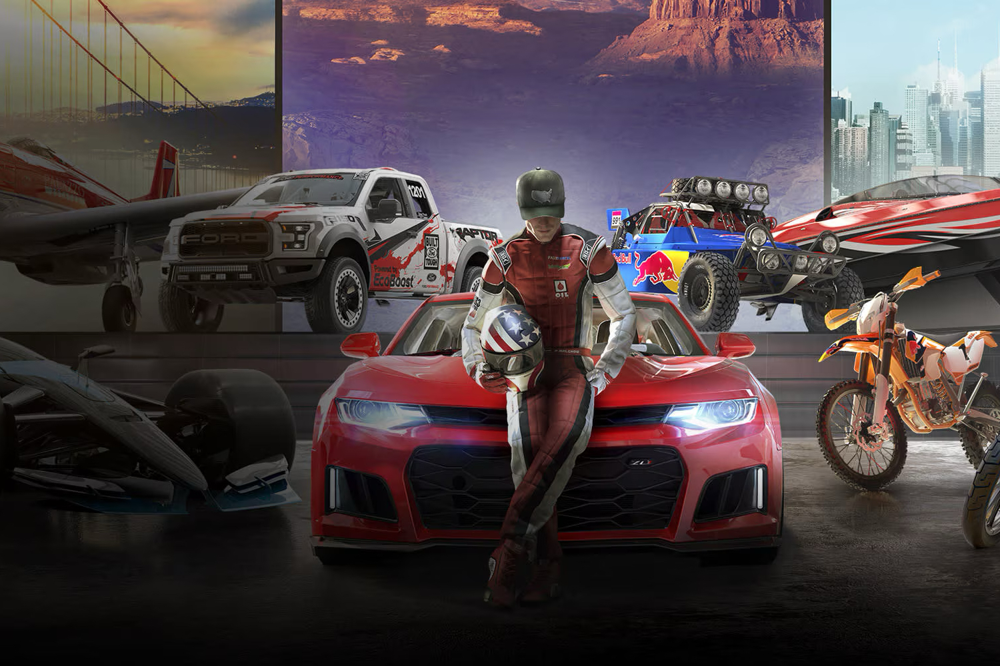

+++
title = "Ubisoft efface The Crew partout, et c'est du brutal"
date = 2024-04-12T18:15:00+01:00
draft = false
author = "Mickaël"
tags = ["Actu"]
image = "https://nostick.fr/articles/2024/avril/1204-ubisoft-efface-the-crew-partout/TheCrew.jpg"
+++ 

Ubisoft ne plaisantait pas quand l'éditeur avait affirmé, par la voix de Philippe Tremblay son directeur des abonnements, que les joueurs [devaient](https://www.gamesindustry.biz/the-new-ubisoft-and-getting-gamers-comfortable-with-not-owning-their-games) se faire à l'idée de plus posséder leurs jeux. Les amateurs du jeu de bagnoles *The Crew* l'ont appris à leur dépens.

Le studio a annoncé en décembre dernier que les serveurs permettant de jouer au jeu fermeraient après le 31 mars de cette année, ce qui fut chose faite. *The Crew* étant un titre multi en ligne, la fermeture des serveurs en signait la mort irrémédiable, ce qui est déjà, en soi, un problème pour un jeu payant. Mais Ubisoft ne s'est pas arrêté là, puisque chez certains joueurs, le titre a tout simplement [disparu](https://gamerant.com/the-crew-ubisoft-connect-revoke-access/) de leurs bibliothèques Ubisoft Connect !

C'est entendu, *The Crew* n'est pas un jeu très récent : il est sorti fin 2014 sur PC et les consoles de l'époque. Et au vu de sa nature entièrement en ligne, il fallait craindre que le jour viendrait où il disparaitrait corps et bien dans l'éther virtuel. Mais on peut aussi comprendre que des joueurs l'aient mauvaise de ne plus avoir accès à rien du tout.

Ubisoft a tenté d'apaiser la colère en proposant des remboursements qui ne concernaient cependant que les achats « *récents* » (l'entreprise n'a pas dû se ruiner). Un joueur a cependant pu [obtenir](https://www.reddit.com/r/thecrew2/comments/1bz1eut/i_managed_to_get_a_refund_in_the_crew_1/) le remboursement de sa copie achetée il y a 9 ans sur le PlayStation Store. C'est d'autant plus notable qu'il est notoirement difficile de se faire rembourser quoi que ce soit dans la boutique de Sony.

Pour les amateurs pas échaudés, il y a toujours *The Crew 2* et *The Crew Motorfest*. Mais qui dit qu'Ubisoft ne voudra pas les évaporer dans quelques années…