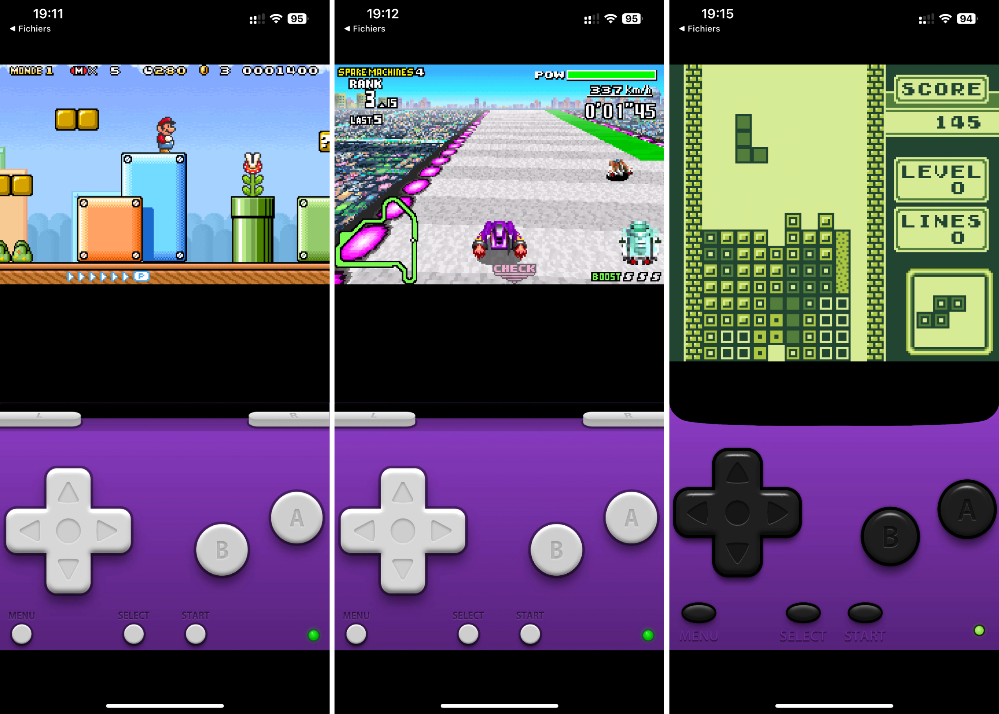

+++
title = "iGBA est le premier émulateur autorisé sur iPhone et iPad, et… retiré de l'App Store"
date = 2024-04-13T23:30:00+01:00
draft = false
author = "Mickaël"
tags = ["Actu"]
+++ 

Comme on pouvait le craindre, Apple a complètement merdé l'arrivée des émulateurs sur l'App Store. Apparu ce week-end, iGBA a été promptement supprimé des rayons de la boutique, sans que le constructeur donne de raisons. Il y a toutefois trois possibilités :

- iGBA a volé le code de GBA4iOS, l'émulateur (devenu Delta) développé il y a une dizaine d'années par Riley Testut qui attend toujours le feu vert d'Apple pour lancer sa propre boutique d'apps en Europe ;
- même si iGBA fait bien office d'émulateur, Apple s'est peut-être rendu compte que c'était un nid à pub ;
- Nintendo a discrètement fait pression sur Apple, ce qui n'est pas à exclure étant donné l'aversion du constructeur envers les émulateurs.

Une autre raison pourrait être avancée et qui fait craindre le pire pour l'avenir des émulateurs sur iPhone et iPad : Apple n'a pas vu qu'iGBA pouvait prendre en charge les ROMs (il faut un peu bidouiller pour les installer). Les *guidelines* de l'App Store — cet ensemble de règles biscornues que les développeurs doivent respecter — concernant les émulateurs peuvent en effet être interprétées comme interdisant les ROMs…

**Article original, 13/04 —** Il y a quelques jours, [Apple autorisait de peine et de misère les émulateurs dans l'App Store](https://nostick.fr/articles/2024/avril/0504-apple-a-fini-par-ceder-et-autorise-les-emulateurs-dans-lapp-store/), après en avoir fait la chasse depuis toujours. Une très bonne nouvelle donc, mais on pouvait craindre que les petites lignes des fameuses *guidelines*, autrement dit l'ensemble des règles auxquelles doivent se soumettre les développeurs, bloquent d'une manière ou d'une autre la possibilité d'émuler d'anciens jeux sur iPhone et iPad.

Ça n'est heureusement pas le cas ! Le premier émulateur « officiel » à faire son apparition dans la boutique d'Apple, [iGBA](https://apps.apple.com/gb/app/igba-gba-gbc-retro-emulator/id6482993626), permet de lancer n'importe quelle ROM Game Boy, Game Boy Color et Game Boy Advance. Et avec des performances à l'avenant, d'après les quelques jeux que j'ai pu essayer.

Par défaut, l'application renvoie vers [https://hh.gbdev.io](https://hh.gbdev.io), un excellent site web proposant des jeux réalisés par des fans. Mais pour ceux qui voudraient utiliser leurs propres ROMs, il suffit de les lancer depuis l'app Fichiers de votre iPhone ou de votre iPad, ou encore depuis le dossier « Téléchargements » de l'appareil, pour que iGBA les enregistre.

L'app ne propose qu'une seule interface à l'heure actuelle — une GBA — et affiche un bandeau de pub assez discret sur sa page d'accueil. La bonne surprise, c'est que les contrôles tactiles se montrent plutôt efficaces, même si on aimerait pouvoir repositionner les boutons comme on voudrait (il est possible de modifier l'opacité).

Parmi les réglages intéressants de iGBA, on relève la possibilité de réduire le framerate pour favoriser la qualité, une fonction de sauvegarde automatique (on peut aussi réaliser ses propres sauvegardes), ainsi que trois niveaux de retours haptiques. 

(Mise à jour) Évidemment, Apple a encore fait n'importe quoi en donnant le feu vert à une application qui est la copie conforme de GBA4iOS. Le développeur de cette app, Mattia La Spina, a tout simplement [copié/collé](https://www.threads.net/@rileytestut/post/C5u9xdDNCJ2) le code de l'émulateur mis au point il y a des années par Riley Testut, et qui est depuis devenu Delta. Donc mieux vaut ne pas télécharger iGBA, qui en plus d'afficher de la pub, intègre aussi des traqueurs de pub. Pour une première, Apple pouvait difficilement faire mieux (ou pire) que d'approuver un clone dans sa boutique.