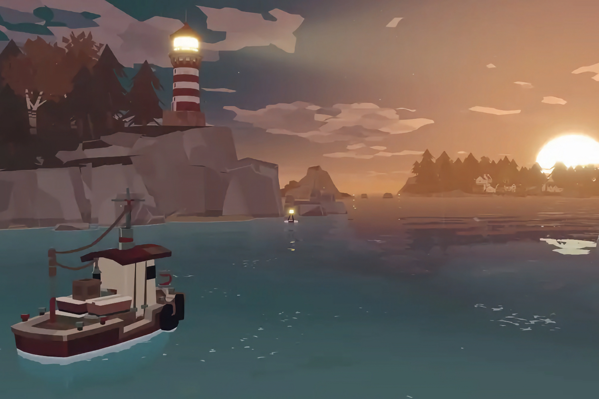
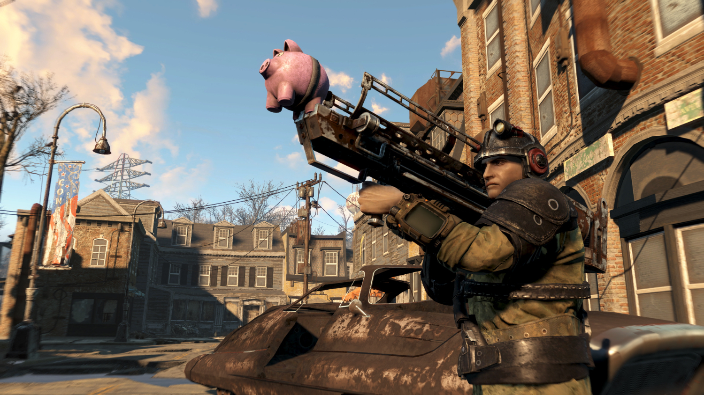

+++
title = "Chouette, grassouillette, un peu pouet-pouet : la folle semaine du jeu vidéo (13/04)"
date = 2024-04-13T11:00:01+01:00
draft = false
author = "Mickaël"
tags = ["Actu"]
+++ 

L’actualité du jeu vidéo ne s’arrête pas à la poignée d’articles publiés sur *Nostick* ! Histoire de rattraper le retard accumulé, voici un retour rapide sur quelques unes des infos les plus importantes (ou insignifiantes) de la semaine.

## Balatro plus facile pour les n00bs

*Balatro* n'est pas bien difficile à appréhender, y compris pour les joueurs qui n'ont jamais tâté du poker avant. Néanmoins, les premières parties peuvent être assez punitives : si on n'a pas immédiatement accroché au concept, certains peuvent passer à autre chose et c'est bien malheureux car ce jeu est une foutue drogue.

C'est pourquoi la première grosse [mise à jour 1.0.1](https://www.reddit.com/r/balatro/comments/1byktoa/101c_experimental_branch_is_live_on_steam/) de *Balatro* va filer un coup de main aux n00bs en facilitant l'octroi de jokers (il y en a même des gratuits !) ; le jeu donne aussi davantage de sous, les cartes de tarot sont plus généreuses en multiplicateur, et il est un peu plus facile de franchir certains paliers de progression.

Les joueurs plus aguerris ne sont pas oubliés pour autant, avec un nouveau mécanisme de jokers « périssables » au bout de 5 rounds pour les mises Orange. Les cartes de location des mises Or augmentent de 3 $ à chaque tour… Dans l'ensemble, le gameplay est rééquilibré plutôt à l'avantage du joueur. 

Cette mise à jour est expérimentale et les choses peuvent encore changer d'ici la version finale. Les joueurs Steam peuvent en tout cas la tester dès à présent en passant par les réglages du jeu dans la bibliothèque Steam (sélectionnez l'option *public_experimental* dans *Bêta* > *Participation à la bêta*).

## Dans un an, le suicide de Suicide Squad

On ne va pas se mentir, contrairement à *Balatro*, *Suicide Squad: Kill the Justice Squad* pourra difficilement prétendre au titre de jeu de l'année (j'attends qu'il tombe à 5 € sur Steam pour tester, ce qui est une question de jours maintenant). Le studio Rocksteady et WB Games ont [misé sur le mauvais cheval](https://nostick.fr/articles/2024/mars/suicidesquad/), et d'après les rumeurs la fin est proche pour le jeu service.

.")

En interne, l'objectif serait d'en terminer courant avril 2025 avec la saison 5, dans laquelle la Justice League devrait finalement travailler avec les quatre zigotos pour mettre fin au règne de terreur de Brainiac. Le fuiteur Miller Ross [ajoute](https://twitter.com/mmmmmmmmiller/status/1776286368219451832) que la saison 1, qui a livré le Joker en tant que perso jouable, n'a pas aidé à relancer des ventes modestes [insérer surprised-pikachu.jpg].

Le supplice de *Suicide Squad* pourrait donc durer encore un an, ce qui parait long pour un jeu qui regroupe moins de 1 000 joueurs en pointe sur Steam. Mais on imagine que Warner Bros avait l'ambition d'en faire sa gagneuse pendant de nombreuses années…

## Nouvelle arnaque pour les crypto-rétro-gogos

S'il ne suffisait pas au bitcoin et aux cryptos d'accélérer la destruction de la planète, voilà que ces arnaques viennent aussi pourrir les consoles rétro ! La BitBoy One se [présente](https://decrypt.co/225056/bitcoin-gaming-handheld-holds-btc-farms-airdrops) comme la première « console Web3 » qui permet de faire rouler des vieux jeux mais aussi des jeux « play to earn » qui permettent de gratter des récompenses en bitcoin (et possiblement des conneries de NFT).

L'appareil, qui rappelle le design de la console de Nintendo, est fabriqué par [Ordz Games](https://www.ordz.games/). Il intègre un écran de 3,45 pouces, un processeur Rockchip RK3566 et 32 Go de stockage ; une liste de caractéristiques qu'on retrouve sur de nombreuses autres consoles rétro du même genre à 50 balles.

En plus de tout le reste, l'engin peut servir de portefeuille à cryptos et même à miner des tokens en restant allumé (mais pas des bitcoins, trop gourmands pour un appareil si peu puissant). Le lancement de la Bitboy One est prévu pour avril au prix rondelet et ridicule de 500 $.

## En pleine rechute de Fallout

Pour une raison qui nous échappe, la série *Fallout* d'Amazon semble rencontrer un [gros succès](https://www.metacritic.com/tv/fallout/) du moins chez les critiques. La seule bonne nouvelle dans tout ça, c'est que ça poussera peut-être Bethesda à mettre rapidement en chantier un nouvel épisode de *Fallout*… le jeu. Après tout, *Fallout 76* remonte à 2018, et le dernier jeu solo *Fallout 4* à 2015.

En attendant que quelque chose de neuf se passe du côté du studio, ce dernier a décidé de donner un petit coup de polish aux jeux existants histoire de séduire les téléspectateurs emballés par la série. *Fallout Shelter*, le jeu mobile sorti en même temps que *Fallout 4*, a accueilli des personnages et de l'équipement de la série.

Mais c'est justement *Fallout 4* qui va finalement avoir droit à sa mise à jour next-gen tant attendue ! Cela veut dire que le jeu va proposer des modes performance et qualité sur Xbox Series S/X et PS5, le support des écrans ultra-widescreen pour les PC, des correctifs à gogo, et même la certification Steam Deck, le tout étant prévu pour le 25 avril. Il y aura même du nouveau contenu gratos, oui GRA-TOS.

## Discord fait le ménage dans les émulateurs Switch

Discord fait du zèle. La plateforme a tout simplement [décidé](https://www.theverge.com/2024/4/11/24127545/discord-suyu-sudachi-server-shutdown-account-ban) de fermer les serveurs dédiés aux émulateurs Suyu et Sudachi, empêchant de fait ces deux communautés d'échanger. L'entreprise explique qu'elle agit en vertu d'une requête DMCA, une loi américaine visant à protéger le droit d'auteur et que les ayants droits ont transformé en véritable arme judiciaire — et parfois de censure.

Le hic, c'est que Discord ne précise pas quelles infractions au DMCA ont abouti à la fermeture de ces serveurs, alors qu'une telle requête doit être motivée en incluant une description du contenu problématique. Et il existe une procédure d'appel qui manifestement a été jetée aux oubliettes par la plateforme.

Par conséquent, les animateurs de ces deux communautés se retrouvent devant le fait accompli. Il faut dire que tout ce qui tourne autour de Yuzu est radioactif. Cet émulateur Switch dont Nintendo a eu la peau sert de base à Suyu et Sudachi. Mais rien ne dit — et Discord non plus jusqu'à preuve du contraire — que du code protégé par copyright a été partagé sur ces serveurs.

Bref, les émulateurs Switch, et au-delà pour toutes les consoles, vivent actuellement un moment bien compliqué.

## Trailers en vrac

 

**Star Wars Outlaws —** Le prochain open world d'Ubisoft s'annonce fort sympathique, ce d'autant qu'il se déroule dans une galaxie très lointaine bien connue. On y incarnera la voleuse Kay Vess accompagnée de son petit compagnon mignon Nix dans une histoire qui se déroule entre les épisodes V et VI de la saga. La preuve, on y voit Han Solo dans sa prison de carbonite ! Sortie prévue le 30 août sur PC, PS5 et Xbox Series S/X.

 

**Destiny 2: La Forme Finale —** Grosse pression sur les épaules de Bungie, le studio devant démontrer qu'il est toujours le champion du jeu service (notamment auprès de son nouveau boss, Sony). *La Forme Finale* est l'extension de *Destiny 2* qui doit conclure les dix ans de la saga. Ça valait bien quelques mois de retard… De nouveaux ennemis feront leur apparition, mais c'est surtout la possibilité de combiner des capacités de lumière et d'obscurité qui fait jaser dans la communauté. Rendez-vous le 4 juin pour enfin tout savoir (on peut s'en foutre, aussi).

## Un peu plus de vrac, je vous le mets quand même allez

**Dredge —** Après *The Last of Us*, *Fallout* et *Borderlands*, le prochain jeu qui va être adapté en live action ne sera autre que… *Dredge*. Oui, le jeu indé mixant pêche et horreur sorti l'an dernier ! C'est la maison de prod' Story Kitchen qui s'est [arrangée](https://variety.com/2024/film/news/dredge-live-action-movie-black-salt-story-kitchen-1235964426/) les droits pour en faire un film. Et ils connaissent leur métier : c'est elle qui est derrière les adaptations au cinoche d'un certain Sonic… Pour le moment, le projet est en développement et on ignore quand Dredge flottera vers le petit ou le grand écran.

**EA Play —** Les 3 joueurs et demi qui sont abonnés au service EA Play paieront plus cher leur accès : l'abonnement mensuel passe de 3,99 € à 5,99 € (ou 39,99 € par an). La formule EA Play Pro sera facturée 19,99 € par mois (+2 €), ou 119,99 € par an (+20 €). Ces tarifs s'appliqueront à partir du 10 mai pour les nouveaux abonnés, s'il y en a. La question qui se pose concerne surtout le Game Pass, qui intègre EA Play sans frais supplémentaires ; faut-il s'attendre à une hausse des prix du service Xbox ?

**Foamstars —** Le ~~clone de Splatoon~~ jeu à base de mousse colorée de Square Enix est dans les chaussettes. Le titre multijoueur exclusif PlayStation a [enregistré](https://www.truetrophies.com/news/foamstars-ps-plus-player-count) une baisse vertigineuse du nombre de joueurs sur le PS Plus : -95 % (!) depuis son lancement il y a deux mois. Le jeu a eu la malchance de sortir en même temps que *Helldivers II*, qui lui fait un carton. Malgré cette cagade, Squeenix continue d'y croire en livrant du contenu frais et en multipliant les saisons (on en est à la 3e). Mais parfois, ça ne suffit pas pour maintenir l'engagement des joueurs, ce qui est évidemment crucial pour un jeu service.