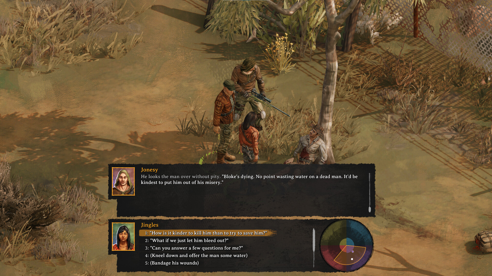
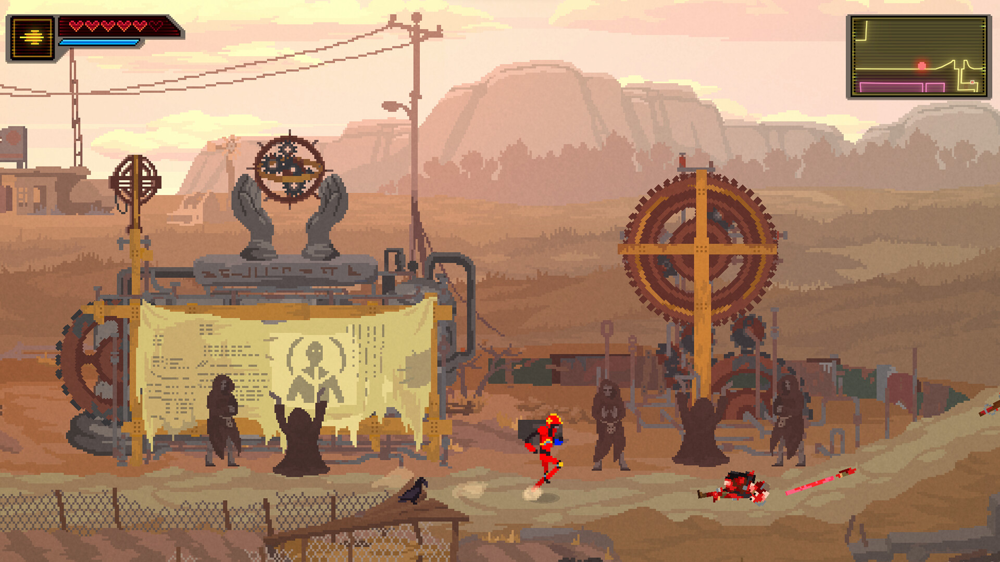

+++
title = "Les sorties de la semaine (14/04)"
date = 2024-04-14T08:00:00+01:00
draft = false
author = "Félix"
tags = ["C’est dispo"]
+++ 

*Entre le boulot, les courses et la TV du salon qui rend l’âme deux semaines après la fin de la garantie (ça n’arrive qu’à vous), vous n’avez peut-être pas eu le temps de vous intéresser aux nouveautés du moment. Qu’à cela ne tienne : voici les sorties de ces derniers jours qui ont retenu notre attention.*

## Cheapo Elysium 

« Ah merde ». Voilà ce que je me suis dit ce matin en voyant les évaluations négatives bien rouges sur la page Steam de ***Broken Road***. Ce RPG australien m’intriguait depuis un bout de temps, cherchant ses inspirations du côté de *Fallout* et autres *Disco Elysium*. Le résultat n’est visiblement pas terrible : les testeurs regrettent un univers superficiel, des personnages ennuyeux et un scénario oubliable, ce qui est quand même pas de bol pour un RPG. Il y a bien un système de choix moraux, mais qui est apparemment sous-exploité tandis que la plupart des quêtes consistent à aller chercher 10 morceaux de tel item pour tel PNJ. C’est dommage parce que le concept d’un monde post-apo en Australie est séduisant (*j’exige* un bon jeu avec des kangourous radioactifs, de la Vegemite et des accents rigolos). Les fans de *Fallout* en manque auront sans doute mieux fait de se tourner vers la série d’Amazon, sur laquelle les critiques sont étonnamment positives. *Broken Road* est à 34 € [sur Steam](https://store.steampowered.com/app/1403440/Broken_Roads/), mais vous pouvez passer votre tour.

## Le soleil dans le viseur

Le concept bizarro de la semaine, c’est sans conteste ***Children of the Sun***. Dans l’idée vous incarnez une jeune fille armée d’un sniper qui doit vider un niveau de ses ennemis. Pas question de courir partout en faisant des 360 noscope : ici il n’y a qu’un seul tir, et on contrôle la vitesse et la trajectoire de la balle à la troisième personne. Le jeu est donc plutôt une sorte de puzzle à l’esthétique PS2 qui me rappelle vaguement *El Paso, Elsewhere*. L’histoire tournant autour d’une revanche sur un culte obscur n’est visiblement pas bien complexe, mais prenante. Avec une durée de vie de 4-5 heures pour un tarif abordable de 15 €, c’est sans doute un bon investissement si les captures d’écrans de [la page Steam](https://store.steampowered.com/app/1309950/Children_of_the_Sun/) vous intriguent. Et admettez que le trailer est chouette :



## A boy and his BMX

Je n’avais absolument jamais entendu parler de *[Turbo Kid](https://en.wikipedia.org/wiki/Turbo_Kid)*, un petit film post-apo canadien de 2015 qui a eu droit à une adaptation en JV presque 10 ans après sa sortie. Le jeu est un metroidvania en pixel-art réalisé par le studio derrière *PewDiePie: Legend of the Brofist*, qui était apparemment [pas aussi nul](https://www.rockpapershotgun.com/pewdiepies-legend-of-the-brofist-review-pc) que ce qu’on pourrait imaginer. Bref, ***Turbo Kid*** se démarque surtout par ses graphismes sympas et la possibilité d’explorer le monde en BMX. Les retours sur Steam sont très positifs, et les quelques tests ici et là donnent plutôt envie. Peut-être pas le GOTY, mais ça pourra faire le taf si vous cherchez un truc à grignoter en attendant *Silksong* (le tarif [de 20 €](https://store.steampowered.com/app/1733250/Turbo_Kid/) est correct). Et si vous n’avez pas vu le film, pas de problème : les développeurs mettent en avant le fait que « *tous les dialogues sont sautables* » tandis qu’il est possible d’ignorer les cinématiques.

## Red Dead VRedemption

Les beaux jours reviennent : pourquoi ne pas fermer les volets pour faire un peu de VR ? Tout d’abord pour replonger quelques semaines dans *Wow*, dont un mod en réalité virtuelle [vient de sortir](https://www.dsogaming.com/mods/world-of-warcraft-vr-mod-available-for-download/). Une fois que vous serez lassé de la taverne de Goldshire, vous pourrez essayer ***Black Trail VR***, un jeu qui vous plonge au cœur de l’action d’un Western. Tous les clichés y sont, la page Steam évoquant pêle-mêle un vieux chasseur de primes et la « mine de Snake Canyon » avant de montrer des combats à l’arc ou à la Gatling depuis un train. Bon, on se doute que c’est pas le nouveau *Half-Life : Alyx*, mais pour une fois qu’un jeu un peu développé sort en VR, on ne va pas se priver. Les retours ne sont pas incroyables pour un truc facturé 35 € [sur Steam](https://store.steampowered.com/app/1576420/Black_Trail_VR/), mais à 5 € en soldes dans quelques mois ça pourra faire le taf.

## Le Journey F2P s’envole sur Steam

Vous vous sentez un peu seul en ce moment, ce qui n’est pas aidé par le fait que vos comptes sont dans le rouge alors qu’on est pas encore le 15 du mois ? Pas de soucis : le MMO free-to-play pour smartphone ***Sky : Enfants de la Lumière*** est désormais disponible [sur Steam](https://store.steampowered.com/app/2325290/Sky_Children_of_the_Light/). Non, moi non plus je n’ai pas envie de jouer à un MMO free-to-play mobile sur mon PC, mais celui-là a l’air sympa étant donné qu’il a été réalisé par les développeurs de *Journey* et *Flower*, des jeux très relax super bien accueillis (plus de 90 % sur Metacritic). Bref, il s’agit d’un joli jeu d’aventure avec des plateformes et énigmes mettant l’accent sur les interactions sociales, bien que le tchat soit désactivé. Il est possible de faire toute l’aventure sans débourser un centime vu que la boutique vend juste différents bonus pour aller plus vite. Le jeu avait été bien accueilli à sa sortie sur iOS en 2018, alors pourquoi pas. 





