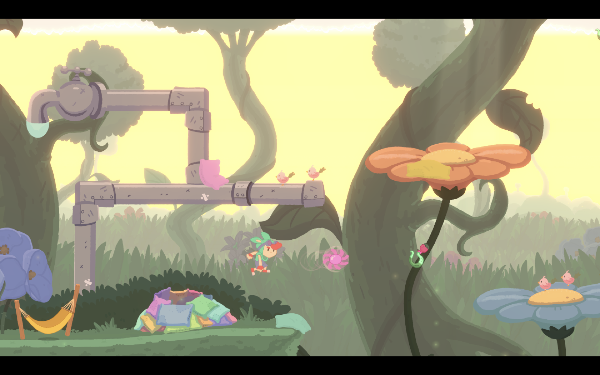
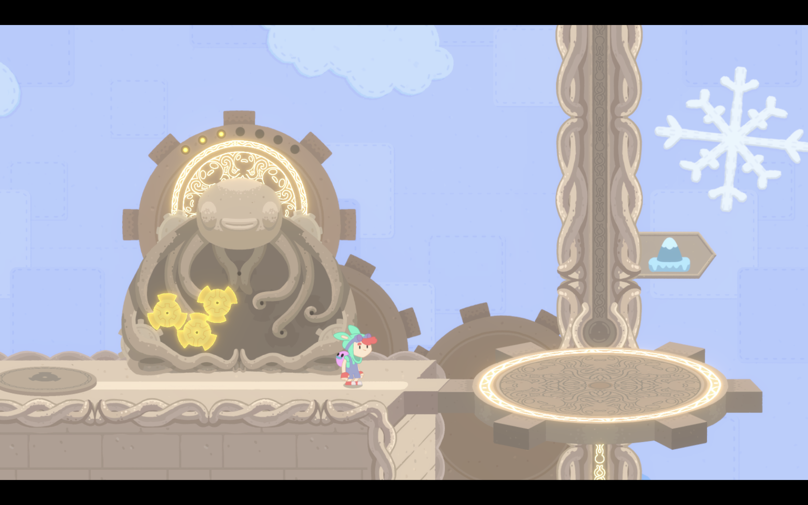
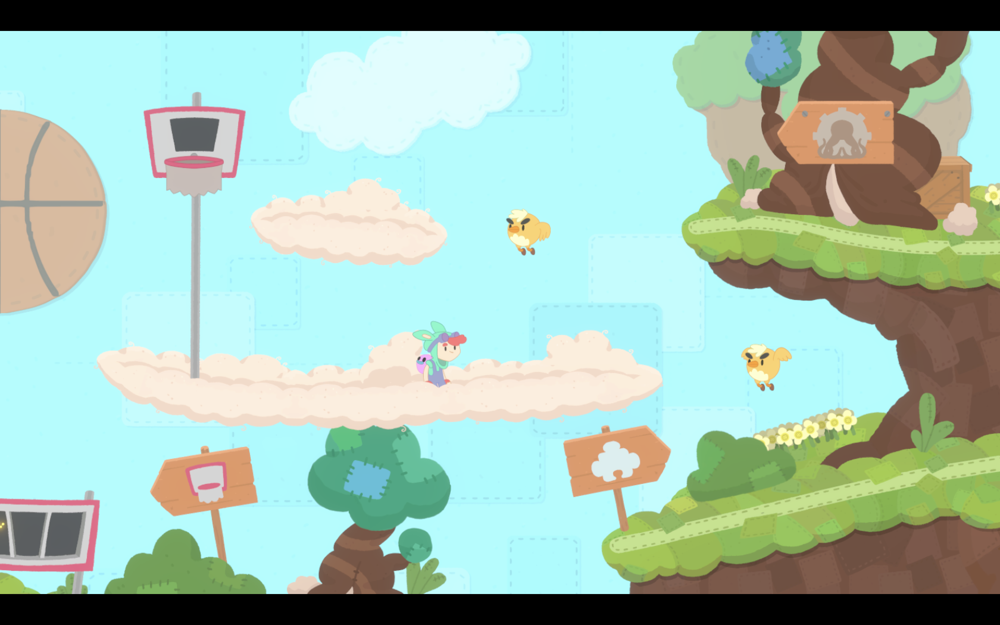
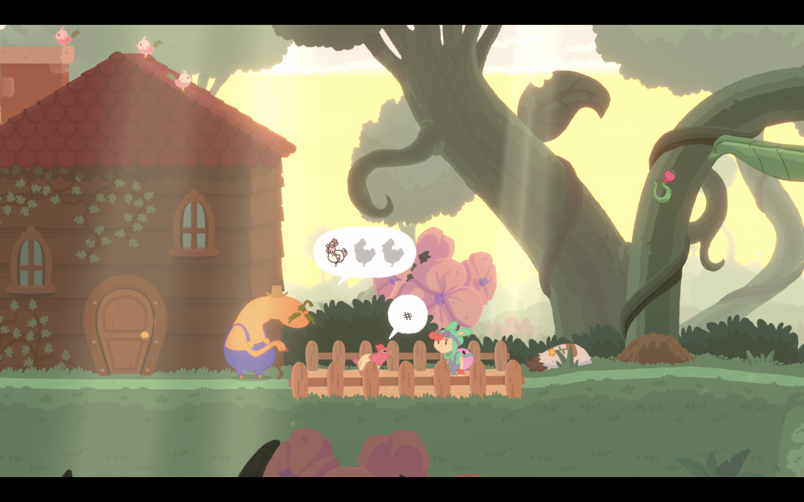
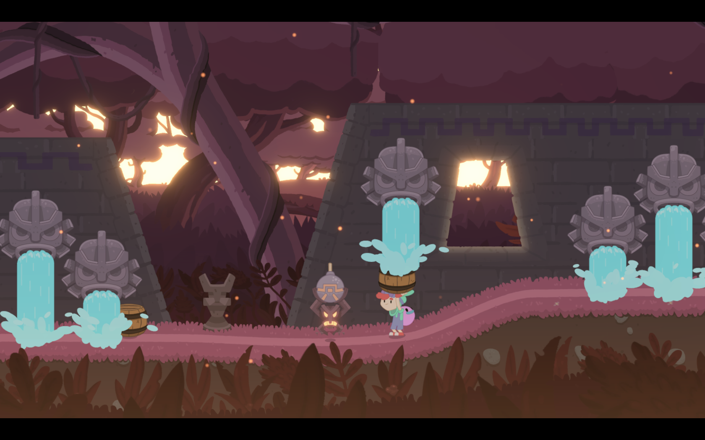
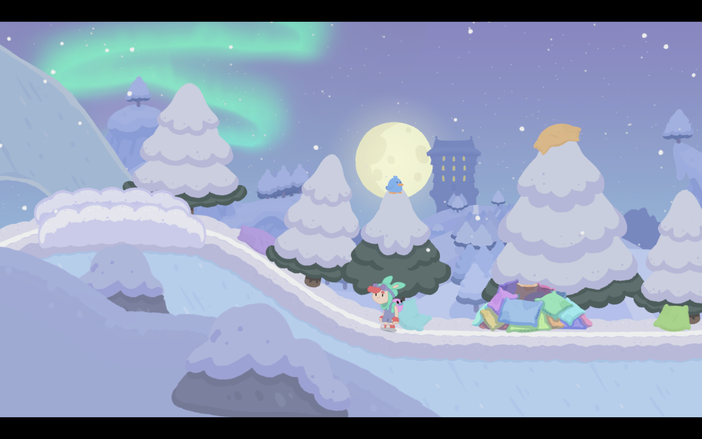

+++
title = "Test de Promenade : sauts de cabris et collecte de pièces jaunes"
date = 2024-04-15T20:00:00+01:00
draft = false
author = "Félix"
tags = ["Test"]
image = "https://nostick.fr/articles/2024/avril/1504-promenade-poulpe-friction/011.png"
+++ 

Vous pouvez ranger les tronçonneuses et autres shotguns : *Promenade* est un plateformer tout mignon et délicieusement animé créé par le studio nantais Holy Cap. Et ces gens-là savent que ce qu’on veut dans un jeu de plateforme, c’est la satisfaction de réussir une suite de sauts alambiqués sans forcément s’embarrasser de dialogues et autres cinématiques.

## Promenade, ça parle de quoi ?

Le scénario tient sur un post-it. On incarne un petit bonhomme qui n’est pas sans rappeler Finn d’*Adveture Time* ayant avec lui un poulpe-boomerang servant à attraper les ennemis (pensez à Yoshi dans les *Mario 2D*). Un méchant arrive sans plus d’explications, casse les rouages d’un ascenseur central, et emballé c’est pesé : il faut partir à la recherche de ces petits mécanismes jaunes dispersés à travers la carte pour réparer la machine et débloquer les étages supérieurs qui sont autant de nouveaux mondes.

L’absence de véritable fil rouge ne veut pas dire que le jeu manque de personnalité. Comme dans un *Rayman*, les environnements traversés sont tous différents et originaux, avec autant de monstres à découvrir que de détails en arrière-plan. Vous l’aurez remarqué sur les captures d’écrans, *Promenade* table sur un design très dessin animé vraiment sympa une fois que tout se met en mouvement. Et la bonne nouvelle, c’est que le gameplay n’est pas en reste.

## Comment ça se joue ?

*Promenade* se présente comme un jeu de plateformes en apparence assez simple : pas de dash, de coup de poing ou de touche pour courir. Le poulpe que l’on a dès le début est une sorte de grappin servant à attraper les objets et autres ennemis. On peut alors les jeter à ses pieds pour effectuer un double saut, qui est une des mécaniques principales du jeu. Quelques petites améliorations constantes se débloquent par la suite, ce qui renouvelle le gameplay sans pour autant le chambouler.

Avec ses graphismes pour enfant et son gameplay abordable, on pourrait facilement se dire que *Promenade* est un plateformer ultra-simpliste visant les 7-12 ans. Ce serait une erreur : si le jeu commence avec un personnage un peu lent et des niveaux accessibles, il révèle vite un gameplay beaucoup plus nerveux qu’imaginé. On n’est pas au niveau d’un *Super Meat Boy*, mais *Promenade* réserve son lot de passages ardus que j’ai dû recommencer une dizaine de fois. 

Le jeu incite à récupérer des fragments de rouages cachés ici et là, que ce soit à la fin de mini-niveaux de plateformes ou par de petites énigmes toujours bien pensées. Tout pousse à l’exploration pour trouver ces fameux items, parfois mis en évidence, parfois beaucoup plus planqués.

J’avais un peu peur que cet aspect collecte soit redondant : ai-je vraiment envie de partir une fois de plus à la recherche de X fragments de machins pour débloquer une nouvelle zone ? Les développeurs ont eu la bonne idée de faire des zones de tailles raisonnables, ce qui fait que l’on cherche dans un périmètre assez restreint. On a rapidement quadrillé un nouveau secteur, et la progression s’enchaîne finalement assez vite. 

Contrairement à ce que l’on aurait pu craindre, les énigmes ne sont pas uniquement là pour répondre à un cahier des charges et s’intègrent bien à l’aventure, d’autant plus que l’exploration n’est pas linéaire : on peut passer à autre chose le temps de réfléchir.

## Qu'est-ce qui est bien ?

Le gros point fort de Promenade vient du fait qu’il arrive à constamment se renouveler. Son level design bien fichu introduit des gimmicks à la pelle, avec par exemple des fusées à attraper faisant courir le personnage très vite, des accroches pour grappin qui se déplacent, des véhicules… Chacun d’entre eux n'est utilisé que quelque temps, ce qui est un bon point. Dès lors qu’on commence à bien maitriser le gimmick du niveau, on passe à autre chose. Le jeu ne s’essouffle pas, et on entame chaque nouvelle zone en se demandant ce que les développeurs ont bien pu trouver comme bonne idée.

De manière globale, le jeu est léché. On sent une réelle maîtrise dans la progression, et les petites énigmes cachant un fragment sont toujours bien senties. L’univers est chouette et la bande-son reste en tête. La durée de vie est plutôt bonne étant donné qu’il vous faudra une dizaine d’heures pour en venir à bout en cherchant l’intégralité des morceaux. Les plus pressés pourront toujours aller plus vite en omettant de récupérer les mieux cachés.

## Qu'est-ce qui est moins bien ?

Difficile de dire du mal de *Promenade*, bien que l’on puisse regretter quelques petits défauts. Le jeu a fait le pari de ne proposer aucune ligne de texte, ce qui peut parfois être déroutant. Certaines mécaniques de gameplay peuvent sembler un peu obscures au premier abord, tandis que quelques énigmes sont tirées par les cheveux. Le concept même de *‌collectathon* incitant à fouiller de fond en comble un niveau peut parfois se révéler énervant étant donné qu’il implique de faire pas mal d’allers-retours. Je n’aurait pas craché sur une carte non plus.

## C'est oui ou c'est non ?

Vous l’aurez compris, j’ai beaucoup apprécié ma dizaine d’heures passées sur *Promenade*. La partie graphique est une réussite et le gameplay bien rodé. Si *Mario Wonder* vous a laissé sur votre faim et que vous cherchez un plateformer pour votre Switch ou à garder dans un coin de Steam Deck, *Promenade* est un très bon choix. Il a l’avantage d’être proposé un tarif abordable : 19,50 € [sur Steam](https://store.steampowered.com/app/1781260/Promenade/), avec en plus une grosse démo qui permet de bien se faire une idée.

*Jeu testé sur ROG Ally et sur un MacBook Air via CrossOver.*



