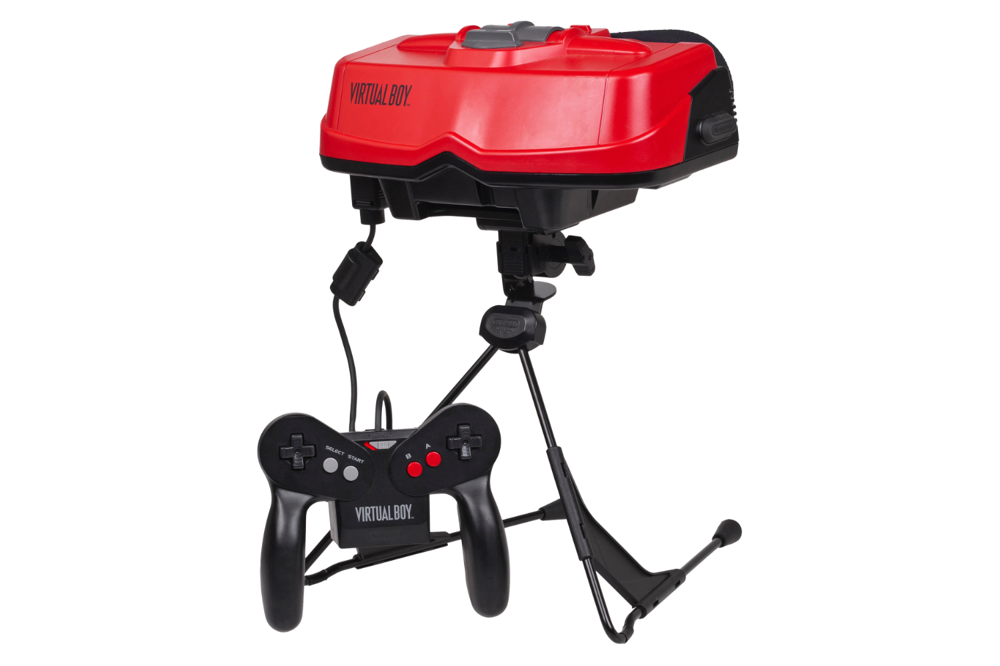

+++
title = "Virtual Boy sur le Vision Pro : enfin une killer app pour le casque d'Apple !"
date = 2024-04-16T18:47:32+01:00
draft = false
author = "Mickaël"
tags = ["Actua"]
+++ 

Nintendo a connu son lot de flops — la Wii U vient immédiatement en tête, bien sûr —, mais le [Virtual Boy](https://en.wikipedia.org/wiki/Virtual_Boy) est probablement le plus incongru. Sortie en 1995, cette horreur de console ressemblait à une grosse paire de jumelles rouges montée sur un trépied. La grande nouveauté était l'affichage en 3D stéréoscopique sur un écran monochrome (rouge).

Le monstre a tenu moins de six mois avant que Nintendo mette le holà : les ventes n'étaient pas du tout au rendez-vous — le constructeur espérait 3 millions d'unités écoulées, en réalité il en aurait vendu moins de 800 000… Durant sa carrière réduite à peau de chagrin, une poignée de jeux est sorti, comme *3D Tetris*, *Mario's Tennis* ou encore *Virtual Boy Wario Land* qui reste probablement le meilleur jeu de la plateforme défunte.

 

Bizarrement, Nintendo n'a pas adapté le maigre catalogue du Virtual Boy sur la 3DS, alors que la console portable semblait tout à fait calée pour accueillir ces titres. Qu'à cela ne tienne, [Red Viper](https://github.com/skyfloogle/red-viper), un émulateur pour 3DS, est disponible depuis le mois de février. Tous les titres du Virtual Boy peuvent rouler dessus sans ralentissement.



Nintendo n'enterrera pas l'héritage du Virtual Boy si facilement. Il existe aussi un émulateur pour le Meta Quest, [Virtual Boy Go](https://sidequestvr.com/app/125/virtualboygo), à installer en sideloading sur le casque. Et surprise, le développeur Adam Gastineau a [annoncé](https://twitter.com/iam_agg/status/1780024134187340085) le développement d'un émulateur Virtual Boy pour l'Apple Vision Pro ! Et après tout ça a du sens, [Apple autorisant enfin les émulateurs dans l'App Store](https://nostick.fr/articles/2024/avril/1304-igba-est-le-premier-emulateur-autorise-sur-iphone-et-ipad/).

 

Adam Gastineau est un spécialiste reconnu de l'émulation. C'est lui qui conçoit les cores PC Engine et Game & Watch pour la Pocket, la console de poche d'Analogue. À l'heure actuelle, il rencontre encore des petits soucis qui empêchent l'émulateur de fonctionner correctement avec le casque de réalité mixte hors de prix d'Apple. Adam prévient aussi que l'application ne sortira pas de si tôt. 

Mais les utilisateurs du Vision pro surveilleront de près le développement, vu la pauvreté du catalogue d'apps pour l'appareil.