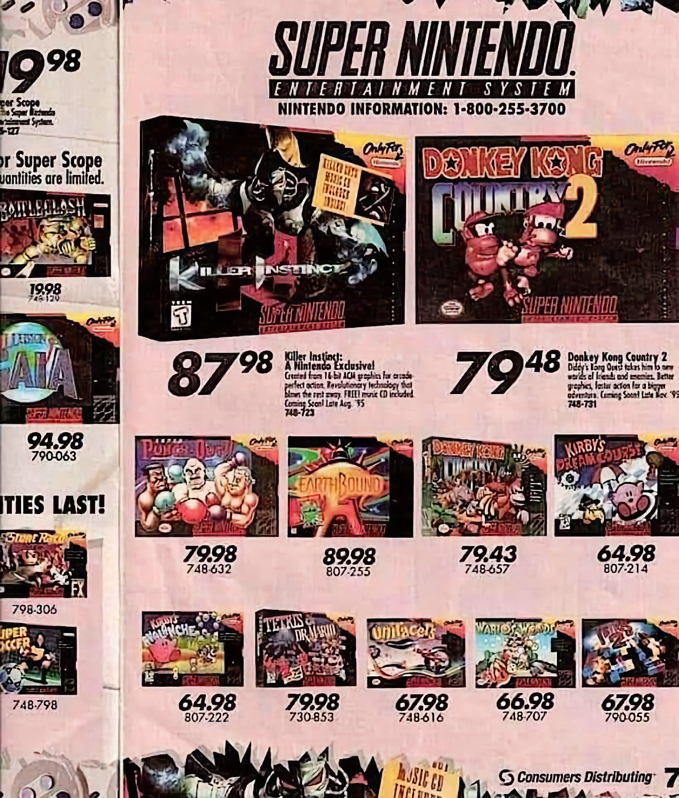
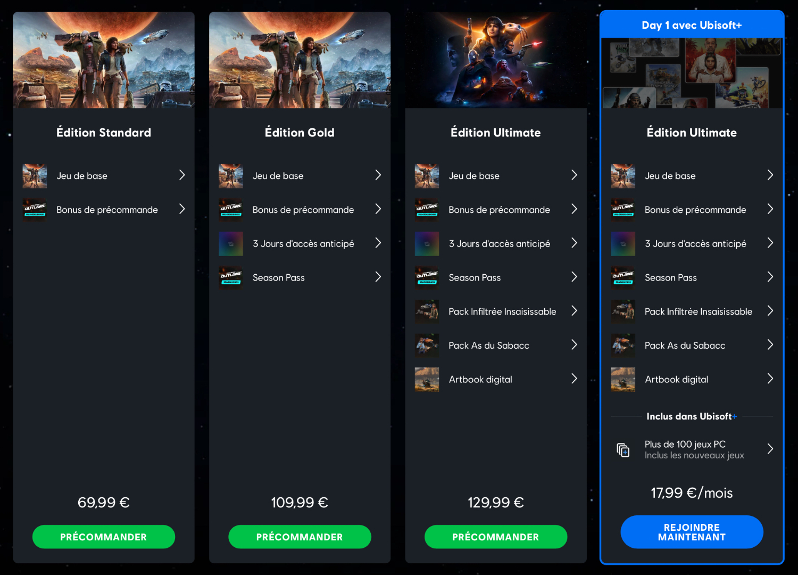
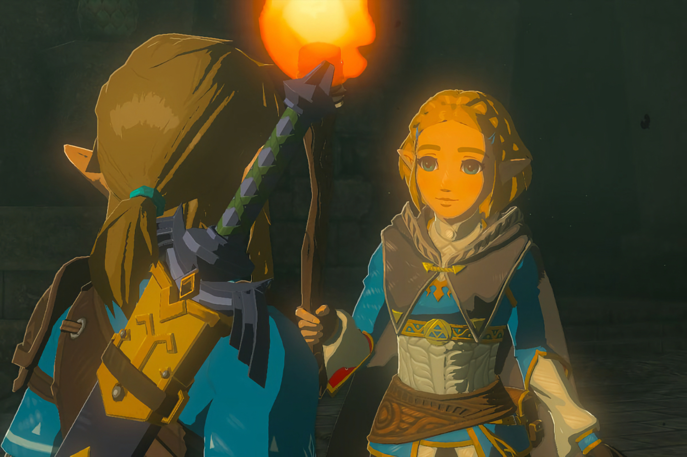
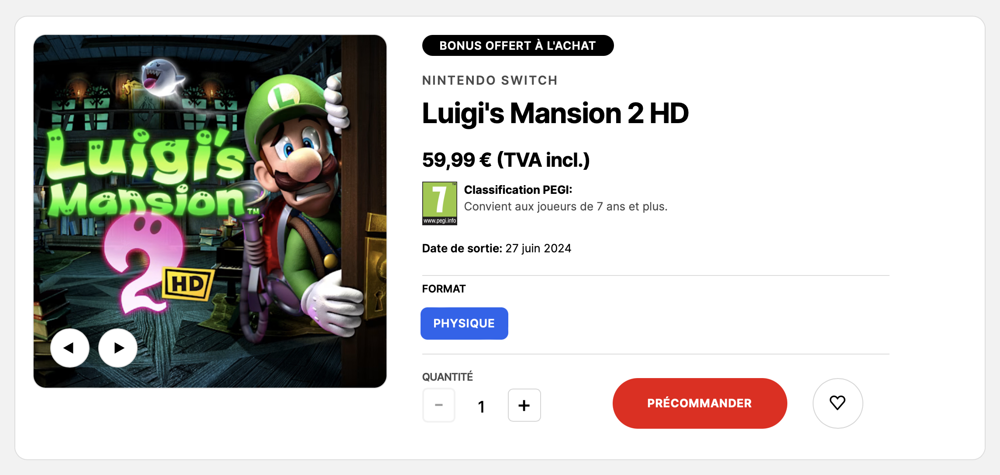
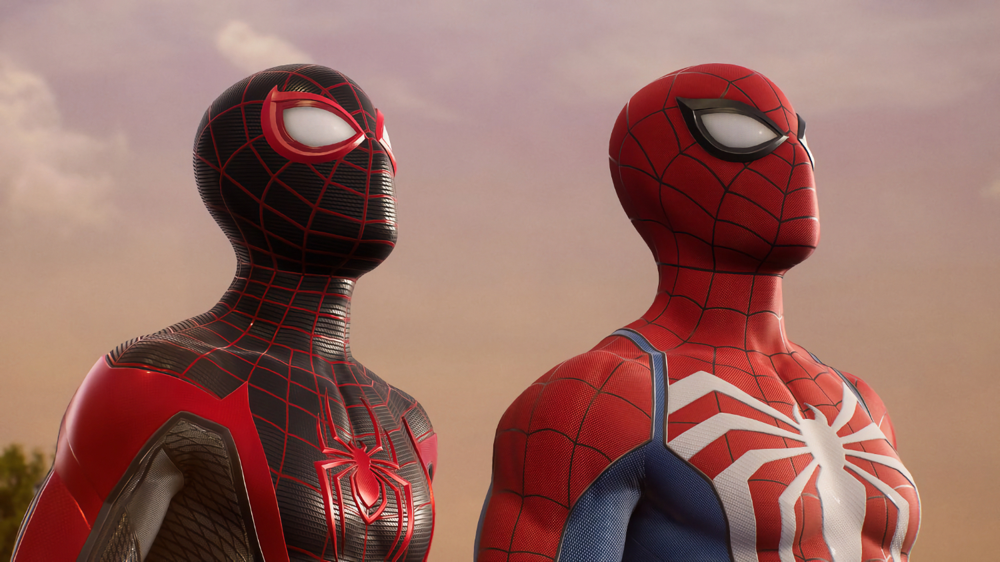
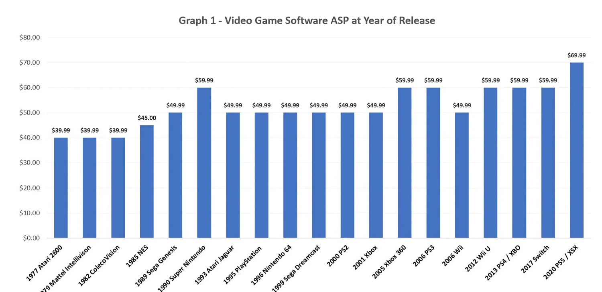
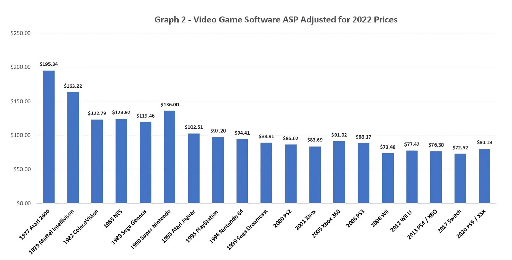

+++
title = "Les jeux vidéo coûtent-ils vraiment trop cher ?"
date = 2024-03-18T18:47:32+01:00
draft = false
author = "Mickaël"
tags = ["XXL"]
+++ 

 

**C'est une petite musique que les studios et les éditeurs font entendre discrètement, mais sûrement, aux oreilles des joueurs : les jeux vidéo ne sont pas vendus assez chers. La barrière des 70 € est toujours un peu difficile à franchir mais l'industrie cherche à relever le seuil psychologique. Jusqu'où ?**

Tous les moyens sont bons pour aller gratter au-delà du prix de vente du jeu. Season pass, battle pass, pack de cosmétiques exclusifs, édition « gold » et « ultimate »… Le lancement de *Starfield* l'an dernier a gravé dans le marbre une nouvelle pratique consistant à donner accès au jeu quelques jours avant son lancement officiel à tous ceux qui ont accepté de mettre un petit billet supplémentaire.

Cet accès anticipé s'est transformé en avantage désormais standard dans les éditions de luxe des nouveaux AAA. Ubisoft a fait fort récemment avec *Star Wars Outlaws*, dont l'édition Ultimate combine 3 jours d'accès anticipé avec un season pass, des packs de machins sans intérêt, un artbook (et le jeu de base, ouf), le tout pour la modique somme de 130 €. Le prix de deux jeux Xbox ou PlayStation…

 

Les studios ne manquent pas d'imagination pour faire cracher les fans au bassinet. Quitte à découper les aventures solo en tranches : les season pass et les DLC ressemblent parfois à des bouts du jeu original que l'éditeur a décidé de mettre de côté pour le vendre à part. Il existe heureusement des exceptions : *Phantom Liberty*, le DLC de *Cyberpunk 2077*, est pratiquement un jeu complet. Le roguelite *Valhalla*, le DLC (gratuit !) de *God of War Ragnarok*, est jouable jusqu'à la fin des temps…

Certains éditeurs jouent cartes sur table. C'est le cas de Nintendo, qui a décidé de vendre le dernier *Zelda* 10 € de plus que les autres titres *first party* du constructeur. *Tears of the Kingdom* est le premier jeu Nintendo à être vendu 70 €, car « *il reflète le genre d'expérience que les fans peuvent attendre de ce type de jeu* », [expliquait](https://apnews.com/article/nintendo-bowser-mario-donkey-kong-universal-interview-8aeaa03f3ad4a3032c08c77945a3e787) Doug Bowser, le président au nom rigolo de Nintendo of America.

Ça ne veut pas dire que 70 € sera le nouveau prix de base des gros jeux de Nintendo. D'ailleurs, aucun autre titre de l'éditeur n'a retrouvé ces sommets tarifaires depuis. Mais s'il s'agissait de tester l'appétit des joueurs pour cette étiquette, l'entreprise peut être rassurée : *TotK* a dépassé les 20 millions de copies l'an dernier.

 

Chez Capcom aussi, on prépare les esprits à une future hausse des prix. Haruhiro Tsujimoto, le président de la boîte, n'y est pas allé par quatre chemins : pendant une interview au Tokyo Game Show, en décembre dernier, il a [déploré](https://www.nikkei.com/article/DGXZQOUF1434D0U3A910C2000000/) que les prix des jeux étaient « *trop bas* ».

En attendant de relever les prix de ses jeux, Capcom met le paquet sur les micro-transactions, ce qui ne manque jamais de créer la polémique. Dernière en date : *Dragon's Dogma II*, où il est beaucoup plus facile d'acheter avec de vrais sous des items présents dans le jeu, aussi rares que pratiques (pour se téléporter, par exemple).

## Un peu de mauvaise foi, un peu de filouterie

Des jeux comme *Tears of the Kingdom*, *Persona 5* ou encore *Yakuza 8* offrent des dizaines et des dizaines d'heures de jeu pour ceux qui veulent aller au-delà de la fin du scénario et poursuivre l'exploration de ces univers. Rapporté au prix de vente du jeu, l'heure passée à crapahuter dans Hyrule ou à Hawaï est finalement assez rentable pour le joueur, certainement plus en tout cas qu'une heure de cinéma.

Le dernier *Zelda* est vendu 70 €, mettons que vous allez y passer 100 heures — un étiage qui ne parait pas farfelu —, l'heure de jeu revient donc à… 0,70 €. De ce point de vue, à part let jet de cailloux dans la mare, vous ne trouverez pas de divertissement plus abordable que le jeu vidéo ! Mais évidemment, ce n'est pas aussi simple.

Un jeu acheté à prix d'or peut se révéler décevant, ou rapidement terminé avec une rejouabilité limitée. Pour excellent qu'il soit, *Metroid Dread* n'a pas grand chose à offrir passée l'aventure qui dure une dizaine d'heures. Et pourtant, le jeu est toujours facturé plein pot par Nintendo, même s'il bénéficie régulièrement de promo. 

 

Entre la mauvaise foi des joueurs (pas tous…) et les filouteries de certains éditeurs pour nous pousser à la dépense, il y a aussi des raisons concrètes, très réelles, qui poussent les feux sous les prix des jeux : « *Les coûts de développement des jeux sont cent fois plus élevés que durant l'ère de la NES* », expliquait l'an dernier Haruhiro Tsujimoto, le président de Capcom, « *mais les prix des logiciels n'ont pas augmenté de la même façon* ». 

Parmi ces coûts, il y a bien sûr celui des salaires dans une industrie qui a besoin de centaines de cerveaux bien faits pour développer des jeux toujours plus longs, plus riches, plus complexes. Mais pour les plus grosses machines, les frais de licence peuvent aussi être exorbitants.

*Spider-Man 2* est un exemple certes caricatural, mais qui n'en est pas moins vrai : l'exclusivité PS5 d'Insomniac a [coûté](https://kotaku.com/what-hacked-files-tell-us-about-the-studio-behind-spide-1851115233) la bagatelle de 300 millions de dollars (!) à développer. Et le jeu réutilisait une map et des éléments conçus pour le premier *Spider-Man* et rentabilisés avec *Miles Morales*… Cette somme digne des plus gros blockbusters hollywoodiens a été multiplié par 3 par rapport au premier opus des aventures de l'homme araignée. 

 

Pas sûr que les joueurs aient réellement vu la différence, malgré les évidentes qualités du titre. Le seuil de rentabilité pour *Spider-Man 2* était de 7 millions de copies, et Sony l'a franchi sans trop de difficulté. Début février, le constructeur annonçait avoir écoulé 10 millions de copies. De quoi gagner de l'argent… mais pas forcément d'exploser le compte en banque. Malgré tous ses succès, Insomniac a fait partie de ces studios Sony qui ont dû [licencier](https://gamerant.com/insomniac-games-statement-layoffs/) du personnel en début d'année.

Le groupe a aussi annoncé, par la voix de son patron par intérim Hiroki Totoki, une réduction des budgets pour ses grosses machines, et procéder à une révision des calendriers de développement qui sont extrêmement longs. Une des solutions envisagées dans l'industrie, et [aussi par de nombreux joueurs qui le temps est compté](https://nostick.fr/articles/2024/avril/0404-les-jeux-trop-longs-sont-trop-longs/), est de produire davantage de jeux plus courts vendus à des prix plus bas. 

*Assassin's Creed Mirage*, avec son univers concentré dans la ville de Baghdad en 861, offre ainsi une vingtaine d'heures de jeu pour 50 €. Et ça n'en reste pas moins un AAA… Tout comme l'est *Hellblade II* qui proposera une expérience concentrée pour 50 € également. 

## Mais est-ce que les jeux coûtent vraiment plus cher ?

C'est la question à un milliard de dollars et la réponse n'a rien d'évident. En surface, c'est oui comme le montre ce graphique *[GamesIndustry.biz](https://www.gamesindustry.biz/are-video-games-really-more-expensive)* à partir de chiffres de *[TechRaptor](https://techraptor.net/gaming/features/cost-of-gaming-since-1970s)*  :

 

À l'époque de l'Atari 2600, un jeu coûtait en moyenne 40 $. 43 ans plus tard, sur une PS5, il coûte 70 $, soit une hausse de 75 %. Dit comme ça, évidemment, le prix des jeux a sérieusement grimpé. Mais dès lors qu'on prend l'inflation en compte, la situation est complètement renversée :

 

Ce même jeu pour Atari 2600 serait vendu aujourd'hui un peu plus de 195 $ ! Soudainement, les 80 $ demandés pour un jeu PS5 (prix ajusté par rapport à l'inflation de 2020) paraissent presque bon marché. Plus on avance dans le temps, plus le prix des jeux dégringole alors qu'en termes absolus les tarifs ont augmenté. Entre 1977 et 2020, le prix relatif moyen d'un jeu a baissé de 2 % chaque année.

Le hic bien sûr, c'est que nous ne raisonnons pas en termes relatifs, mais en termes absolus : quand les prix augmentent, notre tendance naturelle va nous faire évaluer le nouveau prix par rapport à l'ancien, et ce coût supplémentaire va peser sur notre portefeuille. Mais on ne prend pas en compte tout le reste (hausse du pouvoir d'achat, baisse des prix d'autres biens et services…).

Est-ce qu'on peut dire que les jeux vidéo sont devenus *plus abordables* ? Pris dans un contexte global, ça ne fait pas vraiment de doute. Mais il est impossible de dégager la perception de l'équation : un jeu vidéo peut coûter moins cher aujourd'hui qu'il y a quelques décennies, mais l'augmentation du prix nominal peut toujours être ressentie comme une contrainte financière plus importante.

Bon et puis rien n'oblige à acheter les nouveaux jeux le jour de leur sortie ! L'anxiété ressentie face à la possibilité de passer à côté de quelque chose (le fameux FOMO) est une sacrée maladie… N'oubliez pas qu'il y a toujours les soldes Steam !


