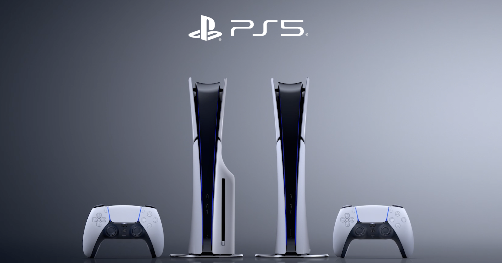

+++
title = "Meilleur GPU, optimisation ray-tracing : bientôt une PS5 pour les Pros™"
date = 2024-04-17T20:00:32+01:00
draft = false
author = "Félix"
tags = ["Actu"]
image = "https://nostick.fr/articles/2024/avril/1704-meilleur-gpu-optimisation-ray-tracing-bientot-une-ps5-pour-les-pros/PS5.png"
+++ 

Si vous venez d’acheter une PS5, ne jetez pas le ticket de caisse : la version Pro est visiblement au tournant. *[The Verge](https://www.theverge.com/2024/4/15/24130716/sony-ps5-pro-specs-release-date-rumors)* a même carrément dévoilé quelques infos sur la fiche technique de la bécane, surnommée Trinity en interne. Et alors attention, asseyez-vous avant de lire ce qui suit : elle va embarquer un CPU légèrement plus rapide et, vous n’allez pas le croire, un meilleur GPU.

À ce niveau, le rendu serait « *45 % plus rapide que sur une PS5 standard* », ce qui est quand même pas mal. On regrettera donc que le CPU ne soit qu’une version overclockée de celui de la PS5 de base, donnant grosso modo 10 % de performance en plus (3,85GHz). Les développeurs pourraient passer sur un mode « standard » à 3,5GHz dans certains cas, bien que ce ne soit évidemment pas le but.

Une technologie d’upscaling maison baptisée PlayStation Spectral Super Resolution (PSSR) devrait aussi faire ses débuts. On nous promet également une mémoire vive potentiellement jusqu’à 28 % plus rapide avec une meilleure bande passante : il fallait bien tout ça pour animer le popotin de l’héroïne de *Stellar Blade* en 4K, j’imagine.

L’architecture ray-tracing va avoir droit à une révision et serait jusqu’à 3x plus efficace. Cet aspect va sans doute être le gros point fort mis en avant par Sony, qui serait en train d’inviter les développeurs à s'assurer que leurs jeux sont compatibles avec cette nouvelle machine. Un label « *Optimisé pour PS5 Pro* » sera même attribué aux bons élèves, comme à l’époque de la PS4 Pro.

Selon *[Insider-Gaming](https://insider-gaming.com/ps5-pro-specs-2024/)*, la machine devrait pointer le bout de son nez d’ici la fin de l’année avec un design plus proche du modèle slim avec son lecteur de disques détachable. Les développeurs pourraient d’ores et déjà commander leurs kits de développement. On s’attend à ce que cette nouvelle version coûte plus cher que le modèle de base (qui restera au catalogue) : il faudra sans doute débourser au moins 550 € pour en profiter, si ce n’est plus. Tout ça pour jouer à des jeux qu’on aura sur PC en patientant un peu, je vous jure.
