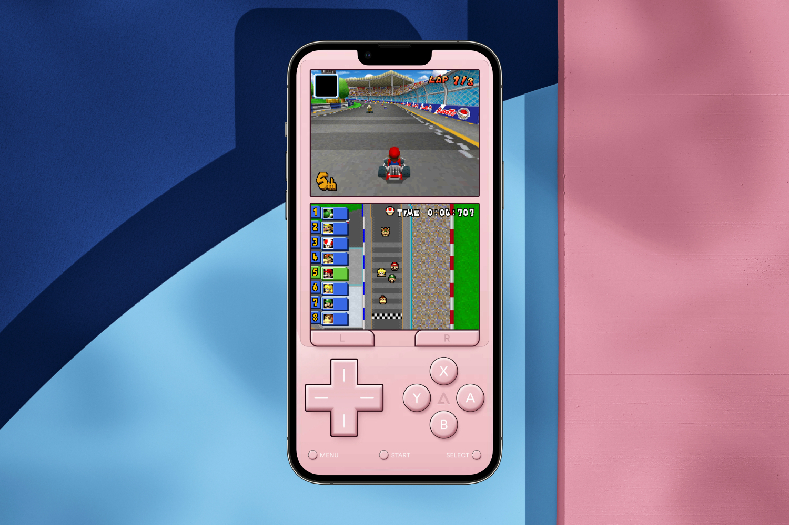
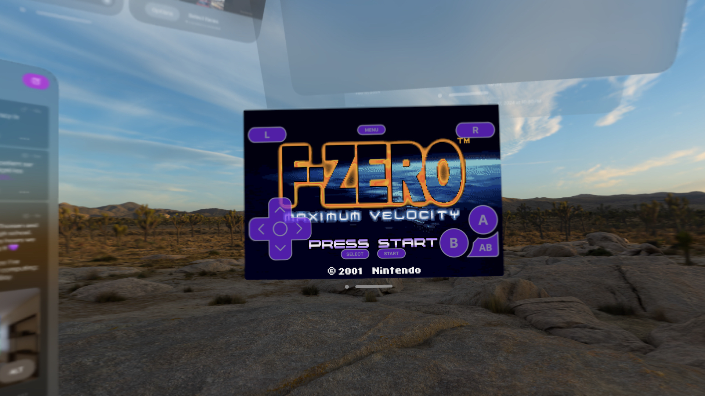
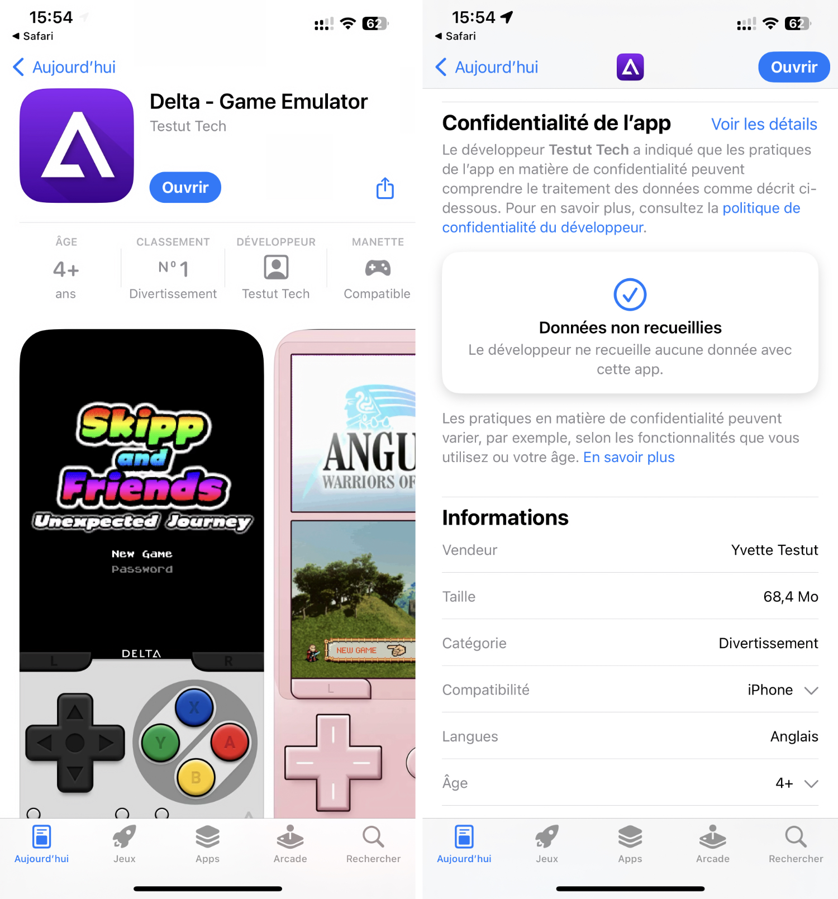
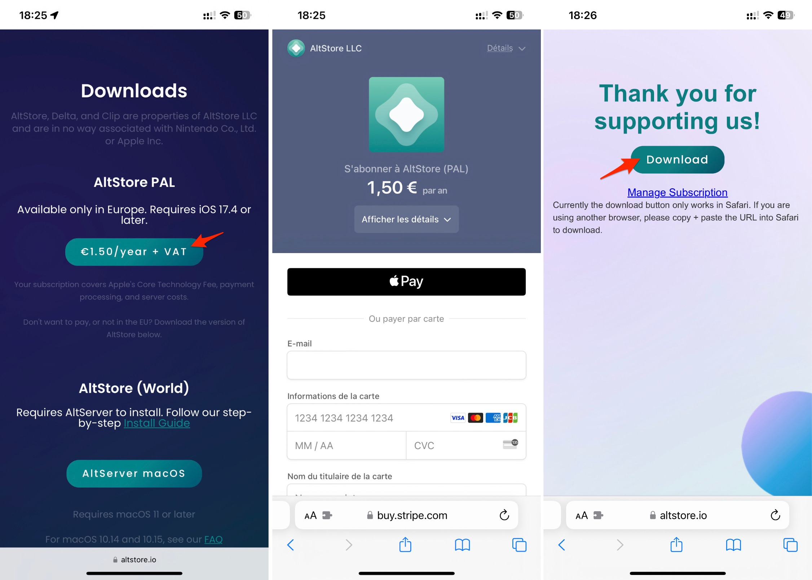
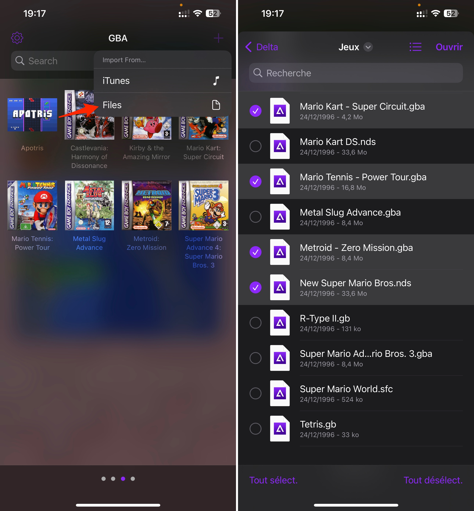
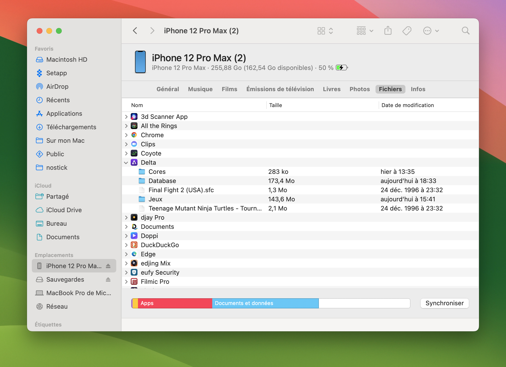
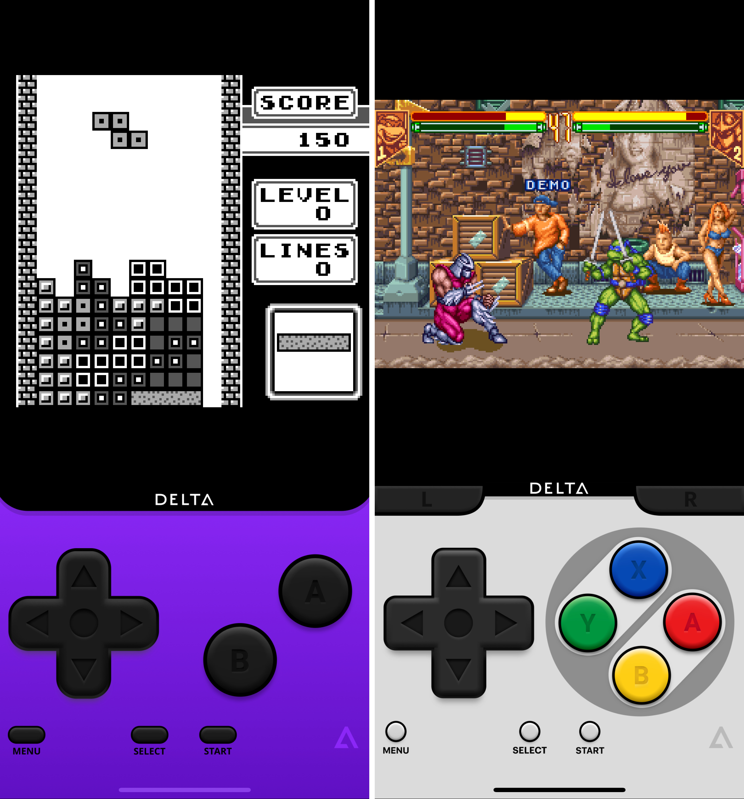
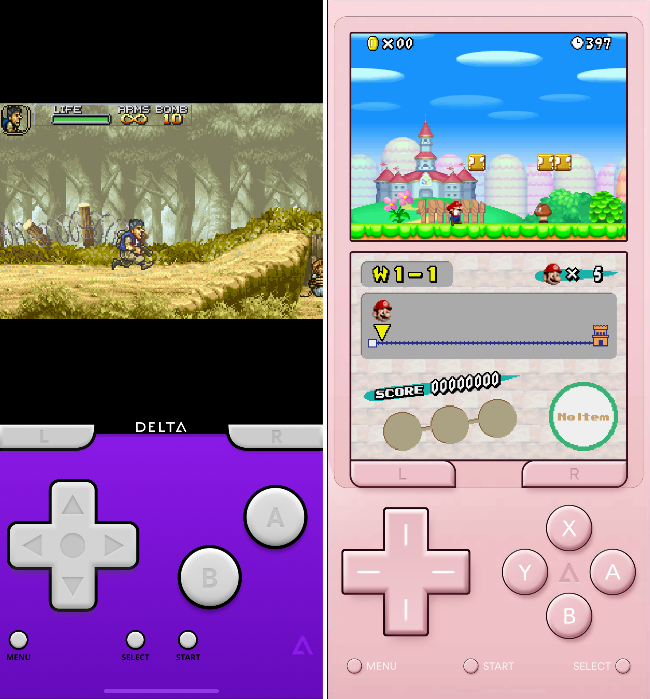
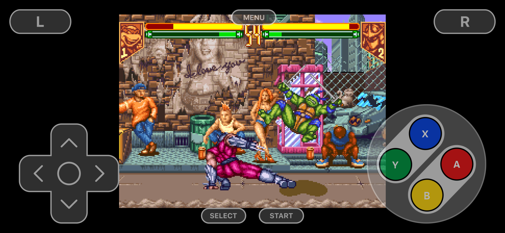

+++
title = "Comment installer et utiliser Delta, l'émulateur Nintendo ultime pour iPhone"
date = 2024-04-19T11:00:00+01:00
draft = false
author = "Mickaël"
tags = ["XXL"]
+++ 

 

Après quelques jours de flottement où on a craint le pire, avec l'arrivée de Delta on peut enfin le dire avec confiance : les émulateurs ont bel et bien droit de cité sur l'App Store ! Qu'est-ce que c'est que cette app, à quoi ça sert, comment peut-on l'installer ? Essayons de répondre à toutes ces questions brûlantes.

## Delta, qu'est-ce que c'est ?

Delta est un émulateur pour consoles Nintendo (NES, SNES, DS, Game Boy, Game Boy Advance et N64) développé par Riley Testut. Cette application n'est pas née de la dernière pluie : elle repose sur [GBA4iOS](http://www.gba4iosapp.com), un émulateur GBA pour iOS (si, si), dont la création remonte à une dizaine d'années. Et qui continue sa petite vie : une version visionOS est en développement !

 

Si Delta est si connu, c'est d'une part parce que Riley en a peaufiné l'interface jusqu'à la maniaquerie : les skins qui reproduisent les consoles de Nintendo sont criantes de vérité. De nombreuses fonctions « qualité de vie » ont été intégrées au fil des annés, comme la sauvegarde automatique de la progression, le support de quatre joueurs, l'affichage en mode portrait, la synchronisation des parties dans Google Drive ou Dropbox… 

Et puis Delta n'a pas attendu le feu vert d'Apple : l'app peut s'installer sur un iPhone depuis toujours, au prix de quelques bidouilles (on y reviendra). 

Delta est une application gratuite, elle n'affiche aucune publicité et n'intègre aucun traqueur de pub. On peut donner un coup de pouce au développeur en s'abonnant à son [Patreon](https://www.patreon.com/rileyshane).

## Comment installer Delta sur mon iPhone ?

Il y a trois manières possibles pour installer Delta sur un iPhone (ou sur un iPad[^1]). La plus simple est de télécharger gratuitement l'application sur l'App Store, directement à cette [adresse](https://apps.apple.com/app/delta-game-emulator/id1048524688). Mais malheureusement, Delta n'est pas disponible dans les boutiques européennes 😅 Si vous possédez un compte App Store américain ou d'un autre pays en dehors de l'UE, alors pas de souci, passez par la boutique liée au compte.

 

Pour les utilisateurs européens, l'autre solution est d'installer AltStore PAL, une boutique alternative développée elle aussi par Riley Testut qui distribue Delta. En vertu du DMA, le fameux règlement sur les marchés numériques auquel Apple doit se plier, ces boutiques ont désormais le feu vert pour s'installer sur l'iPhone (et uniquement l'iPhone, l'iPad n'étant pas considéré comme une plateforme suffisamment grande).

Premier impératif : l'iPhone doit fonctionner sous iOS 17.4. Second impératif : utiliser Safari. Seul le navigateur d'Apple est en mesure d'installer des boutiques alternatives sur le smartphone. Ensuite, rendez-vous sur le site [alstore.io](https://altstore.io/), touchez le bouton *Get AltStore*, puis préparez-vous à sortir le porte-feuille !

 

L'installation d'AltStore PAL nécessite une petite contribution de 1,50 € + TVA par an, soit 1,80 € en France, pour couvrir les frais de transaction bancaire, les coûts des serveurs, et pour régler la dîme due à Apple (les fameux CTF, frais de technologies de base). Le constructeur demande en effet 0,50 € pour chaque installation annuelle d'une boutique alternative et ce, dès la première installation. La transaction passe par Stripe, un intermédiaire de confiance qui prend en charge les paiements Apple Pay ou par carte bancaire.

Sur la page qui suit, il suffit de toucher le bouton *Download* et de confirmer « *l'installation de la place de marché en ligne* ». La procédure est cependant loin d'être aussi simple et rapide que dans l'App Store malheureusement, Apple ayant mis en place un garde-fou casse-pied. Il faudra se rendre dans les réglages d'iOS pour toucher l'alerte « *Autoriser la place de marché en ligne du développeur AltStore, LLC* », afin de confirmer (plusieurs fois !) que oui bon sang de bois, vous voulez installer cette place de marché.

 

Une fois ce bazar évacué, l'icône AltStore doit normalement être présente sur l'écran d'accueil de votre iPhone. La boutique d'apps ressemble… à une boutique d'apps (!), bien qu'elle n'en compte que deux pour le moment : Clip, un gestionnaire de presse-papier, et Delta, que l'on va s'empresser d'installer.

## Minute ! Et si je ne veux pas payer 1,80 € ?

Pas de panique ! Les plus rachots d'entre vous ont toujours la possibilité d'installer AltStore et donc Delta tout à fait gratuitement… mais ça va vous demander un petit effort, et un ordinateur à portée de main. Il faut en fait utiliser la méthode de sioux mise au point par Riley Testut pour contourner (tout à fait légalement) les contraintes d'Apple.

L'opération consiste à installer AltServer sur un Mac ou sur un PC, puis de procéder à quelques réglages pas très difficiles. Le mode d'emploi est disponible ici : [pour Mac](https://faq.altstore.io/getting-started/how-to-install-altstore-macos), [pour PC](https://faq.altstore.io/getting-started/how-to-install-altstore-windows). Pour fonctionner, AltServer doit être connecté à votre compte Apple, ce qui permet à l'utilitaire de s'authentifier auprès du constructeur.

 

Le seul problème de cette solution, c'est que les apps installées via AltStore doivent être rafraîchies de temps en temps par iOS. Cela se fait automatiquement, mais pour être certain que tout fonctionnera bien, il faut lancer AltStore sur son iPhone de temps en temps… Vous êtes sûr de ne pas vouloir claquer 1,80 € plutôt ?

Pour le reste, il faut savoir que les versions App Store et AltStore de Delta sont [similaires](https://mastodon.social/@rileytestut/112294167934634015) en tout point. Pas de jaloux ici.

## Comment utiliser Delta ?

Avant de pouvoir jouer aux jeux de votre enfance, encore faut-il les importer dans Delta. Ça n'est pas bien compliqué ! La solution la plus simple reste encore de glisser un dossier contenant les ROMs dans iCloud Drive (au premier niveau, par exemple), puis d'utiliser l'app Fichiers depuis Delta.

 

Vous pouvez créer des sous-dossiers par console, mais Delta saura retrouver ses petits et ranger les jeux comme il faut. L'autre méthode consiste à passer par iTunes, qui n'est plus disponible que sur Windows, ou encore par le Finder de macOS. Brancher l'iPhone à l'ordinateur, lancer iTunes ou une fenêtre du Finder.

 

Cherchez quelque part dans la fenêtre un onglet *Fichiers* : l'app Delta devrait s'y trouver. Il suffit de glisser/déposer les ROMs dans le dossier Delta. Une fois que c'est fait, touchez le + en haut à droite de l'app Delta, puis l'option *iTunes*. Les jeux devraient apparaitre dans le panneau de leur console respective.

Et ensuite ? À vous de jouer ! Même avec ses gros boutons, les contrôles tactiles de Delta ne sont pas forcément la panacée, alors si vous avez une manette compatible iOS qui traine (provenant de n'importe quelle console… y compris les manettes rétro du Nintendo Switch Online !), ça sera beaucoup plus efficace et amusant.

 

 

 

## Où trouver des jeux compatibles avec Delta ?

Évidemment, c'est la question piège. Les ROMs de jeux Nintendo sont très faciles à trouver en ligne, mais on navigue ici à la frontière, voire au-delà, de la légalité. Les émulateurs sont tout ce qu'il y a de plus légaux, sauf quand ils copient du code protégé par le copyright, ce qui n'est pas le cas de Delta. Ce qui l'est moins, c'est la provenance des ROMs.

Techniquement, nous avons le droit de réaliser une copie d'une cartouche de jeu que l'on possède, pour peu que ce soit techniquement faisable. Il existe par exemple un [adapteur Epilogue](https://www.epilogue.co) pour enregistrer les jeux des cartouches Game Boy/GBA (et leurs précieuses sauvegardes) dans une version numérique prête à l'emploi pour Delta.

Mais évidemment, il n'y a rien de plus simple que d'aller fureter dans les internets interlopes pour récupérer des ROMs. Nintendo n'apprécie guère les émulateurs, et est même parvenu à tuer purement et simplement Yuzu, un émulateur Switch. Ici, la situation est un peu différente puisque Nintendo ne vend plus depuis longtemps de NES ou de GBA, et encore moins de jeux.

Si vous souhaitez rester dans la légalité tout en jouant à des jeux sympas, il existe une communauté homebrew très active qui continue de développer des jeux originaux ! Voici un [répertoire](https://itch.io/c/577395/game-boy-homebrew-games), et un [autre](https://hh.gbdev.io), et encore [un autre](https://snescentral.com/homebrew.php). Faites vous plaisir, il y a des perles !

[^1]: Delta n'est pas optimisé pour iPad, par conséquent l'app s'affiche sous la forme d'une app pour iPhone. Il est toutefois possible d'agrandir la fenêtre en « plein écran ».


