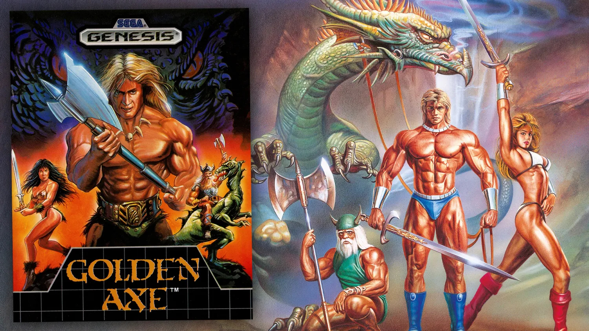

+++
title = "Vos news en vrac de la semaine (20/04)"
date = 2024-04-20T10:00:32+01:00
draft = false
author = "Mickael"
tags = ["Actu"]
image = "https://nostick.fr/articles/2024/avril/2004-en-vrac/GoldenAxe.jpg"
+++ 

*L’actu a été chargée cette semaine. En plus [d’un résumé détaillé](https://nostick.fr/articles/2024/avril/2004-folle-semaine-actu/), les équipes de Nostick (29 journalistes répartis sur une dizaine de fuseaux horaires) vous proposent un peu de rab’ avec une sélection de petites actus.*

**Golden Axe —** Un des meilleurs beat'em up de l'histoire du jeu vidéo ne pourra donner que l'une des meilleures séries animées de l'histoire de l'animation ! *Golden Axe* va en effet être adapté pour la télé avec une première salve de 10 épisodes commandée par Comedy Central. Et le commanditaire a fait appel aux meilleurs : le showrunner sera Joe Chandler, qui a beaucoup écrit pour *American Dad*, et il travaillera avec le producteur Mike McMahan à qui l'on doit l'incroyable série *Star Trek: Lower Decks*. Et les fans du jeu Megadrive vont être gâtés, puisque Sega développe un reboot…

**Fallout —** Bethesda a mis sur le bon cheval en faisant adapter *Fallout* en série télé. Non seulement le programme fait partie des gros succès critiques et publics de l'année, mais encore cela profite aux jeux ! *Fallout 4*, qui n'est pas de la dernière jeunesse, a enregistré une croissance ébouriffante des ventes en Europe la semaine dernière : + 7 500 % (!). Il faut dire que le jeu était proposé à prix cassé, mais tout de même. Selon les données de GSD, *Fallout 4* a représenté 69 % des ventes sur PC du 8 au 14 avril. Si Bethesda se demandait s'il fallait enclencher le développement d'un nouvel épisode…

**Star Wars Outlaws —** Ubisoft doit jouer les pompiers pour son futur jeu *Star Wars*, dont le prix de l'édition Ultimate (lire plus haut) a beaucoup de mal à passer, tout comme le season pass  fourni avec les versions Gold et Ultimate. Un pass qui a conduit des joueurs à [penser](https://www.ubisoft.com/fr-ca/game/star-wars/outlaws/season-pass) qu'il faudra absolument payer plus cher pour accéder à l'ensemble des missions de Jabba le Hutt. Ça ne sera heureusement pas le cas : Ubisoft s'est voulu rassurant en [expliquant](https://www.ign.com/articles/ubisoft-responds-to-star-wars-outlaws-season-pass-backlash-insists-jabba-the-hutt-is-part-of-the-experience-for-all-players) que le jeu standard, celui à 70 $, contiendra ce type de missions. Celle du season pass sera optionnelle, ajoute l'éditeur. On respire donc, mais on peut se demander dans quelle galère Ubisoft s'est lancée en découpant son blockbuster en tranches.

**Gamescom —** Le grand salon européen du jeu vidéo devra faire sans Nintendo. Le constructeur a [décidé](https://www.gameswirtschaft.de/gamescom/gamescom-2024-nintendo-absage-1504/) de ne pas faire le voyage à Cologne, du 21 au 25 août. Ça n'empêchera pas des officiels d'être sur place en coulisse, mais il n'y aura pas de présence officielle. Donc pas de présentation de la Switch 2 non plus, la nouvelle console étant plus ou moins prévue pour mars 2025. En revanche, ce qui est plus inquiétant c'est que cette absence semble indiquer que la fin de l'année ne sera guère rempli en termes de nouveaux jeux pour la Switch vieillissante.

**Blasphemous —** La belle histoire de la semaine, elle est racontée par Enrique Colinet, level designer sur *Blasphemous*. Le studio Larian, à qui l'on doit bien sûr *Baldur's Gate 3*, a versé 1 000 $ lors du financement participatif pour le metroidvania à forte infusion *Souls*. « *Ils ont lâché une somme à quatre chiffres, sans demander leurs récompenses, tout en continuant à faire un des meilleurs jeux de ces dernières années* », [écrit](https://twitter.com/Baxayaun/status/1778749337146732606) Enrique. Larian connait les galères de Kickstarter : c'est ainsi que le studio belge a financé *Divinity: Original Sin* en 2013…

**Baldur's Gate —** Qui aura le redoutable honneur de succéder à Larian pour *Baldur's Gate 4* ? Maintenant que le studio a confirmé qu'il arrêtait les frais avec la licence *Donjons & Dragons*, Wizard of the Coast (filiale de Hasbro qui possède les droits de D&D) s'est mis en quête de nouveaux développeurs capables de s'occuper du quatrième épisode. Une tâche herculéenne, mais Eugene Evans, vice-président stratégie numérique de Hasbro, a [affirmé](https://www.pcgamer.com/games/rpg/hasbro-wants-to-make-another-baldurs-gate-sequel-but-its-early-days-yet-we-certainly-hope-that-its-not-another-25-years/) qu'on n'aurait pas à attendre 25 ans avant de voir débouler *Baldur's Gate 4* — c'est le temps qui s'est écoulé entre les volets 2 et 3. On souhaite d'ores et déjà bien du courage aux courageux qui vont devoir faire au moins aussi bien que Larian…
