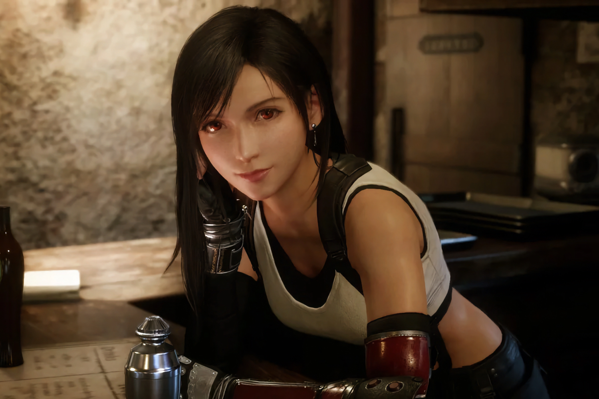
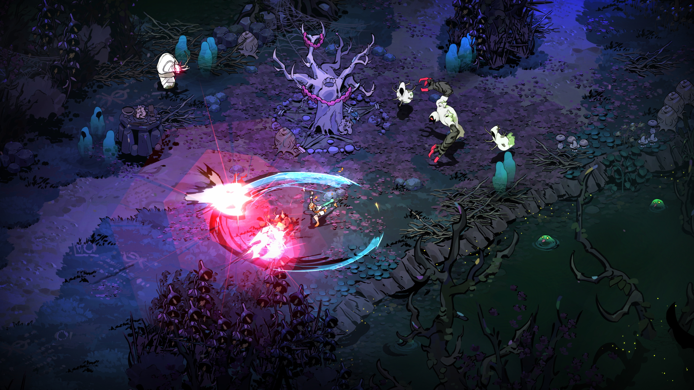
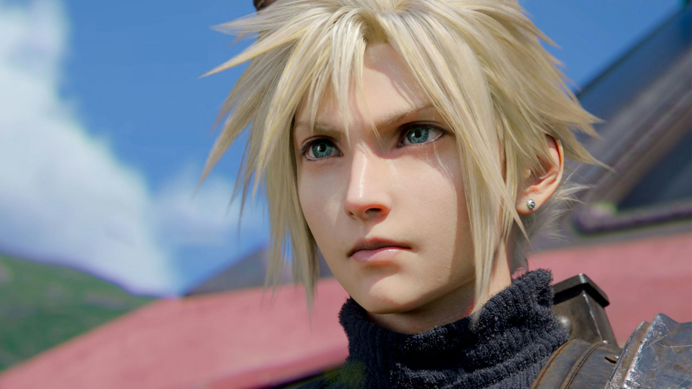
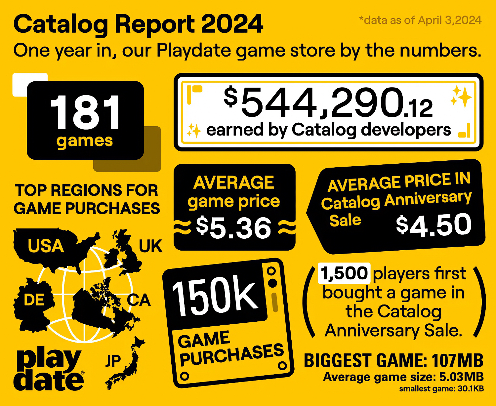
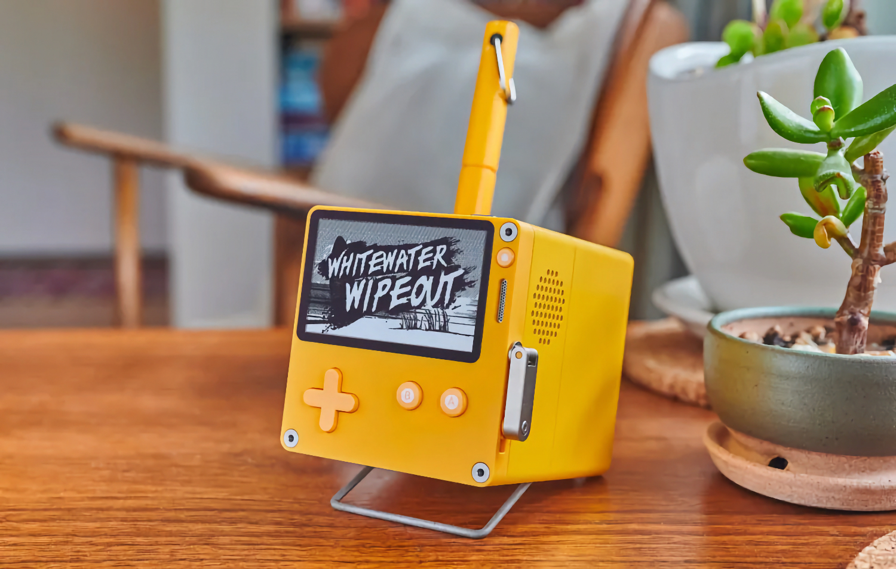
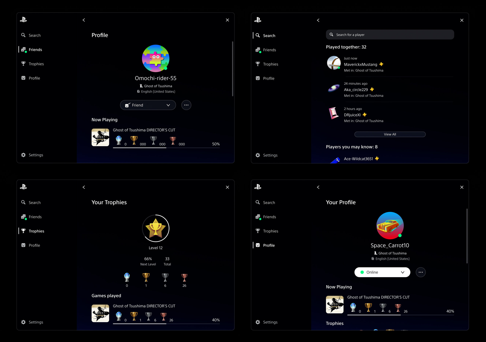
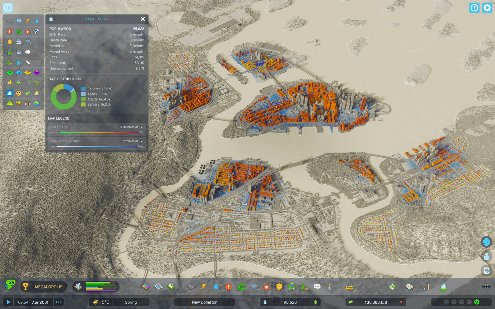

+++
title = "Magnifique, fantastique, un peu ironique : la folle semaine du jeu vidéo (20/04)"
date = 2024-04-20T10:01:00+01:00
draft = false
author = "Mickaël"
tags = ["Actu"]
image = "https://nostick.fr/articles/2024/avril/2004-folle-semaine-actu/Tifa.jpg"
+++ 

L’actualité du jeu vidéo ne s’arrête pas à la poignée d’articles publiés sur *Nostick* ! Histoire de rattraper le retard accumulé, voici un retour rapide sur quelques unes des infos les plus importantes (ou insignifiantes) de la semaine.

## Les grandes manœuvres pour Hades II

Pas question de se planter. Supergiant Games prépare activement le lancement de *Hades II*, le premier volet — sorti en 2020 — étant une darling du jeu indé et pour de très bonnes raisons : ce roguelite qui plonge le joueur dans les Enfers a su conquérir le cœur et les doigts de millions de joueurs adeptes de mythologie grecque (et de personnages sacrément bien foutus).

 

Le studio est à deux doigts de lancer un accès anticipé sur Steam et l'Epic Games Store (c'est prévu entre avril et juin). Mais avant ça, il [organise](https://www.supergiantgames.com/blog/hades2-tech-test-sign-up) un « test technique » pour une poignée de joueurs bienheureux, qui peuvent se frotter à ce tout nouvel univers dans la peau de Melinoë. La fille d'Hadès et sœur de Zagreus — héros du premier opus — est une sorcière avec de puissantes capacités magiques. Surtout, elle est immortelle.

*Hades II* reprend évidemment le principe du précédent volet, roguelite oblige, dans des décors isométriques absolument somptueux, [tout comme les persos](https://www.polygon.com/24133525/hades-2-new-character-list-designs-hecate-hephaestus) d'ailleurs. On croise les doigts pour que le jeu soit au niveau de son illustre prédécesseur, et plus encore.

## Un pourliche ou la vie

Les éditeurs cherchent par tous les moyens à augmenter les prix de leurs jeux, alors que les coûts de développement (pour les triples A, du moins) n'ont cessé d'enfler. Ubisoft a récemment soufflé sur les braises avec une édition Ultimate pour *Star Wars Outlaw* qui comprend le season pass, des skins et 3 jours d'accès anticipé… pour 130 €. 

Mike Ybarra, l'ancien président de Blizzard, a eu une autre idée : un pourboire ! « *À la fin d'un jeu, j'ai souvent pensé "J'aimerais pouvoir donner aux développeurs un autre 10 ou 20 $ parce que leur jeu valait plus que les 70 $ de base, et ils n'ont pas essayé de me faire payer chaque petit supplément"* », a-t-il [déclaré](https://twitter.com/Qwik/status/1778269707575119977).

L'ex boss sait très bien que 70 $ — le tarif habituel pour les gros jeux —, c'est beaucoup d'argent. « *Mais ce serait simplement une option à la fin du jeu* », ajoute-t-il en évoquant les jeux qui, selon lui, mériterait que les joueurs laissent un petit quelque chose en plus, s'ils le veulent : *Horizon: Zero Dawn*, *God of War*, *Red Dead Redemption 2*, *Elden Ring*, ou encore *Baldur's Gate 3*.

L'idée n'est pas complètement idiote quand on y pense — après tout, on peut vraiment adorer un jeu —, mais un pourboire dans les jeux pose des tas de questions techniques et d'attribution : comment s'assurer que les sous soient versés aux développeurs qui se sont donnés du mal en attendant d'être licenciés, plutôt que les actionnaires ? L'idée aurait peut-être du sens pour les développeurs indés : je serais plus enclin à donner un bonus à *Vampire Survivors* ou à *Balatro*, plutôt qu'à Ubisoft ou Sony.

## Final Fantasy 7 Rebirth a du mal avec les chiffres

Square Enix et Sony avaient probablement des objectifs de vente beaucoup plus ambitieux pour *Final Fantasy 7 Rebirth*. Le jeu, deuxième volet de la trilogie, se serait écoulé à [2 millions d'unités](https://www.ampereanalysis.com/insight/stellar-blade-demo-numbers-impress-but-will-the-hype-convert-to-paying-players) durant son premier mois de commercialisation (il est sorti le 29 février), selon le cabinet Ampere. Dans l'absolu c'est plutôt bien, mais cette estimation fait pâle figure face aux 3,5 millions d'exemplaires vendus par *FF7 Remake* en… trois jours.

Le premier opus était certes sorti en pleine pandémie, à un moment où les joueurs enfermés chez eux cherchaient à s'évader de leur confinement. Et la base de clients PS4 était autrement plus importante que celle de la PS5, la plateforme exclusive de *Rebirth*. Ce qui est plus embêtant, c'est que *FF XVI*, autre exclusivité PS5, a tapé les 3 millions de ventes en 6 jours… 

Square Enix avait trompeté les bons chiffres de vente pour *Remake* et *XVI*, mais le studio est resté prudemment silencieux pour *Rebirth*. Selon Daniel Ahmad, directeur de recherche chez Niko Partners, ce nouvel épisode s'est deux fois moins bien [vendu](https://twitter.com/ZhugeEX/status/1778751429919854691) que *Remake* durant le même laps de temps, et la suite de la carrière commerciale du jeu risque d'être plus faible. Autrement dit, Squeenix ne se refera pas la cerise sur le long terme.

Une des solutions est d'élargir la clientèle potentielle. Les joueurs PC seront ravis d'accueillir *FF7 Rebirth* !

## La Playdate joue et gagne

La Playdate, la petite console jaune poussin avec une manivelle de Panic, a été lancée il y a deux ans, hé oui déjà. Une occasion en or pour faire le point sur le succès de l'appareil : on peut dire que la Playdate a trouvé sa petite place sur le marché !

Le constructeur, qui est aussi le créateur d'*Untitled Goose Game*, de *Firewatch* et dans un tout autre genre, de l'éditeur de code Nova, a dévoilé une poignée de chiffres. La boutique de jeux de la Playdate compte ainsi 181 jeux, vendus en moyenne 5,36 $ par tête de pipe. En deux ans, ce sont 150 000 jeux qui ont été écoulés et qui ont rapporté aux développeurs près de 545 000 $ (après les frais divers et la commission de Panic de 25 %).

Pas si mal pour une console équipée d'un écran monochrome, 4 Go de stockage et 16 Mo de RAM qui s'est vendue à 700 000 exemplaires ! La bonne nouvelle dans tout ça, c'est que le dock de recharge qui transforme la console en une sorte de mini-télé vintage est toujours dans les tuyaux et qu'il sortira « bientôt ».

## Entre PlayStation et PC, Ghost of Tsushima ne choisit pas

La vie, c'est une succession de petites victoires et la sortie prochaine de *Ghost of Tsushima* sur PC l'illustre parfaitement. Pour la première fois depuis que Sony se pique d'adapter ses franchises PlayStation sur les pécés, on aura droit à une surcouche à la Steam ou Nvidia, ce qui est plutôt une mauvaise nouvelle… mais elle intégrera surtout le profil, les trophées et la liste d'amis PlayStation !

Sony [précise](https://blog.fr.playstation.com/2024/04/17/annonce-des-configurations-systeme-requises-et-du-cross-play-pour-ghost-of-tsushima-directors-cut-pc/) à toutes fins utiles que cela n'empêchera pas de débloquer des trophées Steam et Epic, si jamais c'était votre truc. Cette interface permettra également de profiter de *Legends*, l'excellent mode multi du jeu, avec ses amis restés sur PS4 et PS5, les ballots. 

Voilà un nouveau coup porté au mur qui sépare le monde des consoles de celui des PC et franchement, il était temps. *Ghost of Tsushima* sera dispo le 16 mai avec son extension *Ile d'Iki* et donc le mode *Legends*. Les jours à attendre le jeu semblent bien longs.

## Cities: Skyline 2 appelle la communauté à l'aide

C'est peu dire que le lancement de *Cities: Skyline 2* en octobre dernier a été une catastrophe : performances à la ramasse, bugs à foison, contenus manquants, la suite du fameux city builder était parti sur un mauvais pied. Et malheureusement, les développeurs de Colossal Order et l'éditeur Paradox n'ont pas arrangé les choses. Le premier DLC, *Beach Properties*, ne contient en effet que des éléments de déco et aucune nouvelle fonction. Le tout pour 10 $…

Ce qui devait arriver arriva, le DLC s'est mangé un flot de commentaires négatifs de la part d'une communauté échaudée par les promesses des studios. C'est ce qui a motivé une communication à cœur ouvert de Mariina Hallikainen, la CEO de Colossal Order, et Mattias Lilja son homologue de Paradox. Les deux dirigeants [s'excusent](https://www.paradoxinteractive.com/games/cities-skylines-ii/news/the-way-forward-update) pour à peu près tout ce qui ne va pas dans le jeu, et ils promettent de revoir de fond en comble le fameux DLC. 

Les joueurs qui ont acheté l'extension vont être remboursés, et ceux qui se sont offert l'édition Ultimate de *Skyline 2* recevront gratuitement du contenu supplémentaire d'une valeur de 40 $. À plus long terme, les créateurs du jeu vont mettre le paquet sur l'amélioration du jeu de base et des outils de mods — une fonction essentielle qui a fait le succès de la franchise. Et puis ils veulent aussi impliquer la communauté.

Une réunion va être organisée entre les studios et des représentants des joueurs pour mettre au point la feuille de route de reste de l'année. « *Les équipes de Colossal Order et de Paradox Interactive leur fourniront une totale transparence et répondront à toutes les questions et critiques exprimées* », assurent les deux patrons. Est-ce le début de la rédemption pour *Cities: Skyline 2* ?
