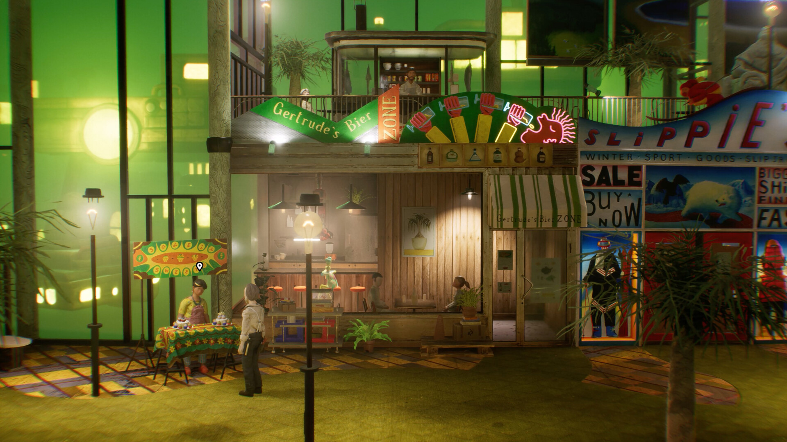
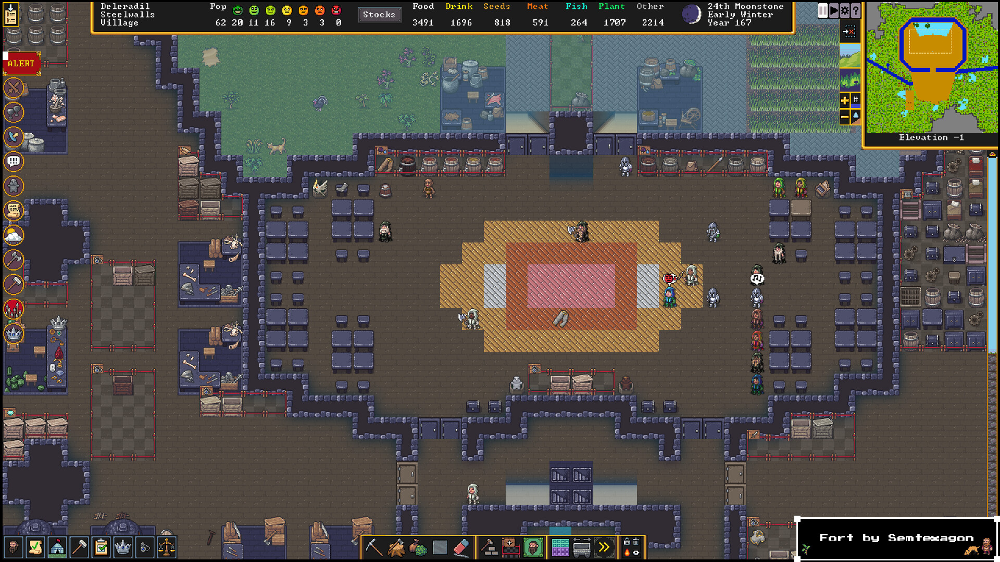
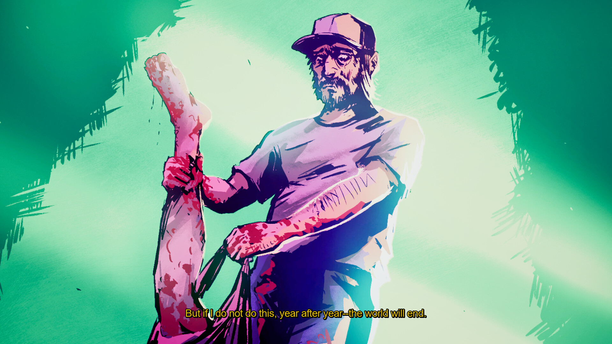

+++
title = "Les sorties de la semaine (21/04)"
date = 2024-04-21T07:00:01+01:00
draft = false
author = "Félix"
tags = ["C’est dispo"]
image = "https://nostick.fr/articles/2024/avril/2104-sorties-de-la-semaine/nrftw.jpg"
+++ 
 
Entre le boulot, les courses et cette andouille de voisin qui joue de la perceuse de 8h à 18h, vous n’avez peut-être pas eu le temps de vous intéresser aux nouveautés du moment. Qu’à cela ne tienne : voici les sorties de ces derniers jours qui ont retenu notre attention.

## Pas de repos pour les souls-like

")

Après deux épisodes d’*Ori* tout mignons, les développeurs de Moon Studios ont décidé de se défouler un peu avec *No Rest for the Wicked*, un action-RPG d4rk et sanglant dans un univers qui rappelle *Diablo* bien que les combats soient plus proches d’un *Dark Souls*. Le pitch n’est pas fun : le roi est mort, la peste réapparaît tandis que des groupes de rebelles et le gouvernement provincial se mettent sur la gueule. Apparemment c’est très joli (même si bien gourmand), avec un système de combats exigeant et une map légèrement incurvée à la *Animal Crossing*. À réserver aux fans du genre avec un bon PC et une manette sous la main étant donné qu’on ne peut pas encore réassigner les touches. Cette version *early-access* est une bonne base, mais attendez-vous quand même à pas mal de bugs et de points à améliorer. 40 boules sur [Steam](https://store.steampowered.com/app/1371980/No_Rest_for_the_Wicked/), également dispo sur Xbox/PS5.

## Harold et Groomit

Premiers retours mitigés sur *Harold Halibut*, ce jeu indé mélangeant pâte à modeler et diorama qui aurait passé plus de 10 ans en cuisine. L’histoire se déroule dans une ville sous l’eau, avec une ambiance décrite comme un *Bioshock* réalisé par Wes Anderson. C’est intrigant, la partie visuelle est vraiment très réussie, mais le bât blesse niveau gameplay : il faut faire pas mal d’aller-retour, et le tout est assez lent. Si l’univers est visiblement bien pensé, l’écriture a des lacunes et les actions à effectuer un peu trop répétitives. Certains ont aimé et ce n’est pas un plantage total, mais les fans de jeux narratifs auront sans doute mieux fait d’attendre quelques mises à jour et une promo. 35 € sur [Steam](https://store.steampowered.com/app/924750/Harold_Halibut/), PlayStation et Xbox, également dispo dans le Game Pass.

## ASCII parait on s’amuse bien

Au fond de moi, j’ai toujours rêvé que mon boss me vire, que ma femme me quitte et parte avec les gosses afin de me coller au RSA et passer mes journées sur *Dwarf Fortress*. Les développeurs viennent de me donner une nouvelle raison d’envisager ce doux rêve grâce à un nouveau mode Aventure, actuellement en bêta sur la version Steam. Pour ceux qui n’auraient pas suivi, *Dwarf Fortress* est un légendaire roguelike en ASCII développé depuis [plus de 20 ans](https://fr.wikipedia.org/wiki/Slaves_to_Armok_II:_Dwarf_Fortress) (!) et dont une version un peu plus accessible avec de jolis graphismes a été mise en ligne sur Steam en 2022. Dans l’idée vous devez gérer une troupe de nains : ça a l’air chiant, mais c’est absolument fascinant étant donné que le jeu est incroyablement détaillé. *Dwarf Fortress* est une formidable machine à histoire où votre colonie peut autant finir noyée à cause d’un défaut de plomberie qu’en dépression après avoir vu un des leurs se faire fracasser par un gorille. Le mode Aventure (qui permet de gérer un unique héros au lieu d’un groupe) est à activer en passant le jeu sur sa version bêta dans les paramètres de Steam, où le jeu est vendu [pour 29 €](https://store.steampowered.com/app/975370/Dwarf_Fortress/). C’est apparemment une manière un peu plus accessible de s’attaquer à ce monument : c’est peut-être l’occasion de vous laisser tenter.

## La Miliviludes le déteste

Les développeurs du sympathique *El Paso; Elswhere* sont de retour avec un nouveau concept bien glauque baptisé *Life Eater*. Si vous aimez les jeux qui mettent mal à l’aise, c’est pour vous : il ne s’agit rien de moins que d’un simulateur de kidnapping dans lequel on doit sacrifier ses victimes dans un rituel pour un dieu obscur. Une histoire d'horreur du point de vue du tueur avec une atmosphère ultra-lourde, donc. Contrairement à un *ManHunt*, *Life Eater* n’est pas un jeu d’infiltration mais plutôt un puzzle-game narratif dans lequel on utilise une sorte de logiciel de montage pour suivre la routine de ses victimes. Les premiers retours évoquent un jeu 7/10 avec un bon concept et une durée de vie assez courte, loin d’être exceptionnel, mais qui devrait vous rester en tête quelque temps. À réserver aux fans du premier *Postal* ou de *Hatred*. 14,79 € [sur Steam](https://store.steampowered.com/app/2632930/Life_Eater/).

 
