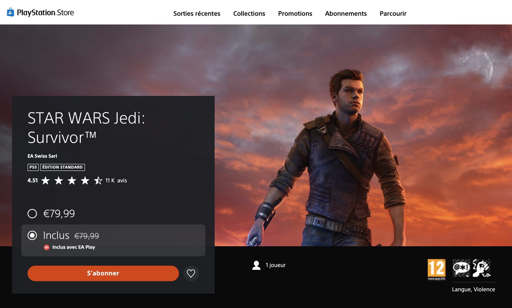
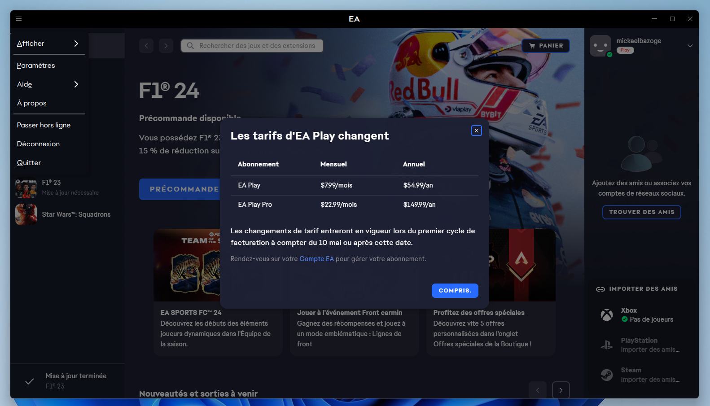

+++
title = "Star Wars Jedi Survivor sur EA Play (et le Game Pass) : EA en profite pour augmenter les prix"
date = 2024-22-04T10:47:32+01:00
draft = false
author = "Mickael"
tags = ["Actu"]
+++ 

Personne ne vous en voudra d'avoir oublié jusqu'à l'existence d'EA Play, le service sur abonnement d'Electronic Arts. Mais l'éditeur entend bien sonner le rassemblement à grand renfort de partoche orchestrale de John Williams ! *Star Wars Jedi: Survivor* est en train de se faire une grosse place dans le catalogue ; l'annonce officielle ne devrait pas tarder, en attendant le PlayStation Store [commence](https://store.playstation.com/fr-fr/product/EP0006-PPSA07784_00-APPLEJACKGAME000) à signaler le jeu comme inclus dans EA Play. Y compris en France.

EA Play étant offert aux abonnés du Game Pass Ultimate, le jeu s'ouvrira très bientôt maintenant à des millions de joueurs supplémentaires. *Jedi Survivor* est la suite directe des aventures de Cal Kestis, un ancien padawan qu'on avait déjà pris en main en 2019 dans *Fallen Order*. Ce nouvel opus sorti en avril dernier a été plutôt bien accueilli, malgré les problèmes de performances et les bugs qui ont été petit à petit corrigés au fil des mises à jour (il en reste).

Le jeu risque de connaitre un joli petit succès sur le Game Pass, qui enregistre un autre blockbuster après *Diablo 4* fin mars. Mais c'est aussi un gros coup pour EA Play, qui cherche à sortir de l'ombre et *Jedi Survivor* pourrait bien lui donner un sérieux coup de main. La mauvaise nouvelle dans tout ça, c'est que l'arrivée du titre coïncide (ça n'est probablement pas un hasard…) avec une hausse des prix : à partir du 10 mai, l'abonnement EA Play va coûter [2 € plus cher](https://nostick.fr/articles/2024/avril/1304-resume-semaine/#un-peu-plus-de-vrac-je-vous-le-mets-quand-même-allez) à 5,99 € par mois, ou encore 39,99 € par an.

L'abonnement EA Play Pro, sur lequel il est déjà possible de profiter de *Jedi Survivor*, prend cher lui aussi à 19,99 € par mois (+ 2 €). Microsoft n'a pas annoncé de son côté si le Game Pass allait à son tour subir une hausse de tarif, on croise les doigts pour que non.