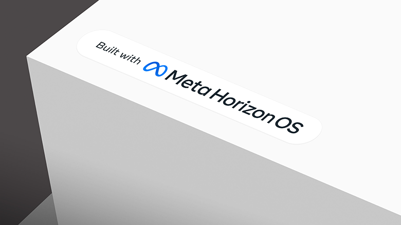
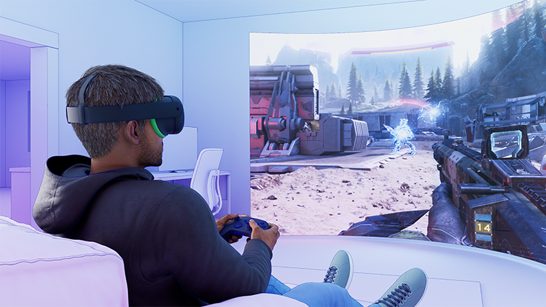

+++
title = "Meta sort les rames pour faire un peu de bénéfice avec la VR"
date = 2024-04-23T19:30:32+01:00
draft = false
author = "Félix"
tags = ["Actu"]
type = ["une"]
vignette = "https://nostick.fr/articles/vignettes/meta.jpg"
+++ 

Décidément, pas facile de faire de l’argent dans le domaine de la VR. La section Reality Labs de Meta claque des milliards chaque année pour développer des casques de réalité virtuelle qui sont loin [de rameuter les foules](https://arinsider.co/2024/02/07/has-meta-sold-half-a-million-quest-3s/). Si le Quest 2 a eu son petit succès, ce type de produit reste une niche et un gouffre à pognon pour Meta, qui [vendrait ses appareils à perte](https://xrdailynews.com/quest-3-bom-production-costs-revealed/) en espérant se refaire la fraise sur la vente d’apps. L’entreprise vient de [dévoiler](https://www.meta.com/fr-fr/blog/quest/meta-horizon-os-open-hardware-ecosystem-asus-republic-gamers-lenovo-xbox/) une nouvelle idée pour relancer la machine : ouvrir son système à d’autres fabricants.

Meta veut donc devenir le Microsoft de la VR en vendant un système d’exploitation qui pourra être embarqué sur les appareils des différentes marques. Baptisé Meta Horizon OS, il s’agit d’une version dérivée d’Android en développement depuis une dizaine d’années et déjà sous le capot de ses casques Quest. Pour rappel, la plupart des casques de VR autonomes embarquent des processeurs de smartphone de chez Snapdragon optimisés pour la réalité virtuelle. Logiquement, les concurrents devront utiliser une de ces puces pour faire tourner le système.

Meta ne met pas de coté la partie sociale et annonce qu’il sera possible d’utiliser les mêmes avatars que sur le Quest ainsi que toutes ses fonctionnalités multi. Horizon World, le « métavers » de la marque qui ressemble pour le moment plus à un Second Life HD qu’à *Ready Player One*, sera évidemment de la partie : Meta va donc pouvoir l’imposer à plus d’utilisateurs. Même chose pour la boutique Quest, bien que les autres acteurs pourront également monter leur propre échoppe.

Le communiqué met d’ailleurs fortement l’accent sur l’ouverture de l’OS, Meta cherchant à se mettre en opposition au modèle fermé du Vision Pro d’Apple. Google est carrément invité à venir installer son Play Store « *avec le même modèle économique que sur les autres plateformes* », comme quoi. La boutique App Lab (moins regardante à l’entrée que le Meta Quest Store) sera mieux mise en avant, et des API permettant de facilement porter des apps mobiles sont en préparation. Le prix des licences pour le nouveau système n’a pas été évoqué, mais entre ça et les données perso de ses utilisateurs, la manœuvre devrait renflouer un peu les caisses de Meta.   

Plusieurs produits basés sur Meta Horizon OS sont en préparation chez les fabricants tiers : Lenovo et Asus sont de la partie, et même Xbox, qui va proposer « *un Meta Quest en édition limité* ». Si la formulation peut faire rêver, il s’agira sans doute d’un Quest 3 aux couleurs de la Xbox avec une manette spéciale et peut-être quelques mois de Game Pass en cadeau. Aucune date de sortie n’a été annoncée pour le moment.