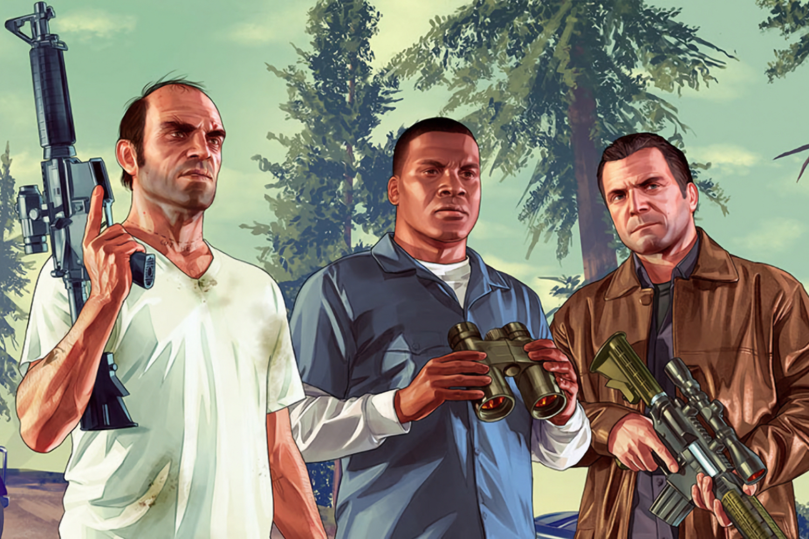

+++
title = "GTA 5 (presque) sur Switch"
date = 2024-04-24T10:47:32+01:00
draft = false
author = "Mickael"
tags = ["Actu"]
image = "https://nostick.fr/articles/2024/avril/2404-gta-5-presque-sur-switch/GTA5.jpg"
+++

À moins d'un miracle, *GTA 6* se tiendra éloigné des consoles de Nintendo, même avec une Switch 2 plus puissante. Rockstar ne s'était déjà pas embêté à porter *GTA 5* sur la Switch première du nom, même si le jeu est sorti sur PS3 et Xbox 360. Cela n'a pas empêché Superstar South, une équipe de moddeurs particulièrement habiles, de créer un mod *GTA 5* — ce n'est pas un portage à proprement parler, même si les bidouilleurs ont utilisé le code source de *GTA 5* qui a fuité l'an dernier.

La petite vidéo postée par les moddeurs est aussi emballante que déprimante. D'un côté, on y voit la mission du prologue rouler sur la Switch, ce qui est plutôt une bonne nouvelle. Mais de l'autre, ça rame sévère. L'équipe explique qu'en vrai, le jeu est plus fluide que dans la vidéo.



Il faut aussi rappeler que les moddeurs n'ont pas accès aux ressources originales, et encore moins à l'infrastructure et aux moyens de Rockstar. Mais c'est une « preuve de concept » suffisamment convaincante pour nourrir l'espoir d'avoir droit, un jour, à une vraie version de *GTA 5* sur la Switch (et, a fortiori, sur la Switch 2). Après tout, *Red Dead Redemption* ne tourne pas si mal sur la console hybride…

Mais Rockstar a probablement d'autres chats à fouetter en ce moment. Les fans qui veulent vivre les aventures de Michael De Santa, Franklin Clinton et Trevor Philips sur la Switch vont devoir se faire une raison, ce d'autant que le mod *GTA 5* ne risque pas d'être proposé au téléchargement (l'éditeur est assez chatouilleux sur la question).