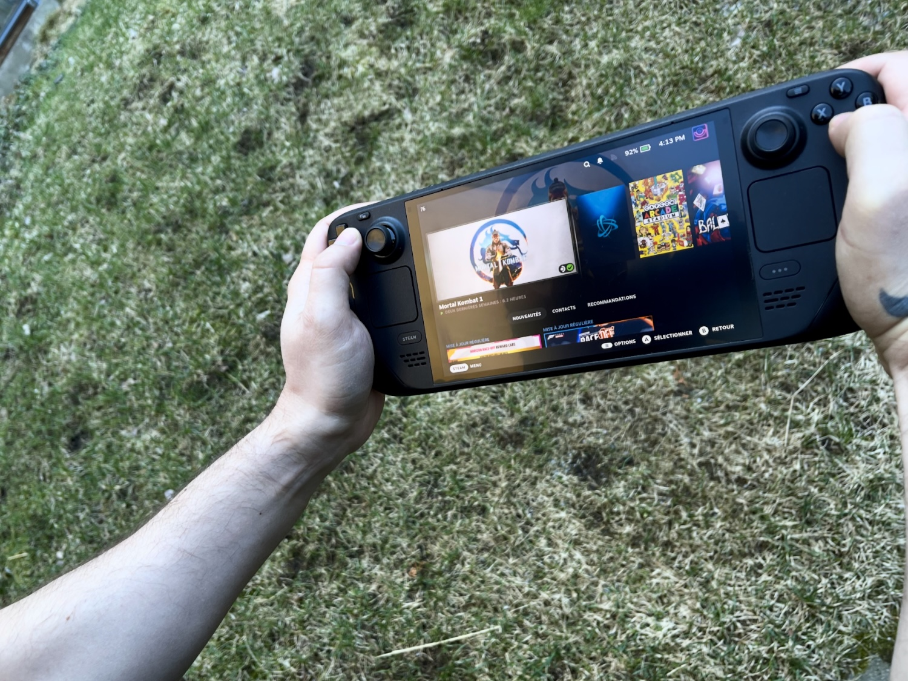
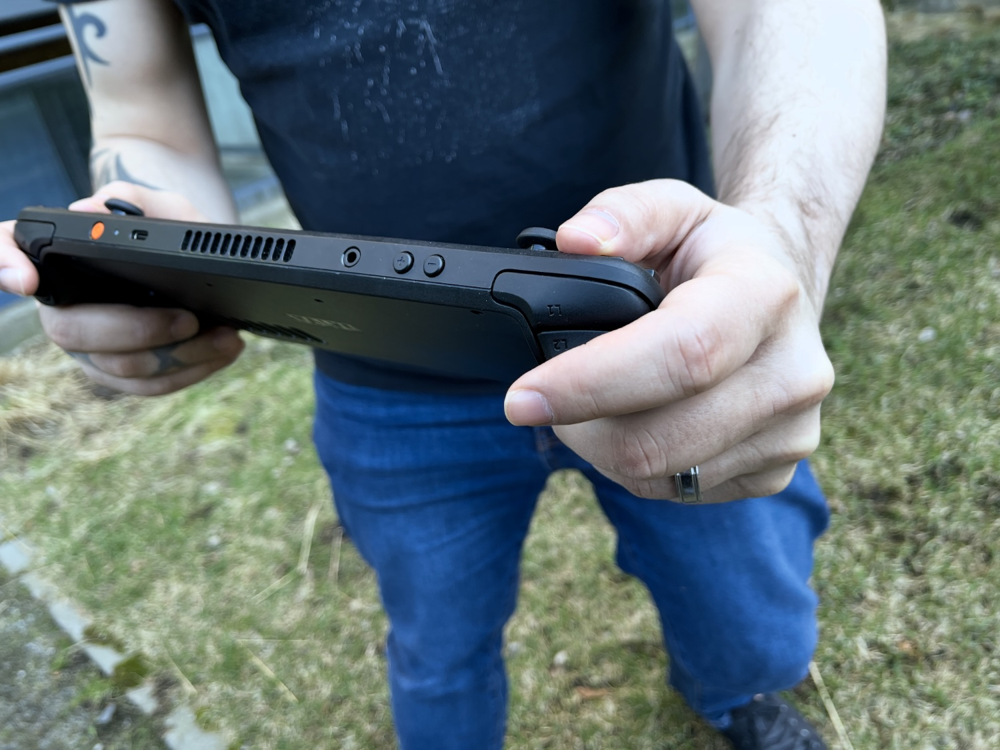
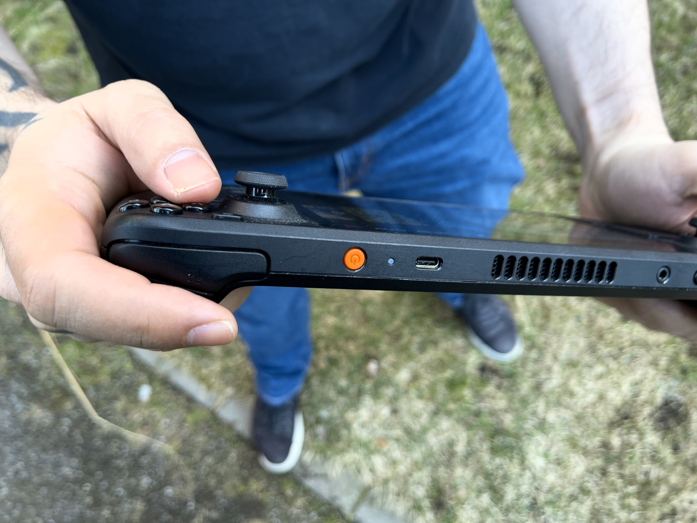
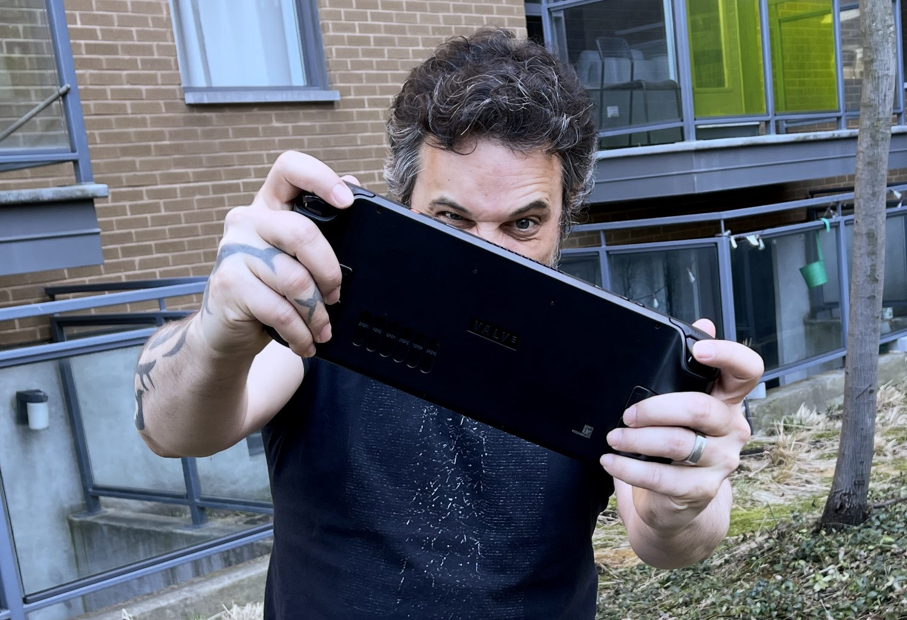

+++
title = "6 mois avec le Steam Deck OLED, 6 mois de bonheur"
date = 2024-04-26T11:00:32+01:00
draft = false
author = "Mickael"
tags = ["Test"]
+++

 

**Le Steam Deck n'est pas la console portable la plus jolie, la plus performante, ni même la plus polyvalente que l'on puisse trouver aujourd'hui. Mais elle n'en reste pas moins… la meilleure console portable !**

Le matos, c'est difficile. Et Valve le sait plus qu'aucun autre ! L'éditeur de jeux et créateur de Steam s'est frotté à plusieurs reprises à la conception et la production d'appareils et de périphériques, sans jamais trouver le succès. Qui se rappelle des Steam Machines, du Steam Controller ou encore du Steam Link ? 

Et pourtant, tous ces échecs n'ont pas été vains. En reprenant des bouts de ses anciens appareils, Valve a fini par trouver sa route avec le Steam Deck lancé en février 2022 et qui est rapidement passé d'un succès d'estime au carton commercial. À tel point que l'appareil a créé un nouveau segment de marché, celui des consoles PC portables : Lenovo, Asus, MSI et d'autres encore — [sans oublier Xbox qui regarde tout cela avec appétit](https://nostick.fr/articles/2024/mars/2503_xboxconsole/) — s'y sont engouffrés avec plus ou moins de bonheur.

Mais alors que le Legion Go, le ROG Ally, ou encore le futur Claw cherchent à ratisser le plus large possible en fonctionnant (pas très bien) sur Windows, le Steam Deck respecte sa promesse : les jeux sont aussi faciles à lancer, à gérer et à jouer que sur une console traditionnelle. 

Et contrairement aux autres consoles, celle de Valve peut exécuter des jeux PC grâce à la couche de compatibilité Proton, qui permet de traduire efficacement les instructions x86 sous SteamOS, un système d'exploitation basé sur Linux bien mieux adapté à ce format que l'empoté Windows.

## Sous l'écran OLED, des améliorations dans tous les sens

En novembre dernier, Valve lançait une version OLED du Steam Deck qui fait presque figure de version 2.0 tellement les changements sont nombreux. Le constructeur ne s'est pas contenté de remplacer le LCD par une dalle OLED : on a aussi droit à une meilleure autonomie, à un système de refroidissement plus efficace, et à des tas de petites modifications ici et là qui sentent l'amour du travail bien fait.

 

Après six mois passés avec cette bécane, il y a au moins une chose dont je suis sûr : l'OLED, c'est la vie. L'écran de ce nouveau Steam Deck brille de mille feux, et dans les jeux qui prennent en charge le HDR, c'est vraiment du bonheur pour les mirettes. La diagonale plus grande (7,4 pouces contre 7 pouces pour le LCD) et la fréquence d'affichage plus élevée (90 Hz vs 60 Hz) sont des bonus appréciables.

La différence saute littéralement aux yeux quand je reprend le Steam Deck LCD qui traine maintenant sa misère sur le bureau. Ce n'est pas que la dalle de ce modèle soit mauvaise, bien au contraire, pour du LCD c'est tout à fait honorable. Mais Night City est tellement plus belle (ou plus crasseuse, c'est selon) sur le modèle OLED ! Dans un tout autre genre, *Ori and the Will of the Wisps* est vraiment exceptionnel avec ses couleurs et sa fréquence à 90 Hz. 

Autre atout moins visuel mais très réel : le ventilo est plus discret. Avec la version LCD, j'évitais de jouer la nuit avec ma douce et tendre de l'autre côté du lit ; avec le modèle OLED, cela devient bien plus tolérable même si c'est une vilaine habitude. Mais bon, quand la fin de *FF7 Remake* arrive enfin, on ne fait pas de chichis, peu importe l'heure et l'endroit on se trouve.

## Savant équilibre

Mais le plus grand bénéfice du Steam Deck OLED finalement, c'est son autonomie. Les jeux AAA, à l'image de *Cyberpunk 2077*, tiennent deux heures et demi, contre un peu moins de 2 heures sur le LCD. Ça n'a l'air de rien, mais cette amélioration fait toute la différence pour finir une mission sans avoir à se précipiter sur la prise de courant la plus proche. Et bien sûr, c'est un atout aussi pour les jeux moins gourmands auxquels on peut jouer plus longtemps sans avoir peur de manquer de jus.

OLED ou LCD, le Steam Deck conserve ses qualités propres, à commencer évidemment par sa large compatibilité avec les jeux distribués sur Steam. Attention, tous ne le sont pas ou ont du mal à s'accommoder de la puissance de la puce AMD — c'est le cas de *Starfield* qui cahote et trébuche souvent. Mais de plus en plus, les développeurs optimisent leurs jeux pour la console, en raison de sa popularité.

 

Il serait vain de demander au Steam Deck des capacités équivalentes à un PC gamer, à moins de se contenter d'une autonomie de quelques minutes. Valve a trouvé un équilibre intéressant entre les performances et la gestion de la batterie, d'où aussi la définition de l'écran pas exceptionnelle (1 280 x 800)… Mais au vu de sa diagonale et de la nécessité de préserver l'autonomie, c'est un compromis qui peut se justifier. Et puis SteamOS propose aussi pléthore de réglages « in game » pour modifier l'affichage et les performances selon ses envies.

Valve lancera la deuxième génération du Steam Deck lorsque le constructeur aura sous la main une puce suffisamment puissante pour faire une vraie différence au niveau des performances. L'APU d'AMD utilisée dans la console OLED est gravée plus finement (6 nm, contre 7 nm sur la LCD) tout en développant la même puissance. Une v2 finira par arriver, mais la plateforme actuelle, et unique, a le mérite de limiter le travail d'optimisation pour les développeurs. 

## Ouvert à la bidouille

Puisqu'on ne vit pas dans le monde des Calinours, tout n'est pas parfait évidemment. La course des gâchettes est trop longue et elles manquent de nerf à mon goût, les deux pads tactiles (même améliorés sur l'OLED) ne sont guère précis, les finitions plastique et le design général ne feront tourner la tête de personne dans la rue. Mais ces petites contrariétés ne pèsent pas lourd face aux qualités de l'appareil.

Valve n'a pas oublié que les joueurs PC sont aussi de fieffés bidouilleurs. Allant à contre-courant du reste de l'industrie, la console est assez simple à ouvrir pour gonfler le stockage ou remplacer la batterie. Mais c'est une autre ouverture qui m'intéresse, celle du logiciel. Le mode bureau de SteamOS (KDE Plasma) autorise en effet bien des fantaisies, à commencer par l'installation d'émulateurs en tout genre.

Le Steam Deck est en effet suffisamment puissant pour accueillir des jeux relativement récents, y compris de PS3 (avec [RPCS3](https://rpcs3.net)). Le plus simple de mon point de vue est d'installer [EmuDeck](https://www.emudeck.com), un agrégateur d'émulateurs qui prend en charge les mises à jour, la synchronisation dans le nuage, les hot keys… Le logiciel fait aussi passerelle avec la bibliothèque Steam. 

 

Je ne dis pas qu'installer et gérer tout ce bazar se fait en un tour de main, mais en même temps l'émulation c'est aussi mettre les doigts dans le cambouis. SteamOS n'est pas Windows, il n'est donc pas possible d'accéder au Game Pass ou à l'Epic Games Store… mais bien sûr, la nature a horreur du vide, c'est pourquoi il existe un outil comme NonSteamLaunchers pour installer des boutiques et services tiers. C'est ce qui permet par exemple de jouer à *Diablo 4* sur le Game Pass via Battle.net ([lire notre mode d'emploi](https://nostick.fr/articles/2024/avril/installez-diablo-iv-sur-le-steam-deck/)) !

## La seule console qu'il vous faut

On peut théoriser tant qu'on veut sur l'impact du Steam Deck, que certains présentent comme le sauveur d'une industrie du jeu vidéo en péril ne sachant plus comment attirer de nouveaux joueurs. En attendant et pour ce qui me concerne, le Steam Deck LCD a marqué un nouvel intérêt pour le jeu vidéo PC — et le Steam Deck OLED m'a ouvert les yeux sur les capacités de cette console, que ce soit pour le jeu AAA, le jeu indé ou le rétro-gaming. 

Cette petite machine (façon de parler, c'est un gros cul tout de même) avale tout ce que je lui demande sans barguigner et c'est un véritable gouffre à productivité. Le plus beau, c'est que le Steam Deck OLED est relativement bon marché, n'ayons pas peur des mots : 569 € avec 512 Go de stockage, 679 € pour 1 To. Et les versions LCD, toujours au catalogue, sont encore plus abordables. Ma Switch et mon PC en ont marre de prendre la poussière.