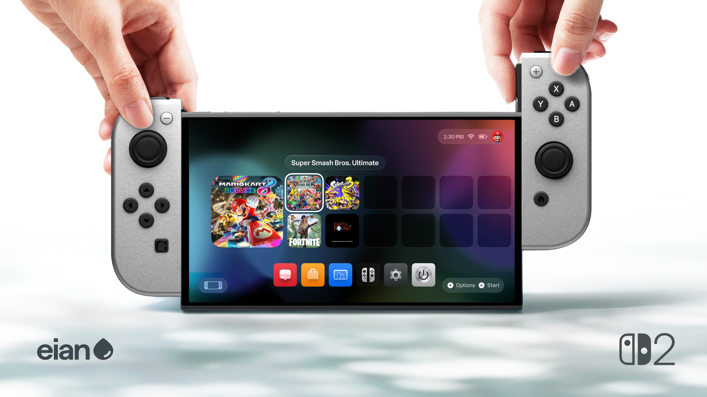
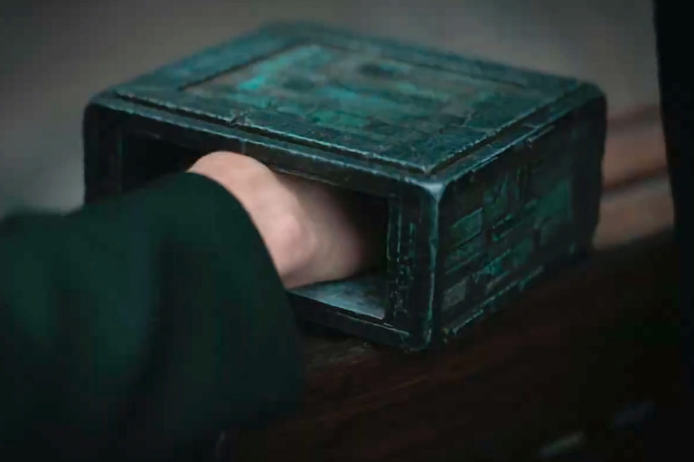

+++
title = "Des Joy-Con à aimants pour une Switch 2 plus grande"
date = 2024-04-26T18:47:32+01:00
draft = false
author = "Mickael"
tags = ["Actu"]
+++

La Switch 2, Super Nintendo Switch, Switch U ou peu importe comment Nintendo appellera sa nouvelle console ne devrait pas trop s'éloigner de la Switch actuelle. Le constructeur serait bien idiot de mécontenter une centaine de millions de joueurs qui serait forcé à rebâtir une nouvelle bibliothèque de jeux.

Mais si la base restera probablement la même — une console hybride à jouer sur sa télé et à emporter avec soi —, Nintendo pourrait modifier certaines caractéristiques techniques. On s'attend à un écran plus grand, une plus grande patate pour faire tourner décemment les jeux récents, et aussi… à des Joy-Con magnétiques.

Oui, c'est la nouvelle rumeur [propagée](https://vandal.elespanol.com/noticia/1350770848/exclusiva-switch-2-conocemos-en-primicia-nuevos-detalles-de-la-proxima-consola-de-nintendo/) par le site *Vandal*, qui a de bonnes sources habituellement (il avait donné des détails sur la Switch OLED qui se sont révélés exacts). Lors d'un salon, Nintendo aurait montré à des fabricants d'accessoires la future console, ou presque : ils étaient invités à glisser leurs mains dans une boîte sombre dans laquelle l'appareil était caché ! Il s'agissait de leur donner une petite idée du design et des dimensions de la bête.

La Switch 2 devrait donc effectivement être un peu plus grande. Et surtout, Nintendo aurait révélé que les Joy-Con s'attachaient à la console avec des aimants. Ce sera plus élégant qu'avec les rails actuels, mais on peut se demander si ce système magnétique sera suffisamment costaud pour tenir le choc avec les Benoît Brisefer de ce monde.

Malheureusement, il semble que les Joy-Con actuels ne soient pas compatibles avec la future Switch. Pas grand monde n'ira pleurer sur leur sort, notamment à cause du fameux drift — on espère que Nintendo aura trouvé la solution pour s'en débarrasser sur les nouveaux modèles. Le site indique que la manette Nintendo Pro sera prise en charge par la console à venir, ce qui pour le coup n'étonnera personne.

L'attente va être longue avant de voir débouler cette Switch 2, dont le lancement serait prévu début 2025 et encore, plutôt en mars qu'en janvier. Nintendo en profiterait pour peaufiner au maximum le line-up de jeux, quitte à essuyer une fin d'année très calme sur le front de la Switch première du nom.