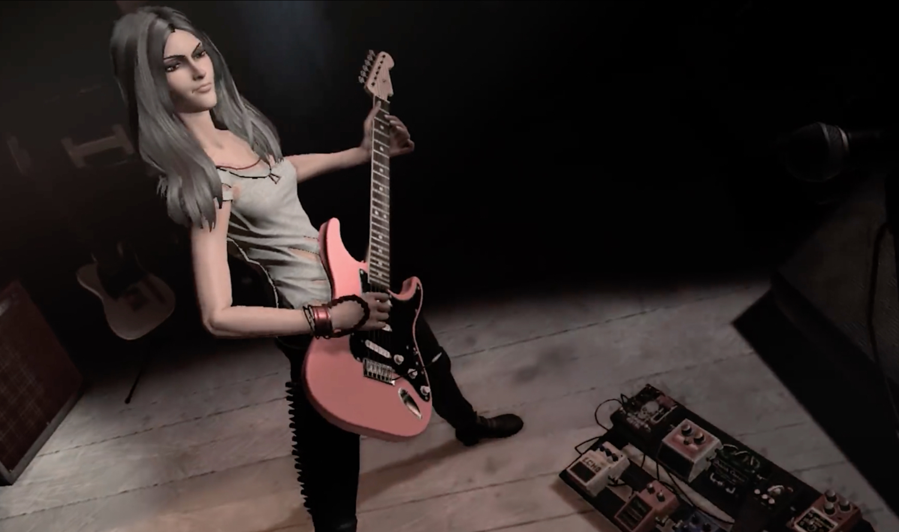
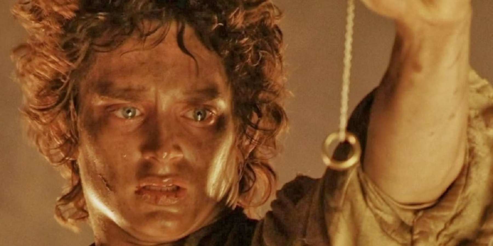
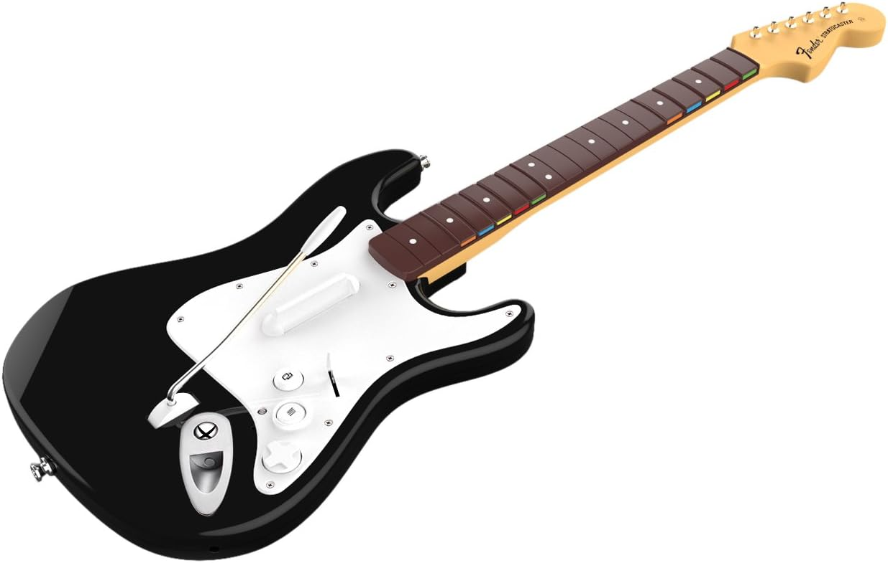
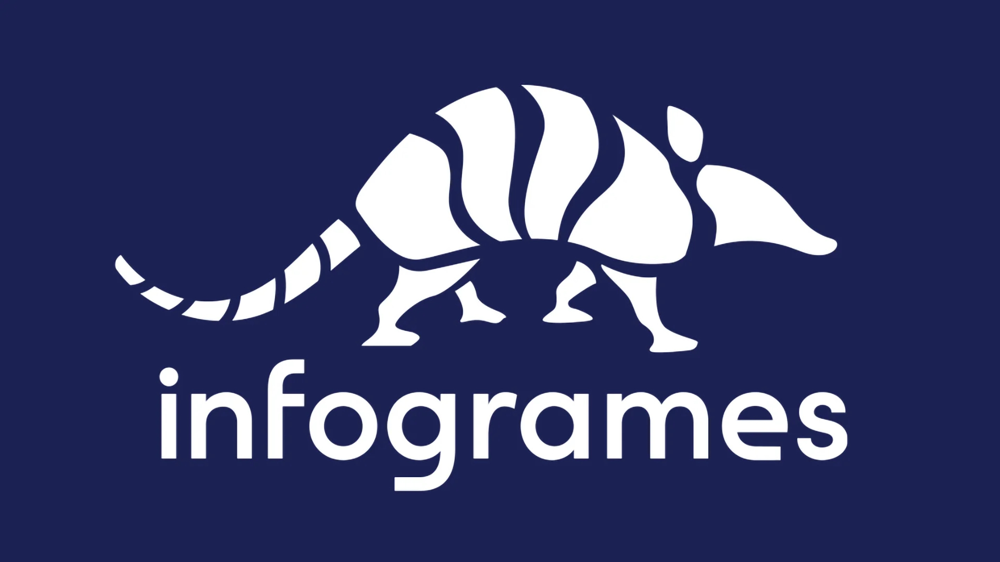
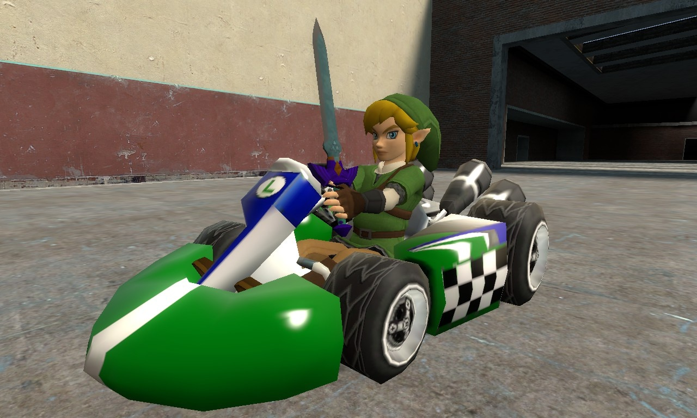

+++
title = "Incongrue, farfelue, un peu malotrue : la folle semaine du jeu vidéo (27/04)"
date = 2024-04-27T09:30:32+01:00
draft = false
author = "Mickael"
tags = ["Actu"]
image = "https://nostick.fr/articles/2024/avril/2704-folle-semaine-du-jeu-video/RockBand.jpg"
+++

L’actualité du jeu vidéo ne s’arrête pas à la poignée d’articles publiés sur *Nostick* ! Histoire de rattraper le retard accumulé, voici un retour rapide sur quelques unes des infos les plus importantes (ou insignifiantes) de la semaine.

## Embracer se coupe en trois

Est-ce finalement l'épilogue de la folle embardée d'Embracer ? Le groupe suédois qui s'est rêvé plus gros que le bœuf a multiplié les acquisitions avant de se faire poser un lapin par un fonds d'investissement. Pour s'en tirer, l'entreprise a licencié à tour de bras, fait fermer des studios (fraîchement achetés) et [en a libéré d'autres comme Saber](https://nostick.fr/articles/2024/mars/1403_saberinteractive/).

Embracer a fait un pas de plus vers la disparition pure et simple, en se [scindant](https://embracer.com/releases/embracer-group-announces-its-intention-to-transform-into-three-standalone-publicly-listed-entities-at-nasdaq-stockholm/) en trois entités. Middle-earth Enterprises & Friends regroupe les licences AAA (*Tomb Raider*, *Le Seigneur des Anneaux*, *Dead Island*…) ; Coffee Stain & Friends s'occupe des jeux mobiles et des indés ; Asmodee Group prend sous son aile les jeux de plateau et de société (*7 Wonders*, *Les Aventuriers du Rail*, *Catane*…) et va aussi développer des jeux traditionnels basés sur des franchises comme Marvel, *Game of Thrones*, ou encore *Le Seigneur des Anneaux*, oui encore.

Ces trois entreprises, qui seront cotées (à Stockholm), ont nécessité une réorganisation capitalistique aux allures de Meccano. Mais au bout du compte, c'est peut-être ce qui sauvera ce qui restait d'Embracer…

## Le code Konami n'a pas révélé tous ses secrets

Le code Konami a encore frappé ! Apparu en 1986 dans le portage de *Gradius* sur la NES, ce code gravé dans la mémoire musculaire des joueurs a été utilisé dans tous les sens dans les jeux de Konami (*Contra* est un exemple célèbre) mais aussi partout ailleurs, y compris pas dans des jeux — pour [dézoner](https://www.universfreebox.com/article/15276/Le-lecteur-Blu-ray-de-la-Freebox-Revolution-devient-multizone) le lecteur Blu-ray de la Freebox Révolution, par exemple !

Et on trouve encore aujourd'hui des codes Konami, y compris dans des jeux qui ont largement dépassé la date de péremption. *Castlevania: Legacy of Darkness*, tout à la fois préquelle et remake 3D de *Castlevania* pour la N64, a perdu beaucoup de sa superbe depuis sa sortie en 1999 avec sa 3D rudimentaire. Néanmoins, les joueurs voudront peut-être tenter ou retenter leur chance maintenant qu'il est possible de débloquer tous les personnages (Cornell, Reinhardt, Carrie et Henry) grâce au fameux code !

 

Il y a toutefois une subtilité, puisqu'il faut saisir chaque touche du code deux fois, tandis que les touches A et B diffèrent. Cela nous donne (avec une manette N64):

↑ ↑ ↑ ↑ ↓ ↓ ↓ ↓ ← ← → → ← ← → → L R Z

Cette découverte, 25 ans après la sortie du jeu, de deux joueurs sur le [Discord](https://discord.com/invite/NUtgg7Kyhh) de *Castlevania 64* permet aussi de bénéficier des costumes alternatifs et de tester son agilité dans le mode difficile.

## Les guitares de Rock Band 4 reprennent du service

Ne jetez pas les vieilles grattes que vous avez poncées avec *Rock Band 4* ! Même si le jeu — sorti en 2015 ! — n'a plus droit à de nouveaux DLC depuis janvier, les guitares en plastique gagnent à une deuxième vie grâce à Epic. Le jeu *Fortnite Festival*, qui fait partie de la galaxie de titres freemium du studio, est désormais [compatible](https://www.fortnite.com/news/fortnite-festival-season-3-features-billie-eilish) avec ces accessoires.

Mais comment se fait-il ? C'est assez simple en vérité : en 2021, Epic rachetait Harmonix, le développeur de *Rock Band* qui a conçu *Fortnite Festival*, sorte de successeur spirituel. Par conséquent, il n'était pas bien compliqué de raccrocher les wagons et les guitares… En plus, c'est bon pour la planète, alors que demande le peuple à part des riffs bien saignants !

Les grattes compatibles sont les Riffmaster, Fender Jaguar et Fender Stratocaster pour PS4, PS5, Xbox One/S/X, et PC. Attention, pour que ça marche sur les pécés il faut un adaptateur sans fil Xbox One pour Windows 10.

## Infogrames renaît de ses cendres

Voilà une info que les moins de ~~20~~ ~~30~~ 40 ans ne peuvent pas connaitre. Atari a [décidé](https://atari.com/pages/infogrames) de faire revivre la marque Infogrames, oui, le développeur et éditeur de jeux français qui a connu son heure de gloire dans les années 80 et 90. Ce n'est pourtant qu'un juste retour des choses, puisque Infogrames s'était offert Atari (ou plutôt ce qu'il en restait) en 2001, en même temps qu'Hasbro Interactive.

Deux ans ans plus tard, Infogrames prenait le nom d'Atari, plus vendeur à l'international, tout en frôlant à plusieurs reprises la faillite. Finalement, l'entreprise est plus ou moins revenue sur de bons rails en surfant éhontément sur la mode du rétro. La marque Infogrames, tombée dans l'oubli pendant vingt ans, revient donc dans la danse, et redevient un éditeur de jeux.

La première licence que le nouvel Infogrames va faire fructifier est *Totally Reliable Delivery Service*, un jeu sorti en 2019 chez tinyBuild. Le premier objectif est de revitaliser cette franchise « *à fort potentiel* », comme se rassure le directeur Geoffroy Châteauvieux. D'anciens titres du catalogue pourraient aussi être relancés : pour *Alone in the Dark* c'est trop tard, le jeu ayant été rebooté tout récemment par THQ. Mais il y a du potentiel avec *V-Rally*, *Heart of Darkness* et autres vieilleries.

## Coup de massue pour Bethesda France

Il ne se passe quasiment pas un jour sans que de nouveaux licenciements soient annoncés dans le petit monde du jeu vidéo, mais ce coup de hache fait un peu plus mal. Microsoft a décidé de [fermer](https://www.bfmtv.com/tech/gaming/promesses-non-tenues-plongee-dans-la-fermeture-surprise-de-bethesda-france-fallout-the-elder-scrolls_AV-202404230448.html) la filiale France de Bethesda — et c'est dans la discrétion la plus totale que la branche a été coupée il y a quelques semaines, sans fleur ni couronne ni communication officielle.

Bethesda France gérait en particulier la localisation des jeux du studio, la communication et l'animation de la communauté. Autrement dit, c'est cette filiale qui se prenait tout dans la poire quand la maison mère lançait des jeux décevants, à l'image de *Redfall* ou, dans une moindre mesure, *Starfield*. C'est d'autant plus difficile à encaisser que *Fallout* connait un énorme regain de popularité grâce à la série d'Amazon, amenant à la saga de nouveaux joueurs (et pas mal de sous).

En janvier, Microsoft avait annoncé une charrette de licenciements maousse costaud dans sa division gaming : 1 900 postes supprimés d'un coup, dont faisait partie Bethesda France malheureusement.

## Garry's Mod déblaie les contenus Nintendo

Nintendo a décidé de sévir contre les skins et les mods de ses personnages dans *Garry's Mod*. Facepunch Studios, le créateur du jeu bac à sable, a commencé à retirer tous ces éléments et il y a du boulot : depuis son lancement en 2006, le titre a accumulé un stock invraisemblable de mods et d'extensions liés à [Mario](https://steamcommunity.com/workshop/browse/?appid=4000&searchtext=mario&browsesort=trend&section=readytouseitems&created_date_range_filter_start=0&created_date_range_filter_end=0&updated_date_range_filter_start=0&updated_date_range_filter_end=0&actualsort=trend&p=1&days=-1), [Zelda](https://steamcommunity.com/workshop/browse/?appid=4000&searchtext=zelda&childpublishedfileid=0&browsesort=trend&section=readytouseitems&created_date_range_filter_start=0&created_date_range_filter_end=0&updated_date_range_filter_start=0&updated_date_range_filter_end=0), [Kirby](https://steamcommunity.com/workshop/browse/?appid=4000&searchtext=kirby&childpublishedfileid=0&browsesort=trend&section=readytouseitems&created_date_range_filter_start=0&created_date_range_filter_end=0&updated_date_range_filter_start=0&updated_date_range_filter_end=0) et aux autres héros des univers de l'éditeur japonais.

Pour confirmer qu'il s'agissait bien d'une exigence de Nintendo et pas d'une lubie (ou pire, d'une demande de retrait provenant d'un [imposteur](https://torrentfreak.com/nintendo-vs-garrys-mod-dissecting-the-fake-domain-behind-all-the-chaos-240426/)), Facepunch a [publié](https://store.steampowered.com/news/app/4000/view/4200245595694413052) un mot sur Steam expliquant qu'il ne s'agissait pas d'une erreur et que ces retraits provenaient bien de Nintendo. Et manifestement, c'est sans rancœur que les développeurs s'exécutent.

« *Honnêtement, ça nous semble juste* », indiquent-ils. « *C'est le contenu de Nintendo et ce qu'ils autorisent ou non dépend d'eux. S'ils ne veulent pas que vous utilisiez ces éléments dans Garry's Mod, c'est leur décision, nous devons la respecter et en retirer autant que possible* ».

Le seul problème, c'est qu'en 18 ans d'activité, les contenus Nintendo non autorisés se sont multipliés. D'où cet appel aux joueurs : « *Si vous souhaitez nous aider en supprimant vos contenus liés à Nintendo et en ne les uplodant plus jamais, cela nous aiderait beaucoup* ». À bon entendeur… Le plus étonnant dans cette histoire, c'est qu'il a fallu tout ce temps à Nintendo pour lancer son armée de ninjas tueurs.

## La colère gronde à Tarkov

Ça râle chez les joueurs d'*Escape from Tarkov*, et pour de très bonnes raisons. Le studio Battlestate Games a lancé une nouvelle édition [Unheard](https://www.escapefromtarkov.com/preorder-page) du jeu multi, facturée la bagatelle de 250 $ (!). Mais la grosse nouveauté en vaut probablement la peine pour les fans hardcore : un tout nouveau mode solo PvE, alors que *Tarkov* est d'abord et avant tout un PvP.

 

Si la question du prix coince, ça n'est pas le seul problème de cette édition. D'abord parce que Battlestate Games avait promis à tous ceux qui avaient acheté la précédente édition Edge of Darkness qu'ils recevraient tous les futurs DLC sans frais supplémentaires… sauf qu'ils n'ont pas droit au contenu de Unheard. Le studio a tenté de se justifier en affirmant que le mode solo n'était pas un DLC mais une « fonction unique ».

L'entreprise a ensuite mis un peu d'eau dans son vin en [annonçant](https://www.reddit.com/r/EscapefromTarkov/comments/1cdg9cu/the_update_regarding_eod_edition/) que le mode PvE allait finalement être proposé aux joueurs ayant acheté Edge of Darkness, mais uniquement pendant six mois ! Le solo sera ensuite réservé à ceux ayant banqué pour l'édition Unheard. Pas sûr que cette gracieuseté — qui ressemble à un os à ronger — soit bien accueillie.

Mais ça n'est pas le seul souci posé par cette nouvelle édition. Elle comprend en effet bon nombre de privilèges à même de bousculer complètement l'équilibre entre joueurs. Ceux qui possèdent Unheard bénéficient ainsi d'espace supplémentaire dans l'inventaire, de compétences améliorées à chaque remise à zéro du jeu et d'autres bonus. Tout ça fait craindre aux pauvres n'ayant pas casqué pour l'édition d'être désavantagés pendant les parties multi.

*Restez avec nous ! Le résumé ne s'arrête pas là, les news en vrac arrivent d'une minute à l'autre.*

