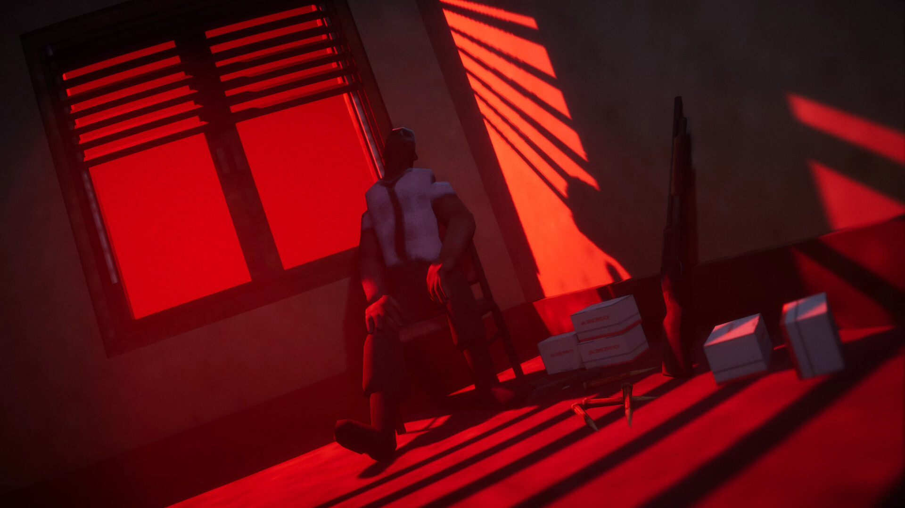

+++
title = "Y'a un peu plus d'actus cette semaine, je vous les mets quand même (27/04)"
date = 2024-04-27T09:00:32+01:00
draft = false
author = "Mickael"
tags = ["Actu"]
image = "https://nostick.fr/articles/2024/avril/270424-news-en-vrac/ElPaso.jpg"
+++

La semaine du jeu vidéo a été bien chargée, mais elle ne se réduit pas à notre désormais célèbre résumé du samedi. Voici en vrac une poignée de brèves en plus, ça nous fait plaisir.

**El Paso, Elsewhere —** À ce rythme, on se demande bien quel jeu n'aura pas été adapté au cinéma ou à la télé. Cette fois, c'est au tour du sympathique jeu de tir à la troisième personne *El Paso, Elsewhere* d'avoir [droit](https://deadline.com/2024/04/el-paso-elsewhere-movie-starring-lakeith-stanfield-in-works-1235890630/) à une version filmée, avec (probablement) à sa tête LaKeith Stanfield à la réalisation et en tête de casting. On lui doit entre autres *Judas and the Black Messiah* ou encore *Sorry to Bother You* que j'avoue ne pas connaître. Le film sera certainement bourré de vampires et autres créatures de la nuit, ce qui ne peut que réjouir les amateurs. *El Paso, Elsewhere* rejoint *Dredge*, *Sifu*, *Fallout*, *Golden Axe*, *Vampire Survivors*, *Splinter Cell* ou encore *Mario* dans la galaxie de plus en plus vaste des jeux adaptés sur petit ou grand écran.

**Metroid —** Samus Aran aurait pu être une des skins de *Fortnite*, mais voilà : Nintendo a exigé qu'elle ne soit jouable que dans la version Switch du *battle royale*… C'est une des révélations du procès ayant opposé Epic à Apple l'an dernier, et qui a été [confirmée](https://www.gamefile.news/p/donald-mustard-fortnite-agbo-shadow-complex) par Donald Mustard, l'ex-chef créatif du studio, auprès de *Game File*. Si Sony et Microsoft ont fait moins de chichis en donnant leur feu vert pour Kratos et Master Chief, Nintendo est resté ferme et voilà pourquoi l'héroïne de Metroid n'est jamais apparue dans *Fortnite*…

**eFootball —** C'était pas gagné pour *eFootball*, le successeur free to play de la saga *Pro Evolution Soccer*. Le jeu de Konami a reçu des notes catastrophiques à son lancement en 2021, et pour cause : il n'était visiblement pas prêt à sortir du four avec ses graphismes horribles, ses contrôles pourris et des performances dignes de celles du PSG en Coupe d'Europe. Mais à force de mouiller le maillot, eFootball a su retrouver des couleurs et trois ans plus tard, il [fête](https://www.konami.com/efootball/fr/topic/promotion/campaign/325/) les 750 millions de téléchargements. Pour l'occasion, Konami offre des tas de trucs pour les joueurs qui ne sont pas passés avec armes et bagages à *FC 24*.

**Steam —** Contrairement à l'eShop ou au PlayStation Store, Steam a mis en place une politique de remboursement à l'avantage des consommateurs. Il faut simplement demander le remboursement dans les 14 jours suivants l'achat, et avoir joué moins de deux heures pour se faire rembourser sans poser de question. Mais ça, c'était avant. Valve a [serré](https://steamcommunity.com/games/593110/announcements/detail/4195741362094579141) les boulons sur les titres distribués en accès avant-première. Les joueurs pouvaient en effet en profiter autant qu'ils voulaient, puis demander le remboursement après le lancement effectif des jeux. C'est désormais terminé : le temps passé durant ces accès anticipés compteront désormais dans le total des heures jouées. C'était trop beau pour durer !

**Blizzcon —** Coup de blues pour les fans des jeux Blizzard : la BlizzCon, l'événement traditionnel qui permet au studio de montrer ses nouveautés, n'aura pas lieu cette année ! Et ce n'est pas la faute du Covid ou d'une quelconque épidémie meurtrière, Blizzard [n'avançant](https://blizzcon.com/en-us/news/24072107) aucune raison particulière si ce n'est l'envie de faire les choses différemment. Les prochains mois seront bien fournis, avec le premier DLC de *Diablo 4*, « Vessel of Hatred », l'extension « The War Within » pour *World of Warcraft* et aussi les célébrations pour le 30e anniversaire (!) de *Warcraft*. Mais pour en savoir plus, il faudra traîner du côté des salons et des conventions de jeux vidéo auxquels participera Blizzard.

